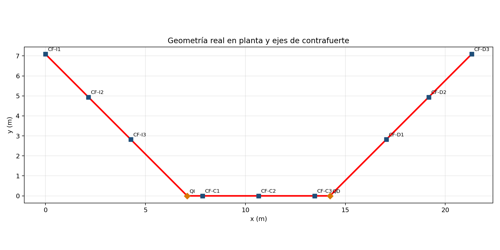
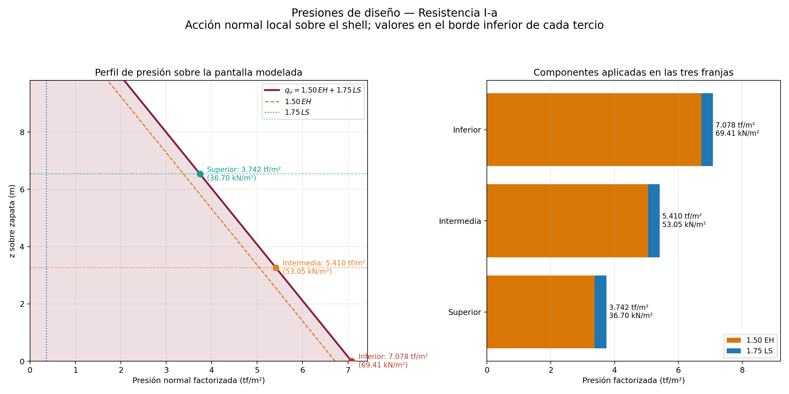
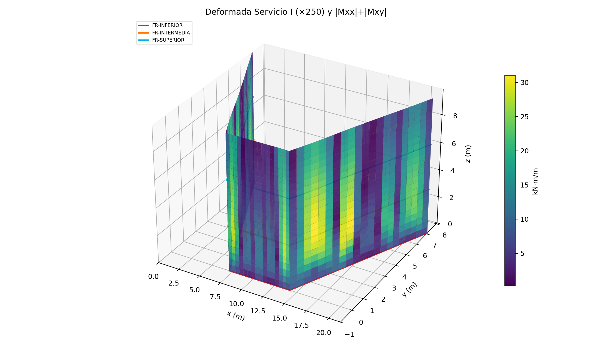
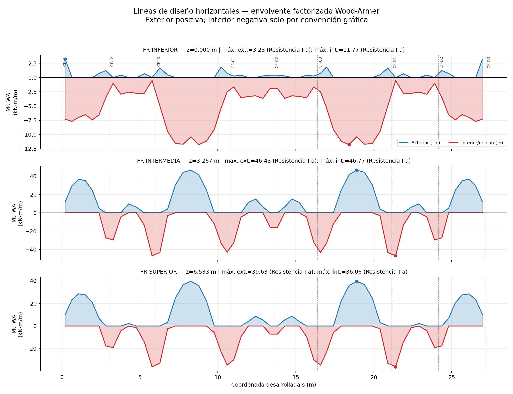

## MEMORIA DE CÁLCULO CALC-EST-2026-003-R00

### Análisis estructural y diseño del refuerzo de la pantalla plegada del estribo.

**Proyecto:** Creación de los servicios de transitabilidad mediante Puente Molinohuayco, distrito de Chilcas, provincia de La Mar, departamento de Ayacucho
**CUI:** 2508483
**Elemento:** pantalla plegada del estribo derecho: pantalla central y alas sobre zapata
**Estado:** preliminar, para consulta técnica y pronunciamiento del Proyectista
**Revisión:** R00
**Fecha de actualización:** 19/08/2026
**Sistema de unidades:** kN, m, kN·m, MPa y cm²/m (presiones de referencia en tf/m²)
**Elaborado por:** Ing. Paolo De la Calle — Especialista de Estructuras

---

## 1. Objeto

Elaborar el análisis estructural tridimensional independiente y el diseño del refuerzo de la **pantalla plegada del estribo** (pantalla central y alas) mediante un modelo de elementos finitos de cascarón, y verificar los estados límite de resistencia, servicio, cortante y estabilidad local del panel. La presente memoria documenta el modelo FEM 3D de cascarón y presenta el armado resultante en las zonas de mayor interés constructivo.

## 2. Alcance y exclusiones

**Incluye:**

- Idealización FEM de cascarón de la pantalla plegada con su poligonal real en planta (pantalla central + dos alas).
- Acciones de empuje de tierras (EH), sobrecarga (LS), empuje sísmico (AE) e inercia propia de la pantalla (IR).
- Combinaciones: Servicio I, Resistencia I-a, Resistencia I-b y Evento Extremo I (concurrencias A y B).
- Diseño del refuerzo horizontal y vertical por cara con envolventes Wood-Armer y tracción de membrana.
- Verificación de cortante del concreto y compresión de membrana.
- Estudio de convergencia de malla.

**Excluye (se documentan en otras memorias o módulos):**

- Cajuela y cargas transmitidas por ella.
- Diseño de contrafuertes (se modelan como apoyos rígidos en dirección normal).
- Zapata, estribo como cuerpo, estabilidad global y cimentación.
- Frenado, impacto y otras cargas de superestructura.
- Torsión espacial en los quiebres (el modelo los considera uniones monolíticas compatibles).
- El modelo complementario 1D desplegado y su diagrama de momentos constituyen una verificación aparte y **no forman parte** de la presente memoria.

## 3. Normas y criterios

| Concepto                    | Criterio                                                                       |
| --------------------------- | ------------------------------------------------------------------------------ |
| Cargas y combinaciones      | Manual de Puentes MTC 2018 / AASHTO LRFD                                       |
| Diseño de concreto armado   | NTE E.060 Concreto Armado                                                      |
| Verificación complementaria | MTC 2018 / AASHTO LRFD, se toma el requisito más restrictivo                   |
| Rigidez de la sección       | Sección bruta elástica uniforme (`Ec = 15000√f'c`)                             |
| Método de diseño del panel  | Envolventes Wood-Armer con membrana efectiva distribuida por mitad entre caras |

## 4. Datos de entrada

### 4.1 Parámetros geométricos y del modelo

| Parámetro                                       |                Valor | Unidad | Estado        |
| ----------------------------------------------- | -------------------: | -----: | ------------- |
| Altura total de referencia                      |               13.150 |      m | proporcionado |
| Altura modelada sobre zapata                    |                9.800 |      m | proporcionado |
| Altura excluida (cajuela)                       |                3.350 |      m | calculado     |
| Espesor de la pantalla                          |                0.400 |      m | proporcionado |
| Recubrimiento exterior (+n) — agua con abrasión |                  100 |     mm | proporcionado |
| Recubrimiento interior (−n) — relleno           |                   75 |     mm | proporcionado |
| Longitud desarrollada en planta                 |               27.194 |      m | coordenadas   |
| Tamaño objetivo de malla                        |                0.500 |      m | adoptado      |
| Nodos / elementos de la malla de diseño         |        1 298 / 1 218 |      — | calculado     |
| Coeficiente de Poisson                          |                 0.20 |      — | adoptado      |
| Barras disponibles                              | 5/8", 5/8", 3/4", 1" |   pulg | adoptado      |
| Espaciamiento mínimo / paso                     |              100 / 5 |     mm | adoptado      |

### 4.2 Materiales

| Parámetro         |                      Valor | Estado      |
| ----------------- | -------------------------: | ----------- |
| f'c               |    280 kgf/cm² (27.46 MPa) | agente base |
| fy                | 4 200 kgf/cm² (411.88 MPa) | agente base |
| Ec                |                  24.61 GPa | E.060       |
| γ relleno         |                 1.80 tf/m³ | agente base |
| γ concreto armado |                 2.40 tf/m³ | agente base |
| φ relleno         |                      39.8° | agente base |
| δ muro–suelo      |                19.9° (φ/2) | agente base |

### 4.3 Parámetros sísmicos

| Parámetro                                                 |  Valor |
| --------------------------------------------------------- | -----: |
| Kh                                                        |  0.125 |
| Kv                                                        |   0.05 |
| Ángulo sísmico $\psi = \tan^{-1}\left(K_h/(1-K_v)\right)$ | 7.496° |

## 5. Idealización y modelo

La poligonal real del eje de la pantalla (11 puntos de control, incluidas las dos líneas de contrafuertes y los quiebres QI y QD) se extruye verticalmente 9.80 m sobre la zapata. Cada elemento Q4 combina:

- membrana bilineal en estado plano de esfuerzos;
- placa de Mindlin-Reissner con interpolación MITC4 del cortante transversal;
- seis grados de libertad por nodo (3 traslaciones + 3 rotaciones).

La base se considera **empotrada** en la zapata (monolítica). En cada eje de contrafuerte se restringe **únicamente la traslación normal local** de la pantalla, con rotaciones libres; los quiebres comparten nodos, por lo que la unión es monolítica.

Se emplea rigidez elástica bruta uniforme; la fisuración no lineal y la redistribución por rigidez efectiva no forman parte de este análisis.

**Figura 1.** Geometría real en planta del eje de la pantalla y ubicación de los nueve ejes de contrafuerte.

## 6. Acciones y combinaciones

### 6.1 Coeficientes de presión (Coulomb / Mononobe-Okabe)

| Coeficiente              |       Valor |
| ------------------------ | ----------: |
| Ka resultante            |     0.20113 |
| KAE resultante           |     0.27404 |
| Factor normal (cos δ)    |     0.94029 |
| **Ka normal**            | **0.18912** |
| **KAE normal**           | **0.25768** |
| Sobrecarga equivalente h |      0.61 m |

La presión actúa **normal** a cada panel del shell y varía linealmente con la profundidad $z$ medida desde la coronación de la pantalla (altura total H = 13.15 m).

### 6.2 Estados y combinaciones

| Estado             | Combinación de diseño                  | Escenario                   |
| ------------------ | -------------------------------------- | --------------------------- |
| Servicio I         | EH + LS                                | EH + LS                     |
| Resistencia I-a    | 1.50 EH + 1.75 LS                      | 1.50 EH + 1.75 LS           |
| Resistencia I-b    | 1.50 EH + 1.75 LS (ejecución separada) | 1.50 EH + 1.75 LS           |
| Evento Extremo I-A | PAE + 0.50 PIR                         | 100% PAE + 50% PIR          |
| Evento Extremo I-B | máx(0.50 PAE, PA) + PIR                | máx(50% PAE, PA) + 100% PIR |

Donde: EH = empuje activo de tierras; LS = empuje por sobrecarga; AE = empuje sísmico activo (Mononobe-Okabe); IR = inercia propia de la pantalla (Kh·γc·t).

### 6.3 Presiones de referencia — Resistencia I-a

| Franja     | z sobre zapata (m) | Profundidad (m) | 1.50 EH (tf/m²) | 1.75 LS (tf/m²) | **qu (tf/m²)** | **qu (kN/m²)** |
| ---------- | -----------------: | --------------: | --------------: | --------------: | -------------: | -------------: |
| Inferior   |              0.000 |          13.150 |           6.715 |           0.363 |      **7.078** |      **69.41** |
| Intermedia |              3.267 |           9.883 |           5.047 |           0.363 |      **5.410** |      **53.05** |
| Superior   |              6.533 |           6.617 |           3.379 |           0.363 |      **3.742** |      **36.70** |

**Figura 2.** Perfil de presión normal factorizada $q_u = 1.50 EH + 1.75 LS$ y descomposición de sus componentes en el borde inferior de cada tercio.

## 7. Resultados del análisis global

### 7.1 Respuesta por caso

| Caso               | Escenario                   | d máx. (mm) | F carga (kN) | Error F (kN) | Error M (kN·m) |
| ------------------ | --------------------------- | ----------: | -----------: | -----------: | -------------: |
| Servicio I         | EH + LS                     |      0.3507 |     −6 179.9 |     4.76e−11 |       7.24e−06 |
| Resistencia I-a    | 1.50 EH + 1.75 LS           |      0.5319 |     −9 376.2 |     7.35e−11 |       1.17e−05 |
| Resistencia I-b    | 1.50 EH + 1.75 LS           |      0.5319 |     −9 376.2 |     7.35e−11 |       1.17e−05 |
| Evento Extremo I-A | 100% PAE + 50% PIR          |      0.4306 |     −7 571.4 |     4.78e−11 |       5.96e−06 |
| Evento Extremo I-B | máx(50% PAE, PA) + 100% PIR |      0.3409 |     −6 000.3 |     4.78e−11 |       5.81e−06 |

Los errores de equilibrio de fuerza y momento son del orden de 10⁻¹¹ kN y 10⁻⁵ kN·m, despreciables. El desplazamiento máximo bajo Servicio I es 0.35 mm.

**Figura 3.** Deformada bajo Servicio I (amplificada ×250) y mapa de momentos del panel; la respuesta es simétrica respecto del eje del estribo.

### 7.2 Reacciones normales en los ejes de contrafuerte (kN)

| Caso               | CF-I1 |   CF-I2 |       CF-I3 |   CF-C1 | CF-C2 |   CF-C3 |       CF-D1 |   CF-D2 | CF-D3 |
| ------------------ | ----: | ------: | ----------: | ------: | ----: | ------: | ----------: | ------: | ----: |
| Servicio I         | 305.5 |   799.6 |       949.5 |   688.5 | 634.8 |   688.5 |       949.5 |   799.6 | 305.5 |
| Resistencia I-a    | 463.9 | 1 213.8 | **1 441.6** | 1 045.5 | 963.4 | 1 045.5 | **1 441.6** | 1 213.8 | 463.9 |
| Resistencia I-b    | 463.9 | 1 213.8 | **1 441.6** | 1 045.5 | 963.4 | 1 045.5 | **1 441.6** | 1 213.8 | 463.9 |
| Evento Extremo I-A | 373.1 |   977.4 |     1 159.5 |   840.2 | 777.0 |   840.2 |     1 159.5 |   977.4 | 373.1 |
| Evento Extremo I-B | 296.1 |   775.4 |       920.3 |   667.1 | 616.1 |   667.1 |       920.3 |   775.4 | 296.1 |

La reacción normal máxima es **1 441.6 kN** en CF-I3/CF-D1 bajo Resistencia I; las reacciones son simétricas. Estas reacciones se entregan como cargas de interfaz para el diseño de los contrafuertes (fuera del alcance de esta memoria).

## 8. Resultantes de diseño

Se emplean las resultantes de cascarón `(Nxx, Nyy, Nxy, Mxx, Myy, Mxy, Qx, Qy)` recuperadas en puntos de Gauss. El diseño por cara usa:

- **Envolvente Wood-Armer:** cara exterior (+n): $M_{u,\text{ext}} = M_{xx}+|M_{xy}|$; cara interior/relleno (−n): $M_{u,\text{int}} = -M_{xx}+|M_{xy}|$, truncados a cero.
- **Tracción de membrana:** distribuida conservadoramente por mitad entre las dos caras.

Tres líneas horizontales de lectura `FR-INFERIOR`, `FR-INTERMEDIA` y `FR-SUPERIOR` permiten envolver el momento horizontal en la coordenada desarrollada `s`.

| Línea             |     z (m) | Mu ext. máx. (kN·m/m) |      s (m) | Mu int. máx. (kN·m/m) |      s (m) | Caso            |
| ----------------- | --------: | --------------------: | ---------: | --------------------: | ---------: | --------------- |
| FR-INFERIOR       |     0.000 |                 3.232 |      0.217 |                11.773 |     18.413 | Resistencia I-a |
| **FR-INTERMEDIA** | **3.267** |            **46.428** | **18.912** |            **46.766** | **21.405** | Resistencia I-a |
| FR-SUPERIOR       |     6.533 |                39.630 |     18.912 |                36.065 |     21.405 | Resistencia I-a |

**Figura 4.** Envolventes factorizadas Wood-Armer horizontales a lo largo de la coordenada desarrollada para las tres franjas; la línea FR-INTERMEDIA gobierna el diseño horizontal del nivel intermedio.

## 9. Diseño del refuerzo

### 9.1 Criterios aplicados

- Brazo mecánico por cara con su recubrimiento nominal y barra de control Ø1" (25.4 mm):

  - Cara exterior (+n): $d = 400 - 100 - 25.4/2 = 287.3$ mm.
  - Cara interior (−n): $d = 400 - 75 - 25.4/2 = 312.3$ mm.

- Requisitos de acero comparados por celda (se adopta el mayor):

  - flexión + membrana (envolvente Wood-Armer factorizada): $A_{s,\text{flex}} = \frac{0.85 f'_c b a}{f_y}$ con $a = d - \sqrt{d^2 - \frac{2M_u}{\phi_f 0.85 f'_c b}}$;
  - mínimo de flexión E.060: $A_{s,\min} = 0.70\sqrt{f'_c}\,b\,d/f_y$;
  - temperatura E.060 por cara: $A_{s,t} = 0.0018\,b\,h/2$ = **3.60 cm²/m**;
  - mínimo de flexión MTC/AASHTO: $\max\left(M_u,\ \min(1.33 M_u,\ 1.60 M_{cr})\right)$;
  - temperatura MTC/AASHTO por cara = **2.33 cm²/m**.

- Control de fisuración MTC 2.9.1.4.4.3 / AASHTO 5.7.3.4: separación límite calculada con $d_c$ propio de cada cara y $f_{ss} \le 0.60 f_y$.
- Cortante del concreto con el brazo menor (recubrimiento mayor): $d = 287.3$ mm.
- Desarrollo E.060 y MTC/AASHTO con factor conservador 1.3; se adopta el mayor y se redondea a 50 mm.

### 9.2 Refuerzo horizontal — nivel intermedio (z = 3.267 m sobre zapata)

Caso gobernante en todas las celdas: **Resistencia I-a**. Control de acero: **mínimo de flexión E.060** (8.01 cm²/m exterior; 8.71 cm²/m interior), que es superior al mínimo por temperatura.

| Región           |          Cara | Mu WA (kN·m/m) | Nu cara (kN/m) | As req. (cm²/m) | Control            |              Armado | As prov. (cm²/m) | φMn (kN·m/m) |   DCR | d (mm) | rec. (mm) | fss (MPa) | s fisuración (mm) |
| ---------------- | ------------: | -------------: | -------------: | --------------: | ------------------ | ------------------: | ---------------: | -----------: | ----: | -----: | --------: | --------: | ----------------: |
| Ala izquierda    | Exterior (+n) |          47.05 |          47.49 |           8.012 | mín. flexión E.060 | **Ø 5/8" @ 230 mm** |            8.606 |        89.23 | 0.676 |  287.3 |       100 |     175.9 |             240.2 |
| Pantalla central | Exterior (+n) |          14.82 |          55.19 |           8.012 | mín. flexión E.060 | **Ø 5/8" @ 245 mm** |            8.079 |        83.90 | 0.361 |  287.3 |       100 |      92.0 |             656.6 |
| Ala derecha      | Exterior (+n) |          47.05 |          47.49 |           8.012 | mín. flexión E.060 | **Ø 5/8" @ 230 mm** |            8.606 |        89.23 | 0.676 |  287.3 |       100 |     175.9 |             240.2 |
| Ala izquierda    | Interior (−n) |          46.35 |          34.67 |           8.710 | mín. flexión E.060 | **Ø 5/8" @ 225 mm** |            8.797 |        99.31 | 0.573 |  312.3 |        75 |     149.7 |             430.3 |
| Pantalla central | Interior (−n) |          42.59 |          72.66 |           8.710 | mín. flexión E.060 | **Ø 5/8" @ 225 mm** |            8.797 |        99.31 | 0.652 |  312.3 |        75 |     168.2 |             364.8 |
| Ala derecha      | Interior (−n) |          46.35 |          34.67 |           8.710 | mín. flexión E.060 | **Ø 5/8" @ 225 mm** |            8.797 |        99.31 | 0.573 |  312.3 |        75 |     149.7 |             430.3 |

- Longitud de desarrollo adoptada: **1 500 mm** (máximo E.060/MTC redondeado); empalme Clase B de referencia: **1 950 mm**.
- El DCR aditivo (flexión Wood-Armer + tracción de membrana) máximo del nivel intermedio es **0.676** ≤ 1.00.
- Las alas izquierda y derecha son simétricas; por lo tanto, el armado horizontal intermedio resulta simétrico.

### 9.3 Refuerzo vertical — nivel de la base (zona Inferior, 0.00–3.27 m)

En el nivel de la base y hacia abajo, la demanda de flexión vertical es **menor que el acero mínimo normativo**; por tanto, el refuerzo vertical queda **gobernado por el acero mínimo de flexión E.060** y no por la demanda de flexión. El armado indicado (mínimo de flexión E.060, mayor que el mínimo de temperatura) satisface holgadamente ambos requisitos.

| Región           |          Cara | Mu WA (kN·m/m) | Nu cara (kN/m) | As req. (cm²/m) | Control            |              Armado | As prov. (cm²/m) |   DCR |
| ---------------- | ------------: | -------------: | -------------: | --------------: | ------------------ | ------------------: | ---------------: | ----: |
| Ala izquierda    | Exterior (+n) |          17.03 |          46.75 |           8.012 | mín. flexión E.060 | **Ø 5/8" @ 245 mm** |            8.079 | 0.359 |
| Pantalla central | Exterior (+n) |           9.29 |           4.81 |           8.012 | mín. flexión E.060 | **Ø 5/8" @ 245 mm** |            8.079 | 0.127 |
| Ala derecha      | Exterior (+n) |          17.03 |          46.75 |           8.012 | mín. flexión E.060 | **Ø 5/8" @ 245 mm** |            8.079 | 0.359 |
| Ala izquierda    | Interior (−n) |          52.64 |          26.58 |           8.710 | mín. flexión E.060 | **Ø 5/8" @ 225 mm** |            8.797 | 0.612 |
| Pantalla central | Interior (−n) |          13.36 |           8.52 |           8.710 | mín. flexión E.060 | **Ø 5/8" @ 225 mm** |            8.797 | 0.161 |
| Ala derecha      | Interior (−n) |          52.64 |          26.58 |           8.710 | mín. flexión E.060 | **Ø 5/8" @ 225 mm** |            8.797 | 0.612 |

> **Nota técnica sobre el control de acero:** el procedimiento computacional adopta el mayor de los requisitos de acero por celda. En el nivel de la base el requisito gobernante es el **mínimo de flexión E.060** (8.01 cm²/m exterior y 8.71 cm²/m interior), que es **superior** al acero mínimo por temperatura (E.060: 3.60 cm²/m; MTC/AASHTO: 2.33 cm²/m) y a la demanda de flexión vertical. En consecuencia, el refuerzo vertical del nivel de la base queda gobernado por el acero mínimo normativo de flexión, y el armado indicado cubre, con holgura, tanto la demanda de flexión como los mínimos de temperatura de ambas normas.

- Caso gobernante: **Resistencia I-a**.
- Longitud de desarrollo adoptada: **1 500 mm**; empalme Clase B de referencia: **1 950 mm**.
- DCR máximo del nivel de la base: **0.612** (cara interior, alas) ≤ 1.00.

### 9.4 Nota sobre el resto de zonas

Las 36 celdas de la envolvente (3 regiones × 3 zonas × 2 direcciones × 2 caras) quedan gobernadas por el **acero mínimo normativo** (mínimo de flexión E.060, 8.01/8.71 cm²/m por cara), con DCR máximo global **0.678** ≤ 1.00. El detalle completo de todas las combinaciones, demandas y armados se encuentra en los archivos de resultados de esta misma carpeta (Anexo A).

## 10. Verificación de cortante y compresión de membrana

Capacidad de cortante del concreto calculada con el brazo menor $d = 287.3$ mm. Se adopta la menor capacidad entre ambas normas:

$$
\phi V_c^{E.060} = \phi_c \cdot 0.17\sqrt{f'_c}\,b_w d, \qquad
\phi V_c^{MTC} = \phi_c \cdot 0.083\,\beta\sqrt{f'_c}\,b_w d_v, \qquad
d_v = \max(0.9 d,\ 0.72 h), \quad \beta = 2.0
$$

| Región           |       Zona | Q máx. (kN/m) | φVc E.060 (kN/m) | φVc MTC (kN/m) | **φVc adoptado (kN/m)** | **DCR V** | σc membrana (MPa) | DCR comp. |
| ---------------- | ---------: | ------------: | ---------------: | -------------: | ----------------------: | --------: | ----------------: | --------: |
| Ala izquierda    |   Inferior |    **110.88** |           217.54 |         225.47 |              **217.54** | **0.510** |             0.439 |     0.036 |
| Ala izquierda    | Intermedia |         98.24 |           217.54 |         225.47 |                  217.54 |     0.452 |             0.038 |     0.003 |
| Ala izquierda    |   Superior |         71.00 |           217.54 |         225.47 |                  217.54 |     0.326 |             0.011 |     0.001 |
| Pantalla central |   Inferior |         73.34 |           217.54 |         225.47 |                  217.54 |     0.337 |             0.447 |     0.036 |
| Pantalla central | Intermedia |         70.10 |           217.54 |         225.47 |                  217.54 |     0.322 |             0.071 |     0.006 |
| Pantalla central |   Superior |         52.06 |           217.54 |         225.47 |                  217.54 |     0.239 |             0.025 |     0.002 |
| Ala derecha      |   Inferior |    **110.88** |           217.54 |         225.47 |              **217.54** | **0.510** |             0.439 |     0.036 |
| Ala derecha      | Intermedia |         98.24 |           217.54 |         225.47 |                  217.54 |     0.452 |             0.038 |     0.003 |
| Ala derecha      |   Superior |         71.00 |           217.54 |         225.47 |                  217.54 |     0.326 |             0.011 |     0.001 |

- DCR de cortante máximo: **0.510** ≤ 1.00 (alas, nivel inferior, Resistencia I-a).
- Compresión de membrana máxima: $\sigma_c =$ **0.447 MPa**, muy por debajo del límite de referencia $0.45 f'_c = 12.36$ MPa (DCR 0.036). El panel no presenta riesgo de aplastamiento local.

## 11. Convergencia de malla

Estudio de convergencia bajo Servicio I:

| Tamaño objetivo (m) | Nodos | Elementos | d máx. (mm) | Cambio d (%) | M WA puntual máx. (kN·m/m) |
| ------------------: | ----: | --------: | ----------: | -----------: | -------------------------: |
|                0.80 |   592 |       540 |      0.3403 |            — |                      30.70 |
|                0.60 |   969 |       900 |      0.3528 |         3.57 |                      30.84 |
|                0.50 | 1 298 |     1 218 |      0.3507 |     **0.60** |                      31.04 |

Los desplazamientos globales convergen (cambio < 1% en la última malla). Los picos puntuales de momento Wood-Armer próximos a líneas rígidas son sensibles al mallado y se interpretan como envolventes locales; no gobiernan el armado porque en todas las celdas controla el acero mínimo normativo.

## 12. Validaciones

| Control                                  | Resultado                                 |
| ---------------------------------------- | ----------------------------------------- |
| Longitud desarrollada                    | 27.1935 m                                 |
| Geometría simétrica                      | Conforme                                  |
| Nueve líneas de contrafuerte             | Conforme                                  |
| Cajuela excluida (3.35 m)                | Conforme                                  |
| Resistencia I-a e I-b independientes     | Conforme                                  |
| Resistencia I-a e I-b coinciden          | Conforme                                  |
| Equilibrio de fuerzas y momentos         | Conforme (errores ~10⁻¹¹ kN y ~10⁻⁵ kN·m) |
| Simetría de desplazamientos y reacciones | Conforme                                  |
| Flexión + membrana (DCR ≤ 1)             | Conforme (máx. 0.678)                     |
| Cortante (DCR ≤ 1)                       | Conforme (máx. 0.510)                     |
| Compresión de membrana (DCR ≤ 1)         | Conforme (máx. 0.036)                     |

**Estado global del modelo: CUMPLE.**

## 13. Conclusiones

1. El modelo FEM 3D de cascarón de la pantalla plegada cumple las verificaciones de resistencia, servicio, cortante y compresión de membrana bajo las combinaciones MTC/AASHTO y E.060 adoptadas.
2. El desplazamiento máximo bajo Servicio I es 0.35 mm y la respuesta es simétrica y equilibrada.
3. **Refuerzo horizontal del nivel intermedio (z = 3.267 m):** Ø 5/8" @ 230 mm en la cara exterior de las alas y @ 245 mm en la pantalla central; Ø 5/8" @ 225 mm en la cara interior en toda la longitud. DCR máx. 0.676. Controlado por el acero mínimo de flexión E.060 (mayor que el mínimo de temperatura).
4. **Refuerzo vertical del nivel de la base (zona inferior):** Ø 5/8" @ 245 mm (cara exterior) y Ø 5/8" @ 225 mm (cara interior), gobernado por el **acero mínimo de flexión E.060** (la demanda de flexión vertical no controla). DCR máx. 0.612.
5. La máxima reacción normal de interfaz para el diseño de contrafuertes es 1 441.6 kN (Resistencia I).
6. El espesor de 0.40 m satisface cortante (DCR 0.51) y compresión de membrana (DCR 0.04) sin refuerzo de cortante.
7. **Recubrimientos adoptados:** 100 mm en la cara exterior (+n), en contacto con agua con abrasión, y 75 mm en la cara interior (−n), en contacto con el relleno. Definen los brazos mecánicos de diseño (287.3 y 312.3 mm) y el control de fisuración.
