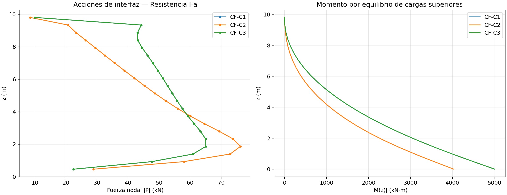
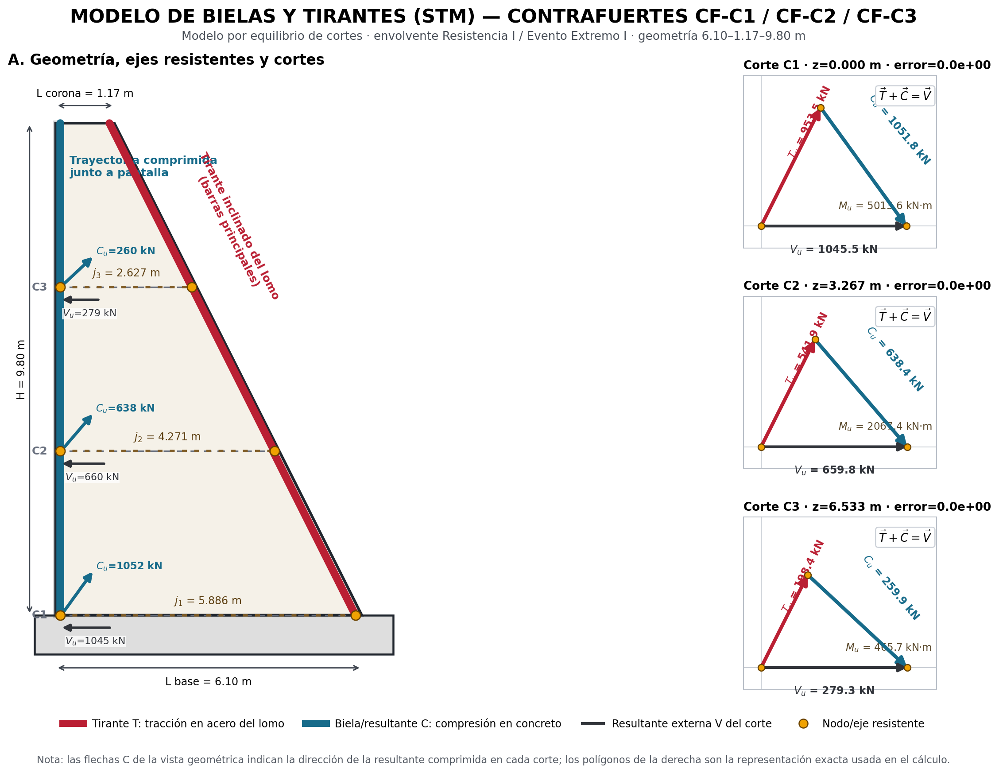
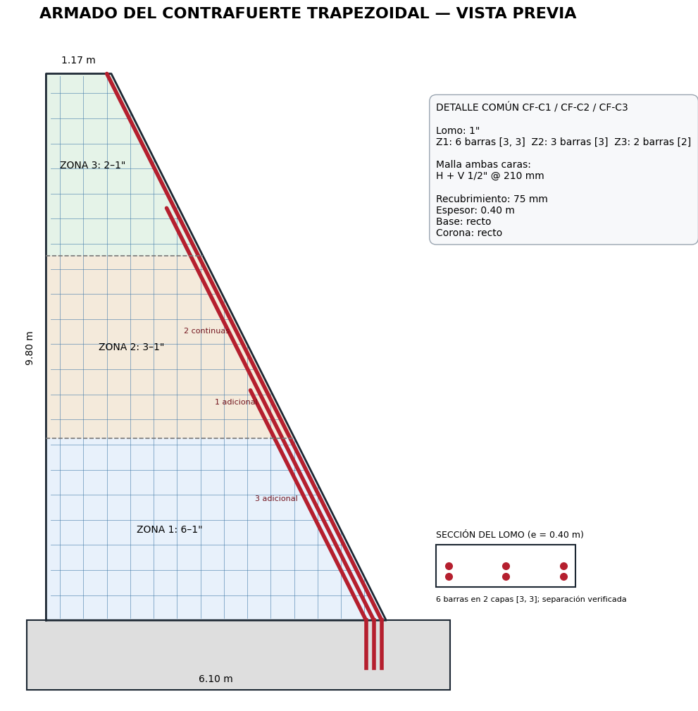
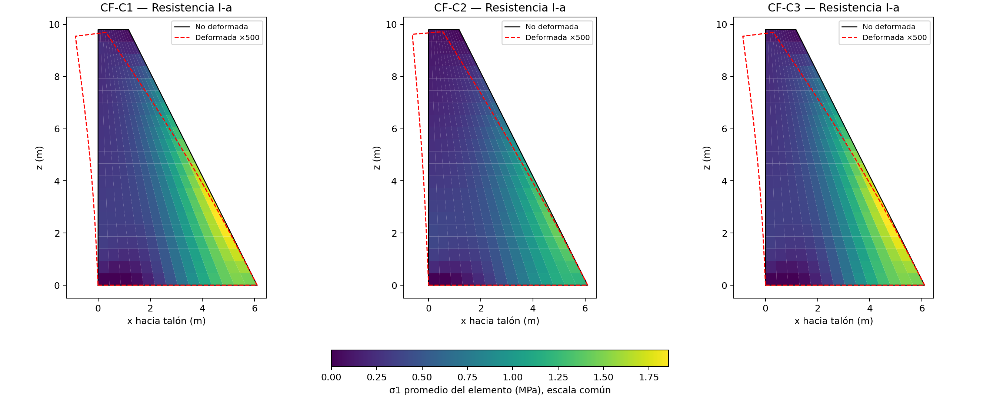

# Sesión 1 — De las reacciones de la pantalla al tirante del contrafuerte

## Propósito de la sesión

Al terminar esta sesión podrás reproducir manualmente una cadena completa de
resultados de los dos programas:

1. convertir las reacciones nodales de la pantalla en cortante y momento en un
   corte horizontal del contrafuerte;
2. convertir ese cortante y ese momento en las fuerzas de una biela y un
   tirante;
3. obtener el área requerida del tirante y comprobar el armado elegido.

Los números se toman de los archivos reales del proyecto. En esta primera
sesión no se desarrolla todavía la matriz de rigidez Q4 ni la recuperación de
esfuerzos en puntos de Gauss. Esos temas requieren sesiones propias.

> **Alcance didáctico.** Esta guía explica y comprueba el algoritmo existente;
> no reemplaza la revisión del ingeniero responsable, la memoria de cálculo ni
> la comprobación de la normativa vigente aplicable al proyecto.

## 1. Dónde estamos dentro del flujo de cálculo

```text
pantalla shell 3D
        │ reacciones nodales R_pantalla(z)
        ▼
analizar_contrafuertes_centrales_2d.py
        │ P_contrafuerte = -R_pantalla
        │ V(z), M(z), desplazamientos y esfuerzos FEM
        ▼
analisis_contrafuertes_centrales_2d.json
        │ envolventes de V y M
        ▼
disenar_contrafuertes_centrales_stm.py
        │ T, C, As requerido, armado y DCR
        ▼
diseno_contrafuertes_centrales_stm.json
```

El primer programa **analiza** el alma trapezoidal con elementos Q4 en esfuerzo
plano. El segundo programa **diseña** el refuerzo común usando las resultantes
por corte del primero. Conviene mantener esta separación: los esfuerzos FEM no
son, por sí solos, áreas de acero.



## 2. Datos que usaremos

Se adopta la envolvente común gobernada por `CF-C1 / Resistencia I-a`. Por
simetría, CF-C3 produce los mismos valores. El corte elegido es el inicio de la
zona 3:

\[
z_c=\frac{2H}{3}=\frac{2(9.80)}{3}=6.5333\ \text{m}.
\]

| Dato | Símbolo | Valor |
|---|---:|---:|
| Altura | \(H\) | 9.80 m |
| Longitud en la base | \(L_b\) | 6.10 m |
| Longitud en la corona | \(L_t\) | 1.17 m |
| Espesor del alma | \(b_w\) | 0.40 m |
| Recubrimiento nominal | \(c\) | 75 mm |
| Diámetro de barra principal | \(d_b\) | 25.4 mm (1”) |
| Resistencia del acero | \(f_y\) | 411.8793 MPa |
| Factor del tirante | \(\phi_t\) | 0.90 |

Convención del modelo 2D:

- \(+x\) va desde la pantalla hacia el talón;
- \(+z\) es vertical hacia arriba;
- la reacción de la pantalla es positiva en el listado mostrado, pero la acción
  aplicada al contrafuerte es igual y opuesta:

\[
P_i=-R_{\text{pantalla},i}.
\]

Por eso, en este caso las cargas del contrafuerte y las resultantes algebraicas
son negativas en \(x\). El archivo de diseño utiliza sus magnitudes positivas
\(V_u\) y \(M_u\).

---

## Ejercicio manual 1 — Cortante y momento en un corte horizontal

### Enunciado

Con las cargas nodales situadas **por encima** de
\(z_c=6.5333\ \text{m}\), calcular:

1. el cortante algebraico \(V(z_c)\);
2. el momento algebraico \(M(z_c)\);
3. las magnitudes \(V_u\) y \(M_u\) que recibe el programa STM.

### Paso 1: aislar el cuerpo libre superior

Al cortar el contrafuerte en \(z_c\), solamente se incluyen las cargas cuya
elevación cumple \(z_i>z_c\). La carga situada exactamente en el corte no se
incluye. Esta es la misma máscara que usa el código:

```python
mascara = cargas.z_m > z + 1e-10
```

| \(z_i\) (m) | \(P_i\) (kN) | \(z_i-z_c\) (m) | \(P_i(z_i-z_c)\) (kN·m) |
|---:|---:|---:|---:|
| 7.0000 | -47.9867 | 0.4667 | -22.3938 |
| 7.4667 | -46.2960 | 0.9333 | -43.2096 |
| 7.9333 | -44.5535 | 1.4000 | -62.3749 |
| 8.4000 | -43.1255 | 1.8667 | -80.5010 |
| 8.8667 | -43.0713 | 2.3333 | -100.4999 |
| 9.3333 | -44.2649 | 2.8000 | -123.9417 |
| 9.8000 | -10.0225 | 3.2667 | -32.7401 |

Los valores mostrados se redondean en la tabla; el programa conserva más
decimales.

### Paso 2: sumar fuerzas horizontales

Por equilibrio del cuerpo libre:

\[
V(z_c)=\sum_{z_i>z_c}P_i.
\]

Sustituyendo:

\[
\begin{aligned}
V(z_c)={}&-47.9867-46.2960-44.5535-43.1255\\
         &-43.0713-44.2649-10.0225\\
       ={}&-279.3204\ \text{kN}.
\end{aligned}
\]

### Paso 3: sumar momentos respecto al corte

Cada fuerza horizontal tiene como brazo vertical \(z_i-z_c\):

\[
M(z_c)=\sum_{z_i>z_c}P_i(z_i-z_c).
\]

Por tanto:

\[
\begin{aligned}
M(z_c)={}&-22.3938-43.2096-62.3749-80.5010\\
          &-100.4999-123.9417-32.7401\\
        ={}&-465.6608\ \text{kN·m}.
\end{aligned}
\]

### Paso 4: pasar a las magnitudes de diseño

El JSON conserva tanto el signo como el valor absoluto. Para formar la
envolvente de diseño se usan:

\[
V_u=|V|=279.3204\ \text{kN},
\qquad
M_u=|M|=465.6608\ \text{kN·m}.
\]

### Verificación contra el programa

| Resultado | Manual | JSON | Diferencia por redondeo |
|---|---:|---:|---:|
| \(V_u\) | 279.3204 kN | 279.320380 kN | < 0.0001 kN |
| \(M_u\) | 465.6608 kN·m | 465.660797 kN·m | < 0.0001 kN·m |

Esta operación corresponde a `resultantes_por_corte(...)` en
[`analizar_contrafuertes_centrales_2d.py`](../../analisis_estabilidad/analizar_contrafuertes_centrales_2d.py).

### Qué significa físicamente

- \(V(z_c)\) es la fuerza horizontal que debe transferirse a través del corte.
- \(M(z_c)\) mide la tendencia del cuerpo superior a girar respecto al corte.
- Al acercarnos a la corona quedan menos cargas por encima; por ello ambas
  resultantes disminuyen hasta cero en \(z=9.80\ \text{m}\).
- Esta suma es una comprobación de estática y no depende de la rigidez elástica
  del Q4 una vez conocidas las cargas nodales.

---

## Ejercicio manual 2 — Del corte al tirante, la biela y el acero

### Enunciado

Usando los resultados del ejercicio 1, reproducir para la zona 3:

1. la geometría de los ejes resistentes;
2. la fuerza del tirante \(T_u\);
3. la fuerza de la biela \(C_u\);
4. el área de acero requerida y el DCR de 2 barras de 1”.



### Paso 1: inclinación del lomo y del tirante

La longitud horizontal del contrafuerte varía linealmente:

\[
L(z)=L_b+\frac{L_t-L_b}{H}z.
\]

La pendiente del lomo es:

\[
m=\frac{1.17-6.10}{9.80}=-0.503061.
\]

El tirante principal es paralelo al lomo. Su ángulo respecto a la vertical es:

\[
\alpha=\tan^{-1}(|m|)=26.7052^\circ.
\]

En el corte:

\[
L(6.5333)=6.10-0.503061(6.5333)=2.8133\ \text{m}.
\]

### Paso 2: ubicar los ejes de tracción y compresión

Para una sola capa de barras, el centro de la barra está separado del lomo:

\[
c_{bar}=c+\frac{d_b}{2}
=75+\frac{25.4}{2}=87.7\ \text{mm}=0.0877\ \text{m}.
\]

Como esa distancia se mide normal al lomo, su retiro horizontal a igual cota
es:

\[
r_x=c_{bar}\sqrt{1+m^2}
=0.0877\sqrt{1+0.503061^2}
=0.09817\ \text{m}.
\]

La coordenada del tirante resulta:

\[
x_t=L(z_c)-r_x=2.8133-0.09817=2.71516\ \text{m}.
\]

El código coloca el eje comprimido junto a la pantalla en:

\[
x_c=c+\frac{d_b}{2}=0.0877\ \text{m}.
\]

Por tanto, el brazo interno es:

\[
j=x_t-x_c=2.71516-0.08770=2.62746\ \text{m}.
\]

### Paso 3: obtener el tirante a partir del momento

La componente vertical del tirante forma con la compresión el par resistente:

\[
T_z=\frac{M_u}{j}
=\frac{465.660797}{2.627461}
=177.2284\ \text{kN}.
\]

Como el tirante está inclinado un ángulo \(\alpha\) respecto de la vertical:

\[
T_u=\frac{T_z}{\cos\alpha}
=\frac{177.2284}{\cos 26.7052^\circ}
=198.3906\ \text{kN}.
\]

Su componente horizontal es:

\[
T_x=T_u\sin\alpha
=198.3906\sin 26.7052^\circ
=89.1567\ \text{kN}.
\]

### Paso 4: cerrar el polígono de fuerzas y obtener la biela

El modelo impone el equilibrio vectorial:

\[
\mathbf T+\mathbf C=\begin{bmatrix}V_u\\0\end{bmatrix}.
\]

Así, las componentes de la biela son:

\[
C_x=V_u-T_x=279.3204-89.1567=190.1636\ \text{kN},
\]

\[
C_z=-T_z=-177.2284\ \text{kN}.
\]

Su magnitud es:

\[
C_u=\sqrt{C_x^2+C_z^2}
=\sqrt{190.1636^2+177.2284^2}
=259.9464\ \text{kN}.
\]

Comprobación del cierre:

\[
\begin{bmatrix}89.1567\\177.2284\end{bmatrix}
+
\begin{bmatrix}190.1636\\-177.2284\end{bmatrix}
=
\begin{bmatrix}279.3203\\0\end{bmatrix}\ \text{kN}.
\]

La pequeña diferencia en la última cifra es solo redondeo; el JSON registra un
error relativo de equilibrio igual a cero con los valores de precisión completa.

### Paso 5: calcular el área requerida del tirante

La resistencia de diseño del tirante se expresa como:

\[
\phi T_n=\phi_t A_s f_y.
\]

Despejando el área requerida y recordando que
\(1\ \text{MPa}=1\ \text{N/mm}^2\):

\[
A_{s,req}
=\frac{T_u(1000)}{\phi_t f_y}
=\frac{198.3906(1000)}{0.90(411.8793)}
=535.19\ \text{mm}^2.
\]

El área de una barra de 1” es:

\[
A_b=\frac{\pi d_b^2}{4}
=\frac{\pi(25.4)^2}{4}
=506.71\ \text{mm}^2.
\]

Por área bastarían matemáticamente:

\[
n=\left\lceil\frac{535.19}{506.71}\right\rceil=2\ \text{barras}.
\]

Además, el algoritmo exige un mínimo de dos barras. Entonces:

\[
A_{s,prov}=2(506.71)=1013.41\ \text{mm}^2.
\]

### Paso 6: capacidad y razón demanda/capacidad

\[
\phi T_n
=0.90(1013.41)(411.8793)/1000
=375.6642\ \text{kN}.
\]

\[
\text{DCR}_{tirante}
=\frac{T_u}{\phi T_n}
=\frac{198.3906}{375.6642}
=0.5281<1.00.
\]

> **Resultado del ejercicio 2:** la zona 3 requiere
> \(A_s=535.19\ \text{mm}^2\); el programa dispone 2 barras de 1”, con
> \(A_{s,prov}=1013.41\ \text{mm}^2\) y DCR = 0.528.

Esta cadena corresponde principalmente a `_ejes_resistentes(...)`,
`equilibrio_stm(...)` y `seleccionar_armado_principal(...)` en
[`disenar_contrafuertes_centrales_stm.py`](../../analisis_estabilidad/disenar_contrafuertes_centrales_stm.py).



## 3. Comparación final con el JSON de diseño

| Magnitud de la zona 3 | Cálculo manual | Resultado del programa |
|---|---:|---:|
| \(V_u\) | 279.3204 kN | 279.320380 kN |
| \(M_u\) | 465.6608 kN·m | 465.660797 kN·m |
| \(j\) | 2.62746 m | 2.627461 m |
| \(T_u\) | 198.3906 kN | 198.390606 kN |
| \(C_u\) | 259.9464 kN | 259.946376 kN |
| \(A_{s,req}\) | 535.19 mm² | 535.190786 mm² |
| Armado | 2 barras de 1” | 2 barras de 1” |
| \(A_{s,prov}\) | 1013.41 mm² | 1013.414958 mm² |
| DCR del tirante | 0.5281 | 0.528106 |

## 4. Errores frecuentes que esta sesión ayuda a evitar

1. **Usar la reacción con el mismo signo en ambos modelos.** La acción sobre el
   contrafuerte es la opuesta a la reacción de la pantalla.
2. **Sumar cargas debajo del corte.** Para el cuerpo libre superior solo se
   incluyen cargas con \(z_i>z_c\).
3. **Usar \(T=M/j\).** En este modelo \(M/j\) es la componente vertical
   \(T_z\), no la magnitud del tirante inclinado.
4. **Confundir metros con milímetros.** La geometría del STM se calcula en
   metros; el acero se calcula en mm² y MPa.
5. **Comparar demanda nominal con capacidad reducida.** El DCR se forma con
   \(T_u/(\phi A_s f_y)\), manteniendo explícito \(\phi\).
6. **Diseñar directamente con un pico FEM.** El STM de este programa se alimenta
   con resultantes por cortes y usa los campos FEM como apoyo para interpretar
   las trayectorias de fuerza.



## 5. Autoevaluación breve

Intenta responder sin mirar el desarrollo:

1. ¿Por qué la carga situada exactamente en \(z=z_c\) no aparece en el cuerpo
   libre superior usado por el programa?
2. Si \(M_u\) permaneciera constante pero el brazo \(j\) disminuyera, ¿qué
   ocurriría con \(T_z\) y con el acero requerido?
3. ¿Por qué \(T_u\) es mayor que \(T_z\)?
4. ¿Qué dos comprobaciones independientes indican que el cálculo cerró bien?

Respuestas esperadas:

1. porque el algoritmo adopta estrictamente \(z_i>z_c\), evitando contar la
   carga del propio plano de corte;
2. ambos aumentarían, porque \(T_z=M_u/j\);
3. porque el tirante está inclinado y \(T_z=T_u\cos\alpha\);
4. la suma manual reproduce \(V_u,M_u\) y el polígono vectorial satisface
   \(\mathbf T+\mathbf C=[V_u,0]^T\).

## 6. Qué quedará para las siguientes sesiones

Una secuencia razonable para continuar es:

| Sesión | Dos ejercicios manuales propuestos |
|---:|---|
| 2 | geometría/malla trapezoidal Q4; funciones de forma y jacobiano |
| 3 | matriz constitutiva de esfuerzo plano; matriz \(B\) y esfuerzo en Gauss |
| 4 | ensamblaje, restricciones y equilibrio global; interpretación de desplazamientos y percentiles |
| 5 | formación de envolventes; zonas 1 y 2 con efecto de una y dos capas |
| 6 | resistencia de bielas y nodos CCT; corte convencional y corte-fricción |
| 7 | malla de fisuración, desarrollo, anclajes, empalmes y cortes de barras |

La siguiente sesión debería entrar al interior del elemento Q4 para explicar
cómo el primer programa pasa de desplazamientos nodales a deformaciones y
esfuerzos.
