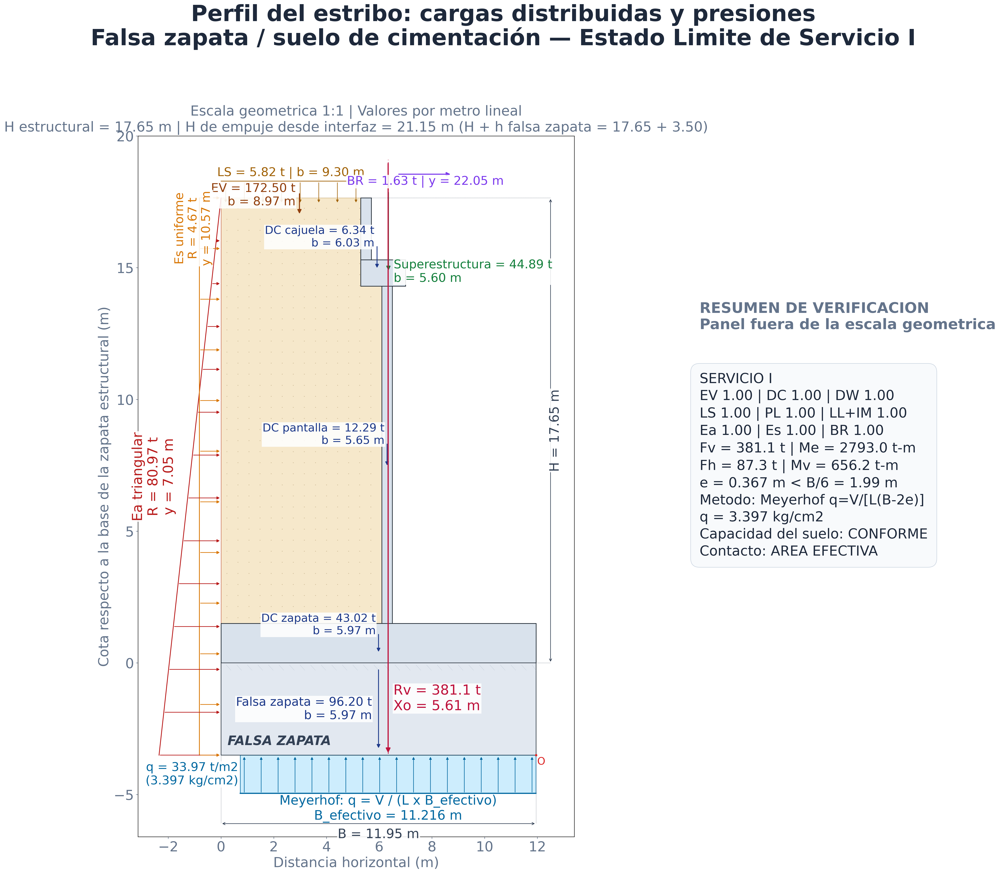
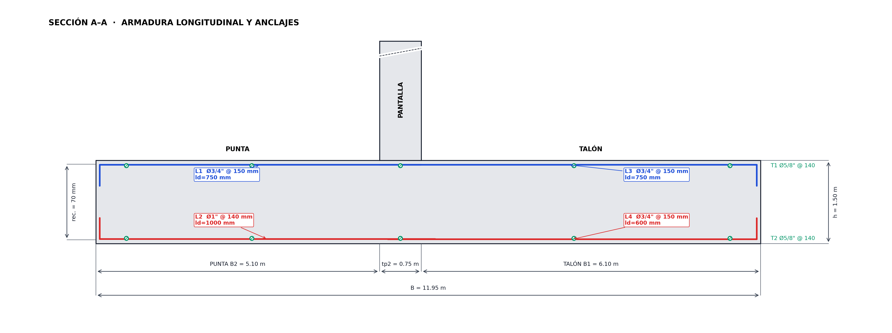
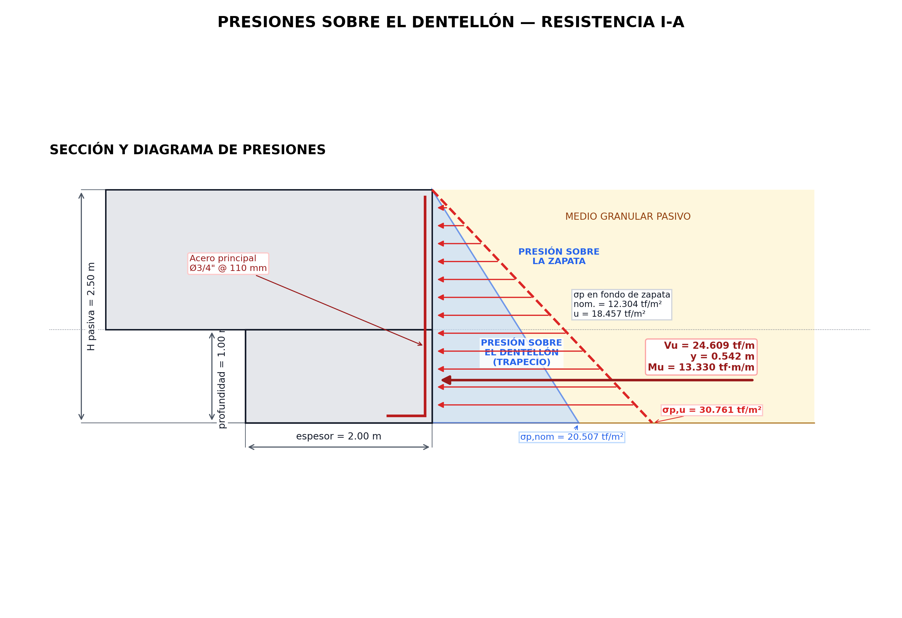

## MEMORIA DE CÁLCULO CALC-EST-2026-001-R01

### Estabilidad del estribo, diseño de la zapata y diseño del dentellón

**Proyecto:** Creación de los servicios de transitabilidad mediante Puente Molinohuayco, distrito de Chilcas, provincia de La Mar, departamento de Ayacucho  
**CUI:** 2508483  
**Elemento:** cimentación del estribo derecho  
**Estado del documento:** preliminar, para consulta técnica y pronunciamiento del Proyectista  
**Revisión:** R01  
**Fecha:** 17/07/2026  
**Sistema de unidades:** tf, m, tf·m, kgf/cm² y cm²/m  
**Elaborado por:** Ing. Paolo De la Calle — Especialista de Estructuras  

### A3.1. Objeto

Verificar preliminarmente la estabilidad del estribo frente a excentricidad, deslizamiento y presiones de contacto; diseñar por flexión y cortante unidireccional la zapata estructural; y verificar por flexión, corte y corte-fricción un dentellón rectangular propuesto. El cálculo se desarrolla por una franja de 1.00 m de longitud del estribo, salvo donde se indica la longitud total de 6.00 m para el detallado.

### A3.2. Verificación de cargas de superestructura

Se presenta a continuación la comparación entre las cargas provenientes del Anexo 3 (Cuadros Nº 40 y 41 de la Memoria de Cálculo del ETT) y las obtenidas mediante un metrado independiente de la superestructura, con la geometría y parámetros contractuales verificados.

Las reacciones corresponden a un estribo para un ancho de tablero de 6.00 m y una luz de 50.00 m.

#### A3.2.1. Reacciones totales por estribo

| Carga | Metrado independiente (tf) | Anexo 3 / ETT (tf) | Diferencia (tf) | Diferencia (%) | Nota |
|:---|---:|---:|---:|---:|:-----|
| DC (peso propio) | 155.90 | 146.58 | −9.32 | −6.0% | El metrado independiente da mayor peso propio |
| DW (superficie de rodadura) | 17.25 | 17.28 | +0.03 | +0.2% | Prácticamente igual |
| PL (carga peatonal) | 18.50 | 18.00 | −0.50 | −2.7% | Diferencia menor (0.370 vs 0.360 tf/m²) |
| LL+IM (sobrecarga vehicular) | 77.71 | 80.19 | +2.48 | +3.2% | El Anexo 3 da mayor sobrecarga |
| BR (frenado) | 9.80 | 20.05 | +10.25 | +104.6% | **Diferencia significativa** |

#### A3.2.2. Cargas por metro de ancho de estribo

| Carga | Metrado independiente (tf/m) | Anexo 3 / ETT (tf/m) | Diferencia (tf/m) |
|:---|---:|---:|---:|
| DC | 25.98 | 24.43 | −1.55 |
| DW | 2.88 | 2.88 | 0.00 |
| PL | 3.08 | 3.00 | −0.08 |
| LL+IM | 12.95 | 13.37 | +0.42 |
| BR | 1.63 | 3.34 | +1.71 |

#### A3.2.3. Desglose de discrepancias

**DC (Carga permanente).** El metrado independiente descompone la carga permanente en los siguientes componentes por metro lineal:

- Losa (6.00 × 0.20 × 2.40): 2.880 tf/m
- Veredas (2.00 × 0.20 × 2.40): 0.960 tf/m
- Vigas (3 × 0.07115 × 7.85): 1.676 tf/m
- Diafragmas (9 líneas): 0.121 tf/m
- Barandas (2 × 0.300): 0.600 tf/m
- **Total w_DC: 6.236 tf/m**
- **Reacción: 6.236 × 50 / 2 = 155.90 tf**

El Anexo 3 reporta 163.86 tf (DC+DW), de donde se deduce DC = 163.86 − 17.28 = 146.58 tf. La diferencia de +6.4 % del metrado independiente sugiere que el Anexo 3 podría no incluir la totalidad de componentes menores (diafragmas, barandas, veredas).

**DW (Superficie de rodadura).** Ambos valores son prácticamente coincidentes: 0.075 × 4.00 × 2.30 × 50 / 2 = 17.25 tf.

**PL (Carga peatonal).** El metrado independiente emplea 2.00 × 0.370 × 50 / 2 = 18.50 tf, mientras que el Anexo 3 utiliza 0.36 tf/m², resultando 18.00 tf. Diferencia menor (−2.7 %).

**LL+IM (Sobrecarga vehicular).** El metrado independiente con vehículo HL-93 + IM 1.33 + FPM 1.20 arroja 77.71 tf; el Anexo 3 reporta 80.19 tf (+3.2 %). La diferencia puede deberse a factores de presencia múltiple o posición vehicular distintos.

**BR (Frenado).** Discrepancia significativa: 9.80 tf (metrado independiente, 1 carril + FPM 1.20) vs. 20.05 tf (Anexo 3, +104.6 %). Este valor debe conciliarse, pues puede deberse a la consideración de 2 carriles de diseño o a un factor adicional no documentado en el ETT.

#### A3.2.4. Impacto en el análisis de subestructura

Si se emplearan los valores del metrado independiente en lugar de los del Anexo 3:

| Efecto | Sentido |
|:-------|:--------|
| Mayor DC (+9.32 tf/estribo) | Aumenta estabilización vertical y fricción → favorable |
| PL similar (−0.50 tf) | Despreciable |
| Menor LL+IM (−2.48 tf) | Reduce efecto desestabilizador → favorable |
| Menor BR (−10.25 tf) | **Reduce significativamente** las fuerzas horizontales desestabilizadoras → favorable |

**Conclusión:** las cargas del metrado independiente resultan en verificaciones de estabilidad más favorables que las del Anexo 3, excepto por el mayor DC que requeriría verificar capacidad portante. La discrepancia de BR debe resolverse antes del diseño definitivo.

#### A3.2.5. Resumen gráfico

*Figura A3-5 — Comparación gráfica de las reacciones totales por estribo según el metrado independiente y el Anexo 3 del ETT.*

### A3.3. Hipótesis y modelo

- Análisis bidimensional por metro lineal del estribo.
- Resultante vertical y momentos referidos a la arista inferior de la punta.
- Distribución lineal elástica de presiones cuando la resultante queda dentro del núcleo central.
- La zapata estructural se idealiza como dos voladizos empotrados en las caras de la pantalla.
- El peso propio, el relleno y la sobrecarga sobre el talón actúan hacia abajo; la reacción de contacto actúa hacia arriba.
- La interfaz superior corresponde a zapata estructural–falsa zapata; la inferior, a falsa zapata–suelo.
- El dentellón se idealiza como voladizo vertical continuo, empotrado en la zapata y solicitado por presión pasiva de un medio granular drenado.
- El modelo no representa contrafuertes ni concentraciones tridimensionales. La falsa zapata se trata como cuerpo rígido para estabilidad; su flexión, corte y punzonamiento no quedan verificados.

### A3.4. Estados límite y combinaciones

El modelo evalúa Servicio I, Resistencia I-a, Resistencia I-b y Evento Extremo I. La forma general es:

$$
Q=\sum_i \eta_i\gamma_i Q_i
$$

| Acción | Servicio I | Resistencia I-a | Resistencia I-b | Evento Extremo I |
|---|---:|---:|---:|---:|
| EV | 1.00 | 1.00 | 1.35 | 1.00 |
| DC | 1.00 | 0.90 | 1.25 | 0.90 |
| DW | 1.00 | 0.65 | 1.50 | 0.65 |
| PL | 1.00 | 1.75 | 1.75 | 0.00 |
| LL+IM | 1.00 | 1.75 | 1.75 | 0.00 |
| LS | 1.00 | 1.75 | 1.75 | 0.00 |
| BR | 1.00 | 1.75 | 1.75 | 0.00 |
| $E_a$ | 1.00 | 1.50 | 1.50 | 1.00 |
| $E_s$ | 1.00 | 1.75 | 1.75 | 1.00 |
| EQ | 0.00 | 0.00 | 0.00 | 1.00 |
| $\Delta E_{as}$ | 0.00 | 0.00 | 0.00 | 1.00 |

> Los factores se presentan a modo de propuesta y deben ser validados contra la normativa y edición contractuales del proyecto.

### A3.5. Verificación de estabilidad

#### A3.5.1. Procedimiento

La posición de la resultante vertical, la excentricidad y las presiones en bordes se obtienen mediante:

$$
x_R=\frac{M_e-M_v}{V}
$$

$$
e=\left|x_R-\frac{B}{2}\right|
$$

$$
q_{max,min}=\frac{V}{B}\left(1\pm\frac{6e}{B}\right)
$$

La condición de contacto total del modelo lineal es:

$$
e\leq\frac{B}{6}=\frac{11.95}{6}=1.992\ \text{m}
$$

La resistencia al deslizamiento por fricción se expresa como:

$$
Q_R=\phi_{des}\,\mu\,V
$$

y se comprueba $F_h\leq Q_R$. Para Servicio I se compara la presión con $q_{adm}=3.67$ kgf/cm²; en estados factorizados debe compararse con la resistencia geotécnica factorizada correspondiente.

#### A3.5.2. Interfaz 1: zapata estructural–falsa zapata

| Estado límite | $V$ (tf/m) | $M_e$ (tf·m/m) | $F_h$ (tf/m) | $M_v$ (tf·m/m) | $e$ (m) | $Q_R$ (tf/m) | $F_h/Q_R$ | $q_{max}$ (kgf/cm²) | Resultado |
|---|---:|---:|---:|---:|---:|---:|---:|---:|---|
| Servicio I | 220.12 | 1628.08 | 29.89 | 138.18 | 0.794 | 132.07 | 0.226 | 2.576 | Conforme |
| Resistencia I-a | 226.90 | 1677.65 | 45.90 | 216.40 | 0.465 | 115.72 | 0.397 | 2.342 | Conforme |
| Resistencia I-b | 297.73 | 2206.64 | 45.90 | 216.40 | 0.710 | 151.84 | 0.302 | 3.380 | Conforme |
| Evento Extremo I | 188.66 | 1435.66 | 54.52 | 258.96 | 0.262 | 113.20 | 0.482 | 1.786 | Conforme |

La máxima relación de deslizamiento es 0.482 en Evento Extremo I. Todas las excentricidades son menores que $B/6$. La presión máxima reportada es 3.380 kgf/cm² en Resistencia I-b; esta conclusión pertenece a la interfaz de concreto y al criterio implementado por el agente, no reemplaza la verificación de compresión y transferencia de corte de una junta realmente ejecutada.

*Figura A3-3 — Presiones de contacto en la interfaz zapata estructural–falsa zapata para la combinación Servicio I.*

#### A3.5.3. Interfaz 2: falsa zapata–suelo

| Estado límite | $V$ (tf/m) | $M_e$ (tf·m/m) | $F_h$ (tf/m) | $M_v$ (tf·m/m) | $e$ (m) | $Q_R$ (tf/m) | $F_h/Q_R$ | $q_{max}$ (kgf/cm²) | Resultado de capacidad |
|---|---:|---:|---:|---:|---:|---:|---:|---:|---|
| Servicio I | 318.44 | 2215.61 | 49.36 | 284.81 | 0.088 | 175.14 | 0.282 | 2.705 | Conforme con $q_{adm}=3.67$ |
| Resistencia I-a | 315.39 | 2206.43 | 75.31 | 440.71 | 0.376 | 147.44 | 0.511 | 2.816 | Pendiente: falta capacidad factorizada |
| Resistencia I-b | 420.64 | 2941.05 | 75.31 | 440.71 | 0.031 | 196.65 | 0.383 | 3.538 | Pendiente: falta capacidad factorizada |
| Evento Extremo I | 277.15 | 1964.43 | 102.26 | 588.10 | 1.009 | 152.43 | 0.671 | 2.791 | Pendiente: falta capacidad factorizada |

El deslizamiento y la excentricidad resultan conformes en los cuatro casos del modelo. La comprobación de capacidad portante queda cerrada solamente para Servicio I; no es técnicamente válido comparar directamente demandas factorizadas de Resistencia I o Evento Extremo I con una capacidad admisible de servicio.

*Figura A3-4 — Presiones de contacto en la interfaz falsa zapata–suelo para la combinación Servicio I.*

### A3.6. Diseño estructural de la zapata — NTE E.060

#### A3.6.1. Modelo y ecuaciones

El peralte efectivo conservador empleado es:

$$
d=h_z-c-\frac{d_b}{2}
=1.500-0.070-\frac{0.034925}{2}
=1.4125\ \text{m}
$$

Para cada voladizo, la presión lineal se integra desde el borde hasta la cara de la pantalla. El momento neto se obtiene restando las acciones descendentes a la reacción ascendente:

$$
M_u=\left|\int q_u(x)\,|x-x_c|\,dx-M_{desc,u}\right|
$$

$$
V_u=\left|\int_{\text{borde}}^{x_c-d}q_u(x)\,dx-V_{desc,u}\right|
$$

Para flexión simple:

$$
\phi M_n\geq M_u,\qquad
M_n=A_s f_y\left(d-\frac{a}{2}\right),\qquad
a=\frac{A_s f_y}{0.85f'_c b}
$$

Para cortante unidireccional se emplea:

$$
\phi V_c=\phi\,0.17\sqrt{f'_c}\,b_wd
$$

con $f'_c$ en MPa y $\phi=0.85$. Este factor debe confirmarse contra la edición contractual de la NTE E.060 antes de la emisión definitiva.

#### A3.6.2. Demandas y verificación de cortante

| Caso | Zona | $q$ borde/cara (tf/m²) | $M_u$ firmado (tf·m/m) | Cara traccionada | $A_{s,calc}$ (cm²/m) | $V_u$ (tf/m) | $\phi V_c$ (tf/m) | D/C |
|---|---|---:|---:|---|---:|---:|---:|---:|
| Resistencia I-a | Punta | 14.554 / 18.338 | 163.541 | Inferior | 31.239 | 46.764 | 109.065 | 0.429 |
| Resistencia I-a | Talón | 23.420 / 18.894 | -34.131 | Superior | 6.418 | 10.317 | 109.065 | 0.095 |
| Resistencia I-b | Punta | 16.033 / 23.614 | 182.852 | Inferior | 35.011 | 52.634 | 109.065 | 0.483 |
| Resistencia I-b | Talón | 33.797 / 24.729 | -13.911 | Superior | 2.610 | 6.475 | 109.065 | 0.059 |
| Evento Extremo I | Punta | 13.711 / 15.483 | 143.859 | Inferior | 27.412 | 40.974 | 109.065 | 0.376 |
| Evento Extremo I | Talón | 17.864 / 15.744 | -87.442 | Superior | 16.548 | 23.019 | 109.065 | 0.211 |

La flexión de punta gobierna en Resistencia I-b con $M_u=182.852$ tf·m/m. El máximo D/C de cortante es 0.483, por lo que la zapata cumple el cortante unidireccional dentro del modelo bidimensional adoptado.

#### A3.6.3. Refuerzo envolvente

| Zona | Cara | Caso gobernante | $A_{s,diseño}$ | Refuerzo | $A_{s,prov}$ | Provisión/demanda |
|---|---|---|---:|---|---:|---:|
| Punta | Superior | Mínimo | 18.000 cm²/m | Ø3/4\" @ 150 mm | 19.002 cm²/m | 1.056 |
| Punta | Inferior | Resistencia I-b | 35.011 cm²/m | Ø1\" @ 140 mm | 36.193 cm²/m | 1.034 |
| Talón | Superior | Evento Extremo I | 18.000 cm²/m | Ø3/4\" @ 150 mm | 19.002 cm²/m | 1.056 |
| Talón | Inferior | Mínimo | 18.000 cm²/m | Ø3/4\" @ 150 mm | 19.002 cm²/m | 1.056 |

El refuerzo transversal de distribución, en ambas caras, es Ø5/8\" @ 140 mm, con $A_{s,prov}=14.138$ cm²/m frente a $A_{s,req}=13.500$ cm²/m. El acero mínimo total considerado es 27.000 cm²/m.

#### A3.6.4. Desarrollo y empalmes

| Marca | Zona/cara | Barra | $l_d$ requerido | Longitud recta disponible | Traslape adoptado |
|---|---|---:|---:|---:|---:|
| L1 | Punta superior | Ø3/4\" | 749 mm | 6780 mm | 1000 mm |
| L2 | Punta inferior | Ø1\" | 951 mm | 6780 mm | 1250 mm |
| L3 | Talón superior | Ø3/4\" | 749 mm | 5780 mm | 1000 mm |
| L4 | Talón inferior | Ø3/4\" | 576 mm | 5780 mm | 750 mm |
| T1 | Transversal superior | Ø5/8\" | 624 mm | 2930 mm | 850 mm |
| T2 | Transversal inferior | Ø5/8\" | 480 mm | 2930 mm | 650 mm |

Los empalmes se clasifican como Clase B, con un máximo de 50 % de barras empalmadas dentro de la longitud de traslape. Su ubicación debe quedar fuera de las secciones de máximo momento y coordinarse con juntas, ganchos y armaduras de pantalla.

#### A3.6.5. Lámina de armado de la zapata

*Figura A3-1 — Armadura longitudinal, refuerzo transversal, anclajes y cotas de la zapata. La geometría representada corresponde a B = 11.95 m y no constituye plano de ejecución mientras no se concilie con campo.*

### A3.7. Diseño del dentellón — NTE E.060

#### A3.7.1. Geometría, pasivo y demanda

| Parámetro | Valor |
|---|---:|
| Espesor horizontal | 2.00 m |
| Profundidad vertical | 1.00 m |
| Longitud total | 6.00 m |
| Peralte efectivo de flexión | 1.9155 m |
| $K_p$ de Rankine | 4.5572 |
| Empuje pasivo nominal sobre el dentellón | 16.406 tf/m |

Para suelo granular drenado:

$$
K_p=\tan^2\left(45^\circ+\frac{\phi'}{2}\right)
=\tan^2\left(45^\circ+\frac{39.8^\circ}{2}\right)
=4.5572
$$

La presión pasiva se representa como:

$$
\sigma_p(z)=K_p(\gamma z+q)
$$

y las resultantes sobre el dentellón se obtienen integrando el tramo inferior de la ley de presiones:

$$
V_u=\int_0^h \sigma_{p,u}(z)\,dz,\qquad
M_u=\int_0^h \sigma_{p,u}(z)\,z\,dz
$$

#### A3.7.2. Contribución al deslizamiento

| Caso | $F_h$ (tf/m) | $Q_R$ sin dentellón (tf/m) | Déficit (tf/m) | $V_u$ dentellón (tf/m) | $M_u$ (tf·m/m) | $Q_R$ con dentellón (tf/m) | Resultado del modelo |
|---|---:|---:|---:|---:|---:|---:|---|
| Servicio I | 29.890 | 132.070 | 0.000 | 16.406 | 8.887 | 148.476 | Conforme |
| Resistencia I-a | 45.900 | 115.720 | 0.000 | 24.609 | 13.330 | 123.923 | Conforme |
| Resistencia I-b | 45.900 | 151.840 | 0.000 | 24.609 | 13.330 | 160.043 | Conforme |
| Evento Extremo I | 54.520 | 113.200 | 0.000 | 16.406 | 8.887 | 129.606 | Conforme |

En todos los casos $Q_R$ sin dentellón ya supera a $F_h$; por ello, el dentellón no es necesario para cerrar el deslizamiento del modelo actual. Su incorporación debe justificarse además por geometría, socavación, constructibilidad o criterio del Proyectista, sin sumar resistencia pasiva que no pueda movilizarse de manera compatible.

#### A3.7.3. Resistencia estructural

El caso gobernante es Resistencia I-a:

La zapata y el dentellón se ejecutarán en un solo vaciado monolítico, con barras verticales continuas a través del plano potencial de corte. Para corte-fricción se adopta $\mu=1.40$ para concreto colocado monolíticamente.

| Verificación | Demanda | Capacidad/provisión | D/C | Estado |
|---|---:|---:|---:|---|
| Flexión | $M_u=13.330$ tf·m/m | $\phi M_n=203.661$ tf·m/m | 0.065 | Cumple E.060 |
| Corte | $V_u=24.609$ tf/m | $\phi V_c=147.898$ tf/m | 0.166 | Cumple E.060 |
| Corte-fricción | $V_u=24.609$ tf/m | $\phi V_n=213.682$ tf/m | 0.115 | Cumple E.060 para vaciado monolítico |
| Desarrollo a ambos lados del plano potencial de corte | $l_d=576$ mm | Disponible: 1425 mm en zapata y 925 mm en dentellón | — | Cumple con barras continuas |

Armadura propuesta:

- Acero principal vertical, cara del pasivo: Ø3/4\" @ 100 mm.
- Acero vertical, cara opuesta: Ø3/4\" @ 200 mm.
- Distribución horizontal en cada cara: Ø3/4\" @ 150 mm.
- Las barras verticales serán continuas entre el dentellón y la zapata y actuarán también como acero de corte-fricción. El detalle debe mantener como mínimo 576 mm de desarrollo a cada lado del plano potencial de corte.

La verificación de las cuantías provistas es:

Para esta verificación, el dentellón se clasifica como losa estructural maciza de espesor uniforme. Conforme a los numerales 9.7 y 10.5.4 de la NTE E.060, se adopta $\rho_{min}=0.0018$ en cada dirección y, cuando el acero se distribuye en ambas caras, $\rho_{min}=0.0012$ en la cara traccionada por flexión.

| Refuerzo | Requerido | Provisto | Provisión/requerido | Estado |
|---|---:|---:|---:|---|
| Vertical principal, cara del pasivo | 24.000 cm²/m | 28.502 cm²/m | 1.188 | Cumple |
| Vertical total, ambas caras | 36.000 cm²/m | 42.753 cm²/m | 1.188 | Cumple |
| Horizontal, por cara | 18.000 cm²/m | 19.002 cm²/m | 1.056 | Cumple el criterio implementado |
| Horizontal total, losa estructural maciza | 36.000 cm²/m | 38.003 cm²/m | 1.056 | Cumple E.060 |

Para el corte-fricción, el acero vertical continuo que cruza el plano potencial de corte es $A_{vf}=28.502+14.251=42.753$ cm²/m. Con $\phi=0.85$, $\mu=1.40$ y $f_y=4200$ kgf/cm² se obtiene $\phi V_n=213.682$ tf/m y $D/C=0.115$. Las longitudes disponibles, 1425 mm dentro de la zapata y 925 mm dentro del dentellón, superan $l_d=576$ mm; por tanto, la transferencia por corte-fricción y el desarrollo de las barras cumplen para el detalle monolítico adoptado.

El armado vertical y el horizontal propuestos cumplen las cuantías mínimas correspondientes a una losa estructural maciza. Los espaciamientos de 100, 200 y 150 mm son menores que el límite de 400 mm establecido por la NTE E.060.

#### A3.7.4. Lámina de presiones y armado del dentellón

*Figura A3-2 — Distribución pasiva nominal y presión estructural del caso Resistencia I-a. Es un esquema de cálculo por metro lineal y no un detalle contractual de construcción.*

### A3.8. Resultados consolidados

| Componente/verificación | Resultado principal | Estado |
|---|---|---|
| Estabilidad, interfaz zapata–falsa zapata | Excentricidad y deslizamiento conformes en los cuatro casos; $q_{max}=3.380$ kgf/cm² | Conforme dentro del modelo; confirmar junta y factores |
| Estabilidad, interfaz falsa zapata–suelo | Excentricidad y deslizamiento conformes; Servicio I: $q_{max}=2.705<3.67$ kgf/cm² | Conforme dentro del modelo adoptado |
| Zapata estructural | Máximo $M_u=182.852$ tf·m/m; máximo D/C de corte = 0.483 | Cumple E.060 para B = 11.95 m y el modelo 2D |
| Dentellón | D/C: flexión 0.065, corte 0.166, corte-fricción 0.115; cuantías de losa y conexión monolítica conformes | Cumple estructuralmente; pendientes supuestos geotécnicos |
| Falsa zapata | Considerada como cuerpo rígido para estabilidad | Verificación conforme dentro del alcance del modelo adoptado |

### A3.9. Conclusiones

1. Para la geometría modelada de $B=11.95$ m, la estabilidad por excentricidad y deslizamiento resulta conforme en las interfaces analizadas. La capacidad portante de la interfaz inferior se comprueba únicamente en Servicio I, con $q_{max}=2.705$ kgf/cm² menor que $q_{adm}=3.67$ kgf/cm².
2. La zapata estructural cumple flexión y cortante unidireccional conforme a la NTE E.060. El armado gobernante es Ø1\" @ 140 mm en la cara inferior de la punta; el máximo D/C de cortante es 0.483.
3. El dentellón satisface flexión, corte y corte-fricción. El armado vertical propuesto, Ø3/4\" @ 100 mm en la cara del pasivo y Ø3/4\" @ 200 mm en la cara opuesta, proporciona 42.753 cm²/m frente al mínimo adoptado de 36.000 cm²/m. Para el vaciado monolítico, el corte-fricción presenta $D/C=0.115$ y el desarrollo de las barras cumple a ambos lados del plano potencial de corte. El D/C máximo de las verificaciones estructurales es 0.166 en corte.
4. Clasificando el dentellón como losa estructural maciza, el acero horizontal Ø3/4\" @ 150 mm en cada cara proporciona 38.003 cm²/m frente al mínimo de 36.000 cm²/m y cumple la NTE E.060. El cierre integral requiere confirmar las condiciones geométricas y geotécnicas documentadas como pendientes.

### A3.10. Cierre

Las verificaciones de estabilidad y de la zapata se mantienen dentro del alcance documentado. Las cuantías, la transferencia por corte-fricción y el desarrollo de las barras del dentellón cumplen para un vaciado monolítico; el cierre integral permanece sujeto a confirmar los supuestos geométricos y geotécnicos indicados en esta memoria.
