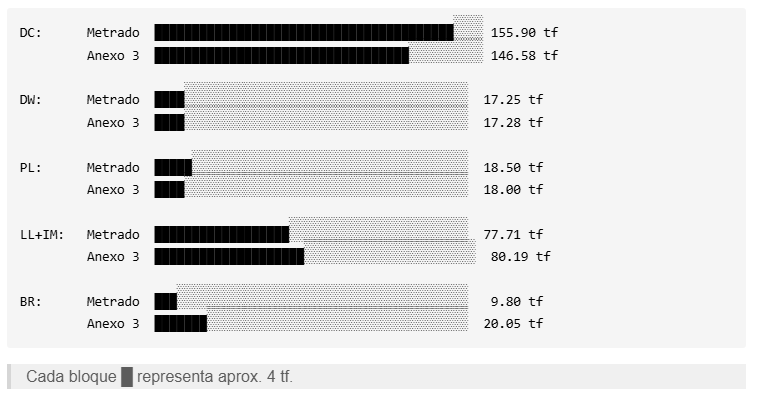
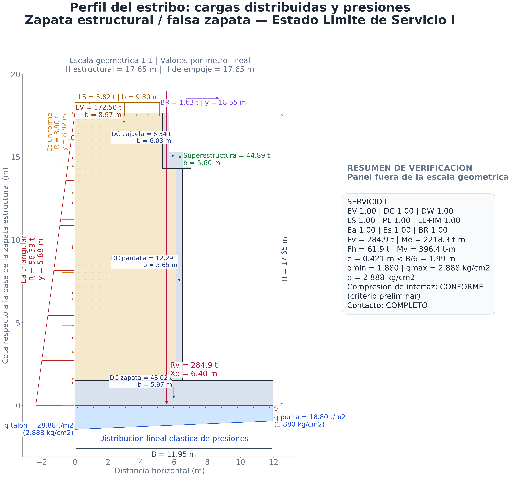
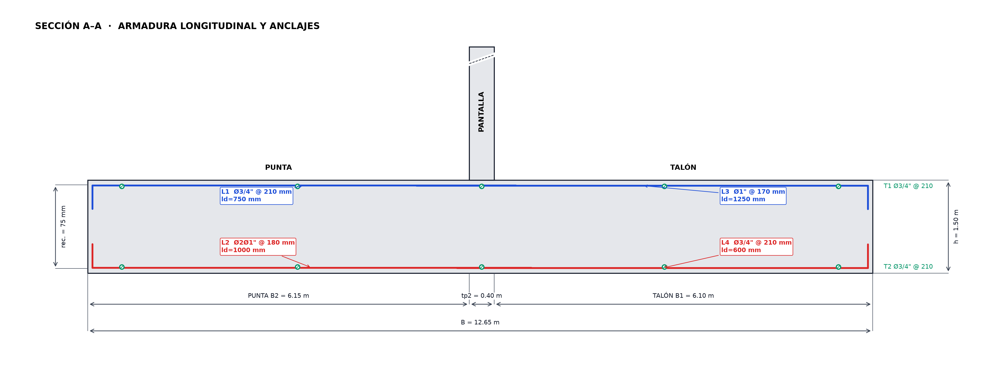
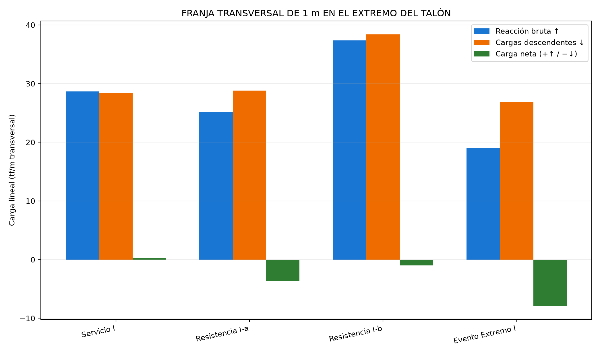
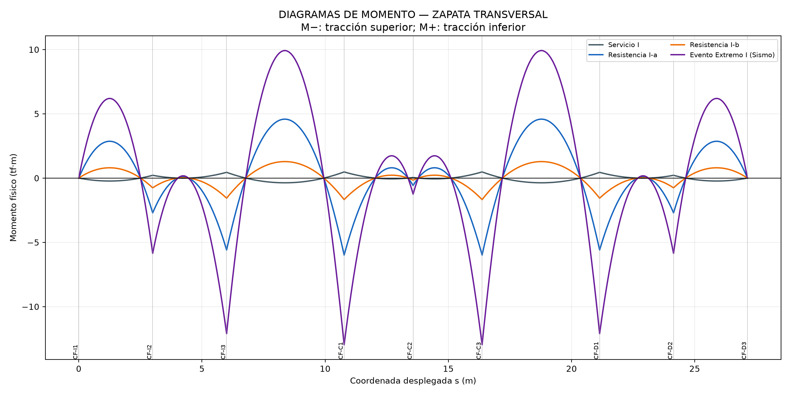
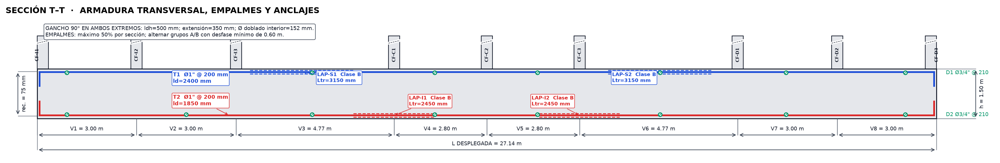
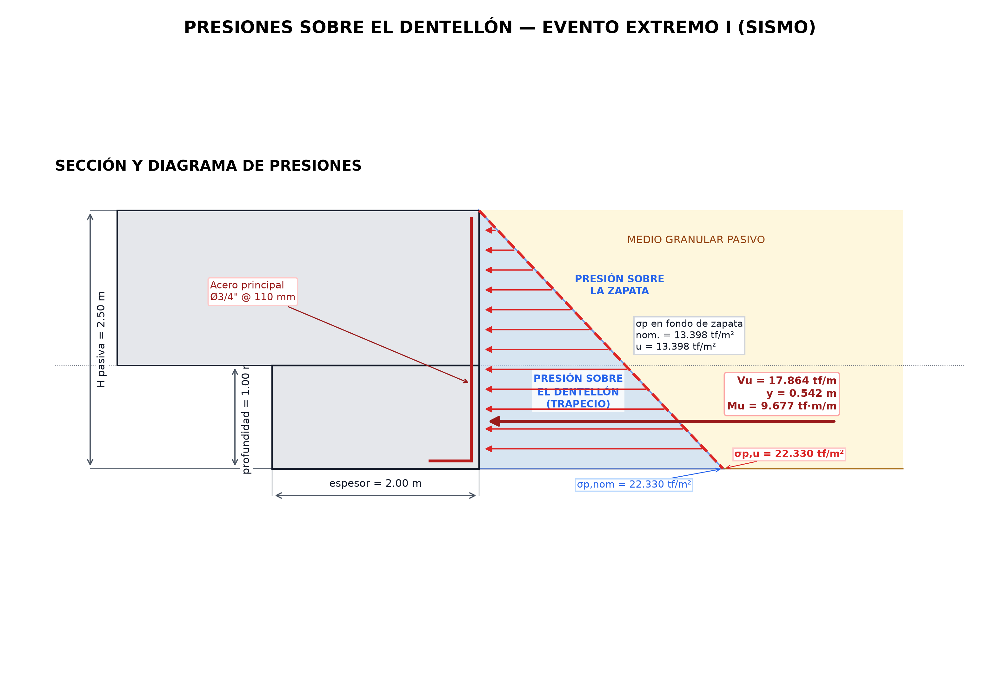
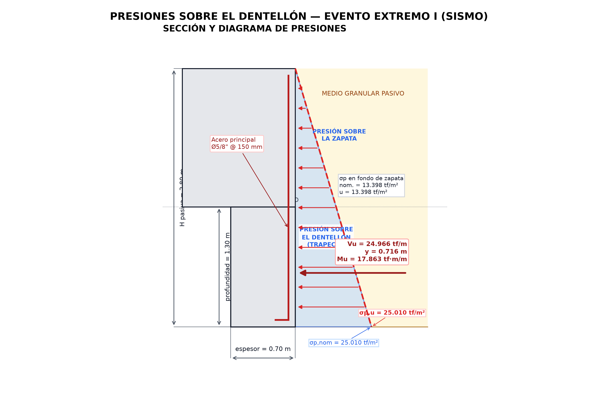

## MEMORIA DE CÁLCULO CALC-EST-2026-002-R00

### Estabilidad del estribo, diseño de zapata y diseño de dentellones en talón y punta — caso H = 14.65 m

**Proyecto:** Creación de los servicios de transitabilidad mediante Puente Molinohuayco, distrito de Chilcas, provincia de La Mar, departamento de Ayacucho
**CUI:** 2508483
**Elemento:** cimentación del estribo derecho
**Estado:** para emitir a la supervisión
**Revisión:** R00
**Fecha de actualización:** 19/08/2026
**Sistema de unidades:** tf, m, tf·m, kgf/cm² y cm²/m
**Elaborado por:** Ing. Paolo De la Calle — Especialista de Estructuras

### 1. Objeto y alcance

Verificar la estabilidad del estribo de altura total $H=14.65$ m, diseñar la zapata estructural en sus direcciones longitudinal y transversal por flexión y cortante, y documentar dos dentellones monolíticos: uno en el talón y otro en la punta. El cálculo longitudinal se desarrolla por una franja de 1.00 m de longitud del estribo; el cálculo transversal estudia el último metro del talón como viga continua desplegada sobre los contrafuertes.

Los resultados corresponden a la configuración vigente al 04/08/2026. Cualquier cambio posterior de geometría, materiales, cargas, interfaz o criterios de armado obliga a actualizar esta memoria.

### 2. Compatibilidad geométrica y alcance

| Comprobación | Desarrollo |
|---|---|
| Altura | $H=h_p+h_z=13.15+1.50=14.65$ m |
| Ancho de zapata | $B=B_2+t_{p2}+B_1=6.15+0.40+6.10=12.65$ m |
| Falsa zapata | $B_{fz}=12.65$ m; $h_{fz}=3.74$ m |
| Dentellón del talón | $t_{d,t}=2.00$ m; $h_{d,t}=1.00$ m |
| Dentellón de la punta | $t_{d,p}=0.70$ m; $h_{d,p}=1.30$ m |
| Longitud de los dentellones | $L_d=6.00$ m |
| Unidades | tf–m para acciones; kgf/cm² para esfuerzos |

### 3. Datos de entrada

| Símbolo | Descripción | Valor | Unidad |
|---|---|---:|---:|
| $H$ | Altura total del estribo | 14.65 | m |
| $h_p$ | Altura de pantalla | 13.15 | m |
| $h_z$ | Espesor de zapata | 1.50 | m |
| $B$ | Ancho total de zapata | 12.65 | m |
| $B_1$ | Talón | 6.10 | m |
| $B_2$ | Punta | 6.15 | m |
| $t_{p2}$ | Espesor inferior de pantalla | 0.40 | m |
| $B_{fz}$ | Ancho de falsa zapata | 12.65 | m |
| $h_{fz}$ | Altura de falsa zapata | 3.74 | m |
| $f'_c$ | Concreto de zapata y dentellones | 280 | kgf/cm² |
| $f_y$ | Acero de refuerzo | 4200 | kgf/cm² |
| $\gamma_r$ | Peso específico del relleno | 1.80 | tf/m³ |
| $\gamma_s$ | Peso específico del suelo de fundación GW | 1.96 | tf/m³ |
| $\phi'$ | Fricción del suelo de fundación GW | 39.8 | grados |
| $q_{adm}$ | Capacidad portante admisible | 3.67 | kgf/cm² |

#### 3.1. Cargas de superestructura

| Acción | Reacción total por estribo | Reacción por metro |
|---|---:|---:|
| DC | 155.90 tf | 25.98 tf/m |
| DW | 17.25 tf | 2.88 tf/m |
| PL | 18.50 tf | 3.08 tf/m |
| LL+IM | 77.71 tf | 12.95 tf/m |
| BR | 9.80 tf | 1.63 tf/m |

La reacción de frenado y los factores de combinación corresponden a la edición contractual del Manual de Puentes.

Como control de trazabilidad, la figura siguiente compara las reacciones totales por estribo del metrado independiente adoptado en esta memoria con los valores consignados en el Anexo 3 del ETT.

**Figura 3-1.** Comparación de las reacciones totales por estribo: metrado independiente adoptado en esta memoria frente al Anexo 3 del ETT.

### 4. Hipótesis y modelo

- Análisis bidimensional por metro lineal del estribo.
- Distribución lineal elástica de presiones en la interfaz zapata estructural–falsa zapata.
- Área efectiva de Meyerhof en la interfaz falsa zapata–suelo.
- Zapata idealizada como dos voladizos empotrados en las caras de la pantalla.
- Para el diseño transversal, el último metro del talón se idealiza como una viga continua de ocho vanos apoyada en los ejes de nueve contrafuertes; los apoyos restringen el desplazamiento vertical y permiten el giro.
- La carga transversal se considera uniforme a lo largo del desarrollo de 27.14 m y se obtiene descontando de la reacción bruta de contacto los pesos locales factorizados de zapata, relleno y sobrecarga.
- Falsa zapata idealizada como cuerpo rígido, sin vuelo respecto de la zapata estructural.
- Los contrafuertes se representan como apoyos rígidos en sus ejes. Su ancho real, la unión tridimensional contrafuerte–zapata y el punzonamiento no están representados.
- Estados calculados: Servicio I, Resistencia I-a, Resistencia I-b y Evento Extremo I.
- El dictamen de estabilidad se limita a Servicio I; las presiones de los estados factorizados se comparan con la resistencia geotécnica factorizada definida según la configuración contractual.
- Ambos dentellones se vaciarán conjuntamente con la zapata estructural, con barras verticales continuas que desarrollan $f_y$ dentro de ella. La falsa zapata corresponde a un vaciado anterior y constituye una interfaz distinta.

### 5. Verificación de estabilidad

La posición de la resultante y la excentricidad se calculan mediante:

$$
x_R=\frac{M_e-M_v}{V},\qquad e=\left|x_R-\frac{B}{2}\right|
$$

Para la interfaz superior:

$$
q_{max,min}=\frac{V}{B}\left(1\pm\frac{6e}{B}\right)
$$

Para la interfaz inferior se emplea el ancho efectivo de Meyerhof:

$$
B'=B-2e,\qquad q=\frac{V}{B'}
$$

#### 5.1. Interfaz zapata estructural–falsa zapata

| Estado | $V$ (tf/m) | $F_h$ (tf/m) | $e$ (m) | $q_{max}$ (kgf/cm²) | $q_{min}$ (kgf/cm²) | Dictamen |
|---|---:|---:|---:|---:|---:|---|
| Servicio I | 251.56 | 43.72 | 1.010 | 2.941 | 1.036 | Conforme |
| Resistencia I-a | 258.21 | 66.80 | 0.535 | 2.559 | 1.523 | Presión informativa |
| Resistencia I-b | 340.05 | 66.80 | 0.892 | 3.825 | 1.551 | Presión informativa |
| Evento Extremo I | 219.97 | 71.93 | 0.214 | 1.915 | 1.562 | Presión informativa |

En Servicio I, $e=1.010<B/6=2.108$ m, la resistencia por fricción es $Q_R=150.94$ tf/m y $Q_R/F_h=3.45$. La presión máxima de contacto es 2.941 kgf/cm². La zapata estructural se vaciará sobre la falsa zapata ya endurecida, cuya superficie no fue rugosizada intencionalmente; para esta interfaz se adopta $\mu=0.60$.

**Figura 5-1.** Cargas y presión de contacto en la interfaz zapata estructural–falsa zapata para Servicio I.

#### 5.2. Interfaz falsa zapata–suelo

| Estado | $V$ (tf/m) | $F_h$ (tf/m) | $e$ (m) | $B'$ (m) | $q$ (kgf/cm²) | Dictamen |
|---|---:|---:|---:|---:|---:|---|
| Servicio I | 355.64 | 66.91 | 0.138 | 12.374 | 2.874 | Conforme: $q<q_{adm}$ |
| Resistencia I-a | 351.89 | 101.79 | 0.497 | 11.656 | 3.019 | Conforme |
| Resistencia I-b | 470.15 | 101.79 | 0.020 | 12.610 | 3.728 | Conforme |
| Evento Extremo I | 313.65 | 125.86 | 1.197 | 10.256 | 3.058 | Conforme |

En Servicio I, $e=0.138<B/6=2.108$ m, $Q_R=195.60$ tf/m, $Q_R/F_h=2.92$ y $q=2.874<3.67$ kgf/cm². Las demandas de Resistencia I y Evento Extremo I se verifican contra la resistencia geotécnica factorizada correspondiente.

**Figura 5-2.** Cargas y presión de contacto mediante el área efectiva de Meyerhof en la interfaz falsa zapata–suelo para Servicio I.

### 6. Diseño estructural de la zapata

#### 6.1. Modelo y resistencia

En el sentido longitudinal se analiza una franja de 1.00 m, considerando la punta y el talón como voladizos empotrados en las caras de la pantalla. La reacción de contacto varía linealmente entre ambos extremos y las demandas se obtienen integrando dicha presión, descontando el peso de la zapata, el relleno y la sobrecarga que actúan en cada voladizo:

$$
q(x)=q_p+\frac{q_t-q_p}{B}x,\qquad
M_u=\left|M_{suelo}-M_{desc}\right|,\qquad
V_u=\left|V_{suelo}-V_{desc}\right|
$$

El peralte efectivo conservador es $d=1.3871$ m. La flexión se verifica con el bloque rectangular de compresión de la NTE E.060 y $\phi_f=0.90$; el acero requerido es el mayor entre el obtenido por flexión y el mínimo normativo:

$$
a=\frac{A_sf_y}{0.85f'_cb},\qquad
M_n=A_sf_y\left(d-\frac{a}{2}\right),\qquad
A_{s,req}=\max(A_{s,calc},A_{s,norm})
$$

Se adoptan los mínimos de los numerales 10.5.4 y 9.7 de la NTE E.060: $0.0012bh$ para cada armado longitudinal y $0.0009bh$ por cara para el acero transversal de retracción y temperatura. La suficiencia del armado se expresa mediante $D/C_{acero}=A_{s,req}/A_{s,disp}$.

El cortante unidireccional se revisa a una distancia $d$ de la cara de la pantalla, con $\phi_v=0.85$ y concreto de peso normal:

$$
V_c=0.17\sqrt{f'_c}\,b_wd,\qquad
D/C_V=\frac{V_u}{\phi_vV_c}\le1.00
$$

El detallado contempla desarrollo de barras rectas y con gancho, diámetros mínimos de doblado y empalmes Clase B conforme a la Tabla 12.1, los numerales 12.5 y 12.15 y la Tabla 7.1 de la NTE E.060. Las longitudes resultantes y el armado finalmente dispuesto se presentan en el ítem 6.3.

#### 6.2. Demandas

| Caso | Zona | $M_u$ firmado (tf·m/m) | Cara traccionada | $A_{s,calc}$ (cm²/m) | $V_u$ (tf/m) | $\phi V_c$ (tf/m) | D/C corte |
|---|---|---:|---|---:|---:|---:|---:|
| Resistencia I-a | Punta | 258.534 | Inferior | 50.960 | 66.406 | 107.101 | 0.620 |
| Resistencia I-a | Talón | -88.759 | Superior | 17.115 | 24.361 | 107.101 | 0.227 |
| Resistencia I-b | Punta | 277.884 | Inferior | 54.917 | 72.825 | 107.101 | 0.680 |
| Resistencia I-b | Talón | -67.139 | Superior | 12.911 | 20.542 | 107.101 | 0.192 |
| Evento Extremo I | Punta | 245.015 | Inferior | 48.208 | 62.149 | 107.101 | 0.580 |
| Evento Extremo I | Talón | -152.974 | Superior | 29.738 | 39.650 | 107.101 | 0.370 |

La punta inferior gobierna por flexión en Resistencia I-b. El cortante unidireccional máximo presenta D/C = 0.680, por lo que cumple dentro del modelo bidimensional.

#### 6.3. Armado propuesto y verificación de áreas

La presentación del armado adopta la misma estructura empleada para los dentellones. La relación D/C del acero es $A_{s,req}/A_{s,disp}$, con:

$$
A_{s,req}=\max\left(A_{s,calc},A_{s,norm}\right)
$$

En las caras sin demanda de flexión se dispone acero de retracción y temperatura, con $A_{s,norm}=13.500$ cm²/m por cara conforme a E.060 9.7. En las caras traccionadas se conserva el mayor valor entre la demanda de flexión y el mínimo aplicable de E.060 10.5.4.

| Armado | Caso gobernante | $A_{s,calc}$ | $A_{s,norm}$ | Control | $A_{s,req}$ | Refuerzo dispuesto | $A_{s,disp}$ | D/C acero | Estado |
|---|---|---:|---:|---|---:|---|---:|---:|---|
| Longitudinal — punta, cara superior | Temperatura | 0.000 cm²/m | 13.500 cm²/m | Retracción y temperatura E.060 9.7 | 13.500 cm²/m | Ø3/4\" @ 210 mm | 13.573 cm²/m | 0.995 | Cumple |
| Longitudinal — punta, cara inferior | Resistencia I-b | 54.917 cm²/m | 18.000 cm²/m | Demanda de flexión | 54.917 cm²/m | 2Ø1\" @ 180 mm | 56.301 cm²/m | 0.975 | Cumple |
| Longitudinal — talón, cara inferior | Temperatura | 0.000 cm²/m | 13.500 cm²/m | Retracción y temperatura E.060 9.7 | 13.500 cm²/m | Ø3/4\" @ 210 mm | 13.573 cm²/m | 0.995 | Cumple |

Los armados consignados cumplen por área. En la punta superior y el talón inferior gobierna el acero de retracción y temperatura. La cara superior del talón se verifica separadamente en el resumen general, donde se conserva el acero base de temperatura incrementado por la demanda de flexión de Evento Extremo I. El arreglo `2Ø1"` de la punta inferior corresponde a dos barras por posición dispuestas en dos capas, con separación libre vertical de 25 mm. El armado principal transversal se presenta separadamente en el ítem 6.4.

Las demandas, áreas de acero, capacidades y relaciones demanda/capacidad se consignan en las tablas precedentes y constituyen la base del detalle adoptado.

Las longitudes de desarrollo recto requeridas son 749 mm para Ø3/4\" superior, 951 mm para 2Ø1\" inferior en la punta, 1236 mm para Ø1\" superior en el talón y 576 mm para Ø3/4\" inferior. Los empalmes a tracción se consideran Clase B, con no más de 50 % de barras empalmadas dentro de la longitud de traslape; su ubicación definitiva debe quedar fuera de las secciones de máximo momento y definirse en planos.

#### 6.4. Diseño transversal en el extremo del talón

Se adopta la NTE E.060 aprobada por DS N.° 010-2009-VIVIENDA y el Manual de Puentes MTC 2018/AASHTO LRFD, conforme a los criterios de diseño del presente cálculo.

##### 6.4.1. Franja, cargas e idealización

Se verifica el último metro del talón, comprendido entre $x=11.65$ m y $x=12.65$ m. En la dirección transversal, esta franja se idealiza como una viga continua de 27.14 m sobre los nueve ejes de contrafuertes, con ocho vanos de 3.00, 3.00, 4.77, 2.80, 2.80, 4.77, 3.00 y 3.00 m.

La reacción ascendente corresponde a la integral de la presión lineal de contacto en la franja. La carga neta resulta de descontar el peso de la zapata, el relleno y la sobrecarga:

$$
w_{neta}=\int_{B-1}^{B}q(x)\,dx-
\left(W_{zapata}+W_{relleno}+W_{sobrecarga}\right)
$$

El signo positivo representa carga neta ascendente y el negativo, predominio de las acciones descendentes.

| Caso | $q_{inicio}$ | $q_{talón}$ | Reacción bruta | Zapata | Relleno | Sobrecarga | $w_{neta}$ |
|---|---:|---:|---:|---:|---:|---:|---:|
| Servicio I | 27.907 | 29.413 | 28.660 | 3.600 | 23.670 | 1.098 | +0.292 |
| Resistencia I-a | 24.773 | 25.592 | 25.183 | 3.240 | 23.670 | 1.921 | -3.649 |
| Resistencia I-b | 36.456 | 38.254 | 37.355 | 4.500 | 31.955 | 1.921 | -1.021 |
| Evento Extremo I | 18.875 | 19.154 | 19.014 | 3.240 | 23.670 | 0.000 | -7.896 |

Las presiones están en tf/m² y las demás magnitudes en tf/m transversal. El signo negativo indica que las acciones locales descendentes superan la reacción de contacto en la franja.

##### 6.4.2. Análisis matricial y envolventes

El análisis matricial restringe los desplazamientos verticales en los nueve apoyos y conserva libres los giros nodales. Con la rigidez $EI$ de la franja se resuelve el sistema $[K]\{\theta\}=\{F\}$ y se obtienen las envolventes de momentos positivos, momentos negativos y cortantes para cada estado límite. El equilibrio global de fuerzas y momentos, la simetría de la respuesta y la continuidad entre vanos se verifican como controles independientes; el error máximo de cierre es $2.27\times10^{-13}$ en las unidades internas del modelo.

| Caso | $w_{neta}$ (tf/m) | $M^+_{max}$ (tf·m) | $\vert M^- \vert_{max}$ (tf·m) | $\vert V \vert_{max}$ (tf) |
|---|---:|---:|---:|---:|
| Servicio I | +0.292 | 0.479 | 0.367 | 0.703 |
| Resistencia I-a | -3.649 | 4.586 | 5.992 | 8.786 |
| Resistencia I-b | -1.021 | 1.283 | 1.677 | 2.459 |
| Evento Extremo I | -7.896 | 9.922 | 12.966 | 19.011 |

Gobierna Evento Extremo I. La envolvente negativa alcanza $M_u^-=12.966$ tf·m en $s=16.370$ m, con tracción superior, y la envolvente positiva alcanza $M_u^+=9.922$ tf·m en $s=18.778$ m, con tracción inferior.

##### 6.4.3. Diseño, fisuración y detalle

El diseño transversal se efectúa independientemente para las caras superior e inferior, usando el peralte efectivo correspondiente y la envolvente de momentos positivos y negativos. La resistencia a flexión se determina con el bloque rectangular de compresión y $\phi_f=0.90$. El acero requerido es el mayor entre la demanda de flexión, el mínimo de la cara traccionada y el acero de contracción y temperatura exigidos por la NTE E.060 y el Manual de Puentes MTC:

$$
A_{s,req}=\max_{\mathrm{E.060,MTC}}\left\{A_{s,flex},A_{s,min},A_{s,temp}\right\},\qquad
D/C_{acero}=\frac{A_{s,req}}{A_{s,disp}},\qquad
D/C_{flex}=\frac{M_u}{\phi M_n}
$$

Se consideran específicamente los numerales 10.5.4 y 9.7 de la NTE E.060 y los numerales 2.9.1.4.4.2 y 2.9.1.4.5.8 del Manual de Puentes MTC. En Servicio I se controla el esfuerzo del acero y el espaciamiento por fisuración; para el espesor de 1.50 m se adopta además un máximo de 300 mm. El acero longitudinal de distribución se define con la condición más exigente de contracción y temperatura.

El cortante se verifica con las resistencias del concreto establecidas por ambas normas y se adopta la menor capacidad de diseño:

$$
\phi V_{c,diseño}=\min\left(\phi_{E.060}V_c^{E.060},\phi_{MTC}V_c^{MTC}\right),\qquad
D/C_V=\frac{V_u}{\phi V_{c,diseño}}\le1.00
$$

Las relaciones D/C de área de acero, resistencia a flexión y cortante se presentan separadamente para identificar con claridad el criterio gobernante.

| Armado | Caso gobernante | $A_{s,calc}$ | $A_{s,norm}$ | Control | $A_{s,req}$ | Refuerzo dispuesto | $A_{s,disp}$ | D/C acero | Estado |
|---|---|---:|---:|---|---:|---|---:|---:|---|
| Principal transversal — cara superior | Evento Extremo I | 2.432 cm²/m | 18.000 cm²/m | Mínimo de cara traccionada E.060 10.5.4 | 18.000 cm²/m | Ø1\" @ 200 mm | 25.335 cm²/m | 0.710 | Cumple |
| Principal transversal — cara inferior | Evento Extremo I | 1.861 cm²/m | 18.000 cm²/m | Mínimo de cara traccionada E.060 10.5.4 | 18.000 cm²/m | Ø1\" @ 200 mm | 25.335 cm²/m | 0.710 | Cumple |

| Verificación | Demanda | Capacidad | D/C | Estado |
|---|---:|---:|---:|---|
| Flexión, cara superior | $M_u=12.966$ tf·m | $\phi M_n=133.112$ tf·m | 0.097 | Cumple |
| Flexión, cara inferior | $M_u=9.922$ tf·m | $\phi M_n=133.112$ tf·m | 0.075 | Cumple |
| Cortante, Evento Extremo I | $V_u=19.011$ tf | $\phi V_c=101.470$ tf | 0.187 | Cumple; gobierna MTC/AASHTO |
| Fisuración | Envolvente de servicio | Límites E.060–MTC | — | Cumple |

Para el detallado se comparan las longitudes de desarrollo y de gancho obtenidas con la NTE E.060 y el Manual de Puentes MTC, adoptándose la mayor y redondeándola hacia arriba a 50 mm. Para las barras principales Ø1\", el desarrollo recto adoptado es 2400 mm en la cara superior y 1850 mm en la inferior. Los empalmes Clase B son 3150 mm y 2450 mm, respectivamente; se limita a 50 % el número de barras empalmadas en una misma sección mediante grupos alternados. En ambos extremos se disponen ganchos de 90° con longitud de desarrollo de 500 mm, extensión recta de 350 mm y diámetro interior de doblado de 152 mm.

El diseño transversal **cumple** conforme a los criterios de la NTE E.060 y del Manual de Puentes MTC, y su armado se compatibiliza con el acero longitudinal general de la zapata.

### 7. Dentellón del talón

#### 7.1. Acción pasiva y demanda

El dentellón del talón se modela como una losa vertical en voladizo de 2.00 m de espesor y 1.00 m de profundidad. El dentellón y la zapata estructural se vaciarán conjuntamente, pero se evalúa el dentellón por separado como una idealización conservadora. El conjunto se apoyará sobre la falsa zapata ya endurecida y no se atribuye acción compuesta a flexión a través de ese contacto.

Para el suelo de fundación GW:

$$
K_p=\tan^2\left(45^\circ+\frac{39.8^\circ}{2}\right)=4.5572
$$

La presión pasiva se prolonga desde la coronación de la zapata, a $z=1.50$ m, hasta la base del dentellón, a $z=2.50$ m. Con $\gamma=1.96$ tf/m³ y $q=0$, su integración produce:

$$
E_p=17.864\ \text{tf/m},\qquad
M_u=9.677\ \text{tf·m/m}
$$

La demanda estructural no se mayora por 1.50: se limita a la reacción pasiva nominal físicamente movilizable. Para la estabilidad se adopta $\phi_p=1.00$ en Servicio I, $\phi_p=0.50$ en Resistencia y $\phi_p=1.00$ en Evento Extremo I.

| Caso | $F_h$ (tf/m) | $Q_R$ sin dentellón (tf/m) | Déficit (tf/m) | $V_u$ dentellón (tf/m) | $M_u$ (tf·m/m) | $Q_R$ con dentellón (tf/m) | Estado |
|---|---:|---:|---:|---:|---:|---:|---|
| Servicio I | 43.720 | 150.940 | 0.000 | 17.864 | 9.677 | 168.804 | Cumple |
| Resistencia I-a | 66.800 | 131.687 | 0.000 | 17.864 | 9.677 | 140.619 | Cumple |
| Resistencia I-b | 66.800 | 173.425 | 0.000 | 17.864 | 9.677 | 182.358 | Cumple |
| Evento Extremo I | 71.930 | 131.982 | 0.000 | 17.864 | 9.677 | 149.846 | Cumple |

El deslizamiento cumple sin aporte del dentellón en todos los casos verificados. Servicio I se emplea únicamente para comprobar la estabilidad y no participa en la selección del caso de diseño resistente conforme a la NTE E.060. Resistencia I-a, Resistencia I-b y Evento Extremo I producen la misma demanda estructural máxima; se presenta Evento Extremo I como caso representativo gobernante por tener el mayor $F_h$.

#### 7.2. Armado y verificación

Para el dentellón del talón se aplican las mismas disposiciones de la NTE E.060 que para el dentellón de la punta. Para una franja de ancho $b=1.00$ m, las verificaciones de flexión y corte son:

$$
a=\frac{A_s f_y}{0.85f'_c b},
\qquad
M_n=A_s f_y\left(d-\frac{a}{2}\right),
\qquad
\phi_fM_n\ge M_u,
\quad \phi_f=0.90
$$

$$
V_c=0.17\lambda\sqrt{f'_c}\,b_wd,
\qquad
\phi_vV_c\ge V_u,
\quad \phi_v=0.85,
\quad \lambda=1.0
$$

En la ecuación de corte se emplean $f'_c$ en MPa y las dimensiones en mm, obteniéndose $V_c$ en N antes de convertirlo a tf/m. Para la transferencia de corte en la interfaz dentellón–zapata:

$$
V_n=\mu A_{vf}f_y,
\qquad
V_n\le\min\left(0.20f'_cA_c,\ (56\ \text{kgf/cm}^2)A_c\right),
\qquad
\phi_vV_n\ge V_u
$$

El dentellón y la zapata estructural se vaciarán conjuntamente; por ello, la transferencia dentellón–zapata se considera monolítica y se adopta $\mu=1.40$. El refuerzo vertical será continuo y desarrollará $f_y$ dentro de la zapata. Esta condición no corresponde al contacto zapata–falsa zapata, que constituye una interfaz distinta entre vaciados separados.

Las cuantías y el espaciamiento se controlan con:

$$
A_{s,min}=0.0018bh,
\qquad
A_{s,\mathrm{flex}}=0.0012bh,
\qquad
A_{s,\mathrm{dist}}=0.0009bh,
\qquad
100\ \text{mm}\le s\le400\ \text{mm}
$$

El acero proporcionado se obtiene de $A_{s,prov}=A_b(1000/s)$. Para $b=100$ cm y $h=200$ cm resultan 36.000 cm²/m como mínimo total de losa, 24.000 cm²/m como mínimo de la cara traccionada cuando el acero se divide y 18.000 cm²/m por cara para la distribución horizontal en dos caras.

De acuerdo con los numerales 9.7.4 y 10.5.4 de la NTE E.060, el mínimo total puede disponerse en una o dos caras. Para este dentellón de 2.00 m de espesor se adopta la opción de **dos caras**: en la dirección vertical se asignan 24.000 cm²/m ($\rho=0.0012$) a la cara traccionada y el saldo de 12.000 cm²/m ($\rho=0.0006$) a la cara opuesta, de modo que la suma conserva 36.000 cm²/m. En la dirección horizontal se reparte el mínimo total por mitades, resultando 18.000 cm²/m ($\rho=0.0009$) en cada cara. Para uniformizar el suministro y el detallado se restringe la selección a barras Ø3/4\" en todos los armados.

Para las barras seleccionadas, la longitud de desarrollo se verifica mediante:

$$
l_d=\max\left[
\frac{f_y}{\alpha_d\min\left(\sqrt{f'_c},8.3\right)}d_b,
\ 300\ \text{mm}
\right],
\qquad
\alpha_d=
\begin{cases}
2.6, & d_b\le19.05\ \text{mm}\\
2.1, & d_b>19.05\ \text{mm}
\end{cases}
$$

| Verificación | Demanda | Capacidad/provisión | D/C | Estado |
|---|---:|---:|---:|---|
| Flexión | $M_u=9.677$ tf·m/m | $\phi M_n=185.369$ tf·m/m | 0.052 | Cumple |
| Corte | $V_u=17.864$ tf/m | $\phi V_c=147.898$ tf/m | 0.121 | Cumple |
| Corte-fricción | $V_u=17.864$ tf/m | $\phi V_n=191.438$ tf/m | 0.093 | Cumple con barras continuas en la interfaz |
| Desarrollo en zapata | $l_d=576$ mm en ambas caras | 1425 mm disponibles | — | Cumple |

La relación D/C del acero es $A_{s,req}/A_{s,disp}$, donde $A_{s,req}$ es el mayor entre el acero calculado y el mínimo normativo asignado al armado correspondiente.

| Armado | $A_{s,calc}$ (cm²/m) | $A_{s,norm}$ asignado (cm²/m) | Control | $A_{s,req}$ (cm²/m) | Refuerzo dispuesto | $A_{s,disp}$ (cm²/m) | D/C acero | Estado |
|---|---:|---:|---|---:|---|---:|---:|---|
| Vertical, cara del pasivo | 1.337 | 24.000 | Mínimo de flexión en la cara traccionada | 24.000 | Ø3/4\" @ 110 mm | 25.911 | 0.926 | Cumple |
| Vertical, cara opuesta | 0.000 | 12.000 | Saldo del mínimo total de losa | 12.000 | Ø3/4\" @ 230 mm | 12.392 | 0.968 | Cumple |
| Horizontal, en cada cara | 0.000 | 18.000 | Mitad del mínimo total de losa | 18.000 | Ø3/4\" @ 150 mm | 19.002 | 0.947 | Cumple |

Las dos armaduras verticales proporcionan en conjunto $A_{vf}=38.303$ cm²/m y actúan además como acero de corte-fricción. El estado estructural y el estado general son **conformes**; el cálculo actualizado no deja verificaciones pendientes para cerrar el diseño del dentellón del talón.

### 8. Dentellón de la punta

#### 8.1. Acción pasiva y demanda

El dentellón de la punta se modela como una losa vertical en voladizo de 0.70 m de espesor y 1.30 m de profundidad. El dentellón y la zapata estructural se vaciarán conjuntamente, pero se evalúa el dentellón por separado como una idealización conservadora. El conjunto se apoyará sobre la falsa zapata ya endurecida y no se atribuye acción compuesta a flexión a través de ese contacto.

Para el suelo de fundación GW:

$$
K_p=\tan^2\left(45^\circ+\frac{39.8^\circ}{2}\right)=4.5572
$$

La presión pasiva se prolonga desde la coronación de la zapata, a $z=1.50$ m, hasta la base del dentellón, a $z=2.80$ m. Su integración produce:

$$
E_p=24.966\ \text{tf/m},\qquad
M_u=17.863\ \text{tf·m/m}
$$

La demanda estructural no se mayora por 1.50: se limita a la reacción pasiva nominal físicamente movilizable. Para la estabilidad se adopta $\phi_p=1.00$ en Servicio I, $\phi_p=0.50$ en Resistencia y $\phi_p=1.00$ en Evento Extremo I. Este último valor corresponde a la regla general de factores de resistencia para eventos extremos del Manual de Puentes MTC y AASHTO LRFD.

| Caso | $F_h$ (tf/m) | $Q_R$ sin dentellón (tf/m) | Déficit (tf/m) | $V_u$ dentellón (tf/m) | $M_u$ (tf·m/m) | $Q_R$ con dentellón (tf/m) | Estado |
|---|---:|---:|---:|---:|---:|---:|---|
| Servicio I | 43.720 | 150.940 | 0.000 | 24.966 | 17.863 | 175.906 | Cumple |
| Resistencia I-a | 66.800 | 131.687 | 0.000 | 24.966 | 17.863 | 144.170 | Cumple |
| Resistencia I-b | 66.800 | 173.425 | 0.000 | 24.966 | 17.863 | 185.908 | Cumple |
| Evento Extremo I | 71.930 | 131.982 | 0.000 | 24.966 | 17.863 | 156.948 | Cumple |

El deslizamiento cumple sin aporte del dentellón en todos los casos verificados. Servicio I se emplea únicamente para comprobar la estabilidad y no participa en la selección del caso de diseño resistente conforme a la NTE E.060. Resistencia I-a, Resistencia I-b y Evento Extremo I producen la misma demanda estructural máxima; se presenta Evento Extremo I como caso representativo gobernante por tener el mayor $F_h$.

#### 8.2. Armado y verificación

Para el dentellón de la punta se aplican las mismas disposiciones de la NTE E.060. Las verificaciones de flexión, corte y corte-fricción se expresan mediante:

$$
a=\frac{A_s f_y}{0.85f'_c b},
\qquad
M_n=A_s f_y\left(d-\frac{a}{2}\right),
\qquad
\phi_fM_n\ge M_u,
\quad \phi_f=0.90
$$

$$
V_c=0.17\lambda\sqrt{f'_c}\,b_wd,
\qquad
\phi_vV_c\ge V_u,
\quad \phi_v=0.85,
\quad \lambda=1.0
$$

En esta expresión se emplean $f'_c$ en MPa y las dimensiones en mm, obteniéndose $V_c$ en N antes de convertirlo a tf/m.

$$
V_n=\mu A_{vf}f_y,
\qquad
V_n\le\min\left(0.20f'_cA_c,\ (5.5\ \text{MPa})A_c\right),
\qquad
\phi_vV_n\ge V_u
$$

El dentellón y la zapata estructural se vaciarán conjuntamente; por ello, la transferencia dentellón–zapata se considera monolítica y se adopta $\mu=1.40$. Esta condición no corresponde al contacto zapata–falsa zapata, que constituye una interfaz distinta entre vaciados separados. El refuerzo vertical del dentellón será continuo y desarrollará $f_y$ dentro de la zapata.

Las cuantías y el espaciamiento se controlan con:

$$
A_{s,min}=0.0018bh,
\qquad
A_{s,\mathrm{tr}}\ge0.0012bh,
\qquad
A_{s,\mathrm{dist}}=0.0009bh,
\qquad
s\le\min(3h,400\ \text{mm})
$$

El acero proporcionado se obtiene de $A_{s,prov}=A_b(1000/s)$. Para $b=100$ cm y $h=70$ cm resultan 12.600 cm²/m por mínimo de losa, 8.400 cm²/m por mínimo de flexión y 6.300 cm²/m por distribución. El mínimo normativo gobernante es, por tanto, 12.600 cm²/m y se aplica completo a cada armado controlado, sin repartirlo entre caras. El desarrollo de las barras Ø5/8\" se verifica mediante la Tabla 12.1:

$$
l_d=\max\left[
\frac{\psi_t\psi_e f_y}{2.6\lambda\sqrt{f'_c}}d_b,
\ 300\ \text{mm}
\right]
$$

con $\psi_t=\psi_e=\lambda=1.0$ para las condiciones adoptadas.

| Verificación | Demanda | Capacidad/provisión | D/C | Estado |
|---|---:|---:|---:|---|
| Flexión | $M_u=17.863$ tf·m/m | $\phi M_n=30.199$ tf·m/m | 0.592 | Cumple |
| Corte | $V_u=24.966$ tf/m | $\phi V_c=47.645$ tf/m | 0.524 | Cumple |
| Corte-fricción | $V_u=24.966$ tf/m | $\phi V_n=131.907$ tf/m | 0.189 | Cumple con barras continuas en la interfaz |
| Desarrollo en zapata | $l_d=480$ mm | 1425 mm disponibles | — | Cumple |

La relación D/C del acero es $A_{s,req}/A_{s,disp}$, donde $A_{s,req}$ es el mayor entre el acero calculado y el mínimo normativo gobernante.

| Armado | $A_{s,calc}$ (cm²/m) | $A_{s,norm}$ gobernante (cm²/m) | Control | $A_{s,req}$ (cm²/m) | Refuerzo dispuesto | $A_{s,disp}$ (cm²/m) | D/C acero | Estado |
|---|---:|---:|---|---:|---|---:|---:|---|
| Vertical, cara del pasivo | 7.744 | 12.600 | Mínimo de losa | 12.600 | Ø5/8\" @ 150 mm | 13.196 | 0.955 | Cumple |
| Vertical, cara opuesta | 0.000 | 12.600 | Mínimo de losa | 12.600 | Ø5/8\" @ 150 mm | 13.196 | 0.955 | Cumple |
| Horizontal, en cada cara | 0.000 | 12.600 | Mínimo de losa | 12.600 | Ø5/8\" @ 150 mm | 13.196 | 0.955 | Cumple |

Las dos armaduras verticales proporcionan en conjunto $A_{vf}=26.392$ cm²/m y actúan además como acero de corte-fricción. El estado estructural y el estado general son **conformes**; el cálculo actualizado no deja verificaciones pendientes para cerrar el diseño del dentellón de la punta.

### 9. Control independiente y trazabilidad

Se verificaron los siguientes controles:

- compatibilidad $B=B_2+t_{p2}+B_1=12.65$ m y $H=h_p+h_z=14.65$ m;
- trazabilidad y verificabilidad de los resultados con la configuración vigente;
- equilibrio de resultantes y orden de magnitud de presiones en ambas interfaces;
- $B'=B-2e$ y $q=V/B'$ en la interfaz inferior;
- identificación de la cara traccionada de la zapata a partir del signo de $M_u$;
- integración de la presión en el último metro del talón y conciliación de la reacción bruta con las cargas locales descendentes;
- equilibrio de fuerzas y momentos, simetría y envolventes del modelo transversal de ocho vanos;
- verificación transversal de flexión, cortante, fisuración, cuantías mínimas, temperatura, desarrollo, anclajes y empalmes;
- comparación demanda/capacidad de flexión, corte y corte-fricción de ambos dentellones;
- separación entre la capacidad admisible de servicio y la resistencia geotécnica factorizada.

Las verificaciones pueden reconstruirse a partir de las ecuaciones, datos y criterios consignados en la presente memoria. Ambos dentellones se evaluaron con el mismo procedimiento de losa vertical en voladizo, la geometría correspondiente y el suelo granular drenado de fundación.

### 10. Resultados consolidados

| Componente | Resultado principal | Estado |
|---|---|---|
| Interfaz zapata–falsa zapata | Servicio I: $e=1.010<2.108$ m; $Q_R/F_h=3.45$; $q_{max}=2.941$ kgf/cm² | Conforme en Servicio I |
| Interfaz falsa zapata–suelo | Servicio I: $e=0.138<2.108$ m; $Q_R/F_h=2.92$; $q=2.874<3.67$ kgf/cm² | Conforme en Servicio I |
| Capacidad portante factorizada | Demandas de Resistencia I y Evento Extremo I verificadas contra la resistencia geotécnica factorizada | Conforme |
| Zapata, dirección longitudinal | $M_{u,max}=277.884$ tf·m/m; D/C máximo: acero 0.998 y corte 0.680 | Cumple E.060 en el modelo 2D |
| Zapata, dirección transversal | $M_u^-=12.966$ tf·m; $M_u^+=9.922$ tf·m; Ø1\" @ 200 mm en ambas caras; D/C máximo: acero 0.710, flexión 0.097 y corte 0.187 | Cumple E.060–MTC |
| Dentellón del talón | $M_u=9.677$ tf·m/m; D/C: flexión 0.052, corte 0.121 y corte-fricción 0.093; Ø3/4\" @ 110 mm en la cara traccionada, @ 230 mm en la opuesta y @ 150 mm horizontal en cada cara | Cumple E.060 |
| Dentellón de la punta | $M_u=17.863$ tf·m/m; D/C: flexión 0.592, corte 0.524 y corte-fricción 0.189; mínimo de losa gobierna y se dispone Ø5/8\" @ 150 mm en ambas caras y direcciones | Cumple E.060 |
| Falsa zapata | Tratada como cuerpo rígido, sin vuelo | Conforme para el modelo de estabilidad adoptado |

### 11. Conclusiones

1. La configuración del estribo es $H=14.65$ m, $B=12.65$ m, $B_1=6.10$ m, $B_2=6.15$ m, $t_{p2}=0.40$ m y $h_z=1.50$ m.
2. La estabilidad es conforme en Servicio I en ambas interfaces. En la interfaz superior se obtiene $q_{max}=2.941$ kgf/cm² y en la inferior $q=2.874<q_{adm}=3.67$ kgf/cm². La capacidad portante de los estados factorizados se verifica conforme contra la resistencia geotécnica factorizada.
3. En la dirección longitudinal, la zapata cumple flexión y cortante unidireccional dentro del modelo bidimensional. Gobierna la punta inferior en Resistencia I-b con $M_u=277.884$ tf·m/m y se dispone `2Ø1" @ 180 mm`. En la punta superior y el talón inferior se adopta Ø3/4\" @ 210 mm por retracción y temperatura. La cara superior del talón conserva Ø1\" @ 170 mm porque su demanda de flexión supera el mínimo de temperatura. Los máximos D/C son 0.998 para el área de acero dispuesta y 0.680 para cortante.
4. En la dirección transversal del último metro del talón gobierna Evento Extremo I, con $M_u^-=12.966$ tf·m y $M_u^+=9.922$ tf·m. Se dispone Ø1\" @ 200 mm en ambas caras, con $A_{s,disp}=25.335$ cm²/m. Los máximos D/C son 0.710 para el área de acero, 0.097 para resistencia a flexión y 0.187 para cortante.
5. El dentellón del talón de 2.00 × 1.00 m se evalúa con el mismo procedimiento empleado para el dentellón de la punta. Servicio I se reserva para estabilidad y la envolvente resistente considera Resistencia I y Evento Extremo I, con Evento Extremo I como caso representativo gobernante. Se adopta la distribución del mínimo en dos caras usando únicamente barras Ø3/4\": vertical @ 110 mm en la cara traccionada y @ 230 mm en la opuesta; horizontal @ 150 mm en cada cara. Las D/C son 0.052 en flexión, 0.121 en corte y 0.093 en corte-fricción. Cumple también el desarrollo y no quedan pendientes para cerrar el diseño.
6. El dentellón de la punta de 0.70 × 1.30 m trabaja monolíticamente con la zapata. Servicio I se reserva para estabilidad y la envolvente resistente considera Resistencia I y Evento Extremo I, con Evento Extremo I como caso representativo gobernante. El mínimo de losa de 12.600 cm²/m controla los tres armados y se dispone Ø5/8\" @ 150 mm en ambas caras y direcciones, con $A_{s,disp}=13.196$ cm²/m y D/C de acero igual a 0.955. Cumple flexión, corte, corte-fricción y desarrollo, sin pendientes para cerrar el diseño.
7. El deslizamiento no requiere el aporte pasivo de los dentellones en el modelo actual. Su empleo debe justificarse por geometría, socavación, constructibilidad u otro criterio del Proyectista, sin sumar resistencias incompatibles ni pasivo no movilizable.
8. Con las verificaciones descritas, la cimentación del estribo derecho queda en condiciones de emitirse a la supervisión para revisión y pronunciamiento.

### 12. Dictamen

La memoria se emite a la supervisión para su revisión y pronunciamiento. La estabilidad en Servicio I, la zapata en sus direcciones longitudinal y transversal, y la resistencia estructural de los dos dentellones resultan conformes dentro de los modelos indicados, con las reacciones, combinaciones, factores de resistencia y capacidad geotécnica factorizada definidos según la configuración contractual adoptada.
