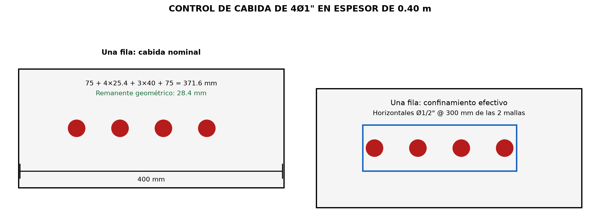
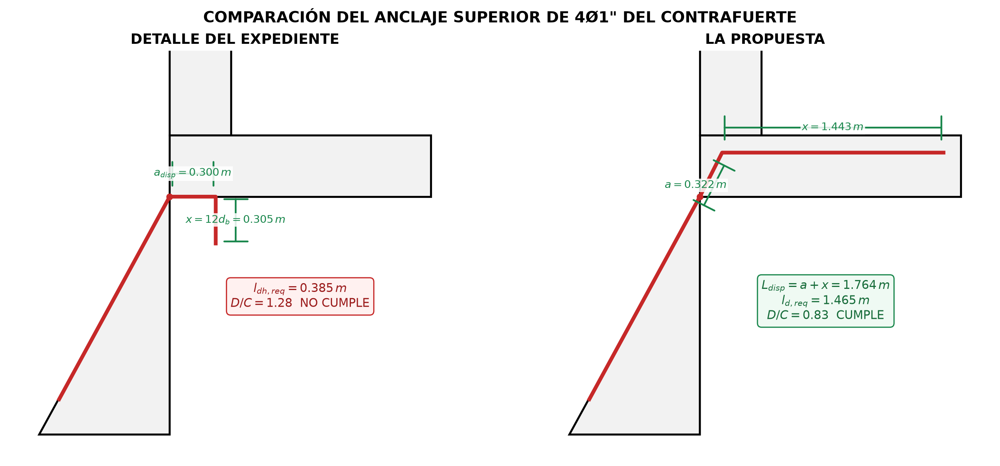

## MEMORIA DE CÁLCULO CALC-EST-2026-004-R00

### Verificación comparativa del anclaje superior de 4Ø1" del contrafuerte: detalle del expediente y propuesta

**Proyecto:** Creación de los servicios de transitabilidad mediante Puente Molinohuayco, distrito de Chilcas, provincia de La Mar, departamento de Ayacucho  
**CUI:** 2508483  
**Elemento:** encuentro superior contrafuerte-pantalla-cajuela del estribo derecho  
**Estado:** para evaluación técnica  
**Revisión:** R00  
**Fecha de actualización:** 27/08/2026  
**Sistema de unidades:** mm, cm, m, MPa, ksi y kN  
**Elaborado por:** Ing. Paolo De la Calle - Especialista de Estructuras

### 1. Resultado

La separación libre corregida de 40 mm entre las barras Ø1" **cumple** el mínimo de 38.1 mm exigido para concreto colocado in situ. La comparación del anclaje, evaluada para desarrollar la fluencia de las cuatro barras, produce el siguiente resultado:

| Alternativa | Longitud requerida | Longitud disponible | D/C | Estado |
|---|---:|---:|---:|---|
| Detalle del expediente: gancho de 90° dentro de la pantalla | 385 mm | 300 mm | 1.28 | No cumple para desarrollar las 4Ø1" a fluencia |
| La propuesta: prolongación dentro de la cajuela | 1465 mm | 1764 mm | 0.83 | Cumple |

El detalle del expediente puede resultar suficiente únicamente si se demuestra y documenta que no se requiere desarrollar la fluencia de las cuatro barras y se aplica la reducción por acero excedente. Usando el acero requerido de 11.38 cm² consignado en el cálculo del expediente y el acero provisto de 20.27 cm², el desarrollo del gancho se reduce a 216 mm y el detalle presenta D/C = 0.72. Esta comprobación condicionada no sustituye la verificación del modelo resistente ni autoriza a asumir una fuerza menor sin trazabilidad de cálculo.

Las cuatro barras Ø1" se consideran contenidas en el contrafuerte de 400 mm y dispuestas en una sola fila, con recubrimiento de 75 mm en ambas caras del contrafuerte. La cabida nominal de las barras resulta compatible con el espesor disponible y los horizontales Ø1/2" @ 300 mm de las dos mallas del contrafuerte se consideran correctamente detallados para confinarlas.

### 2. Objeto y alcance

Verificar el anclaje superior de cuatro barras Ø1" ubicadas en el lomo del contrafuerte y comparar:

- **Detalle del expediente:** las barras ingresan horizontalmente en la pantalla de 400 mm y terminan con gancho de 90° hacia abajo.
- **La propuesta:** las barras continúan inclinadas dentro de la cajuela y luego se prolongan horizontalmente hacia su extremo.

La memoria revisa separación, cabida, desarrollo recto, gancho estándar, recubrimiento y contribución del refuerzo transversal. No recalcula las solicitaciones globales del contrafuerte, la pantalla, la cajuela ni la zapata.

### 3. Documentos y criterios

- Manual de Puentes MTC 2018, artículos 2.6.5.6.1 y 2.6.5.6.2: desarrollo y anclaje del acero de refuerzo.
- Manual de Puentes MTC 2018, artículos 2.9.1.4.5.2 y 2.9.1.4.5.3: ganchos, diámetros de doblado y separación del refuerzo.
- Plano acotado del encuentro contrafuerte-pantalla-cajuela proporcionado para esta verificación.
- Anexo 4 del expediente técnico, diseño del estribo derecho, para la comprobación condicionada por acero excedente.

### 4. Datos

| Símbolo | Descripción | Valor |
|---|---|---:|
| $f'_c$ | Resistencia especificada del concreto | 280 kgf/cm² = 27.46 MPa = 3.983 ksi |
| $f_y$ | Fluencia del acero | 4200 kgf/cm² = 411.88 MPa = 59.74 ksi |
| $d_b$ | Diámetro de barra principal | 1.00 in = 25.4 mm |
| $n$ | Número de barras desarrolladas | 4 |
| $A_b$ | Área de una barra Ø1" | 5.067 cm² |
| $A_{s,prov}$ | Área de 4Ø1" | 20.27 cm² |
| $s_l$ | Separación libre entre barras | 40 mm |
| $d_{agg}$ | Tamaño máximo de agregado | 19.05 mm |
| $t_p$ | Espesor de pantalla | 400 mm |
| $c_{agua}$ | Recubrimiento en contacto con agua y abrasión | 100 mm |
| $c_{relleno}$ | Recubrimiento en contacto con relleno | 75 mm |
| $A_{tr}$ | Acero horizontal de las dos mallas: 2Ø1/2" | 2.534 cm² = 0.3927 in² |
| $s_{tr}$ | Separación del refuerzo transversal | 300 mm = 11.811 in |
| $h_c$ | Espesor vertical de la cajuela | 400 mm |
| $L_c$ | Vuelo de cajuela desde la cara de la pantalla | 1300 mm |
| $h_t$ | Altura disponible bajo la cajuela | 637 mm |

Se consideran barras sin recubrimiento epóxico y concreto de peso normal. Para la verificación principal no se aplica reducción por acero excedente.

### 5. Separación, cabida y confinamiento

#### 5.1 Separación mínima

Para concreto colocado in situ, la separación libre mínima es el mayor valor entre $1.5d_b$, $1.5d_{agg}$ y 38 mm:

$$
s_{min}=\max(1.5\times25.4,\ 1.5\times19.05,\ 38)=38.1\ \mathrm{mm}
$$

$$
s_l=40.0\ \mathrm{mm}>s_{min}=38.1\ \mathrm{mm}
$$

La separación libre **cumple**, con un margen de 1.9 mm.

#### 5.2 Cabida dentro del espesor

Si las cuatro barras se colocan en una sola fila dentro del contrafuerte, entre recubrimientos de 75 mm en ambas caras, el ancho ocupado por las barras y sus separaciones libres es:

$$
b_{ocup}=75+4(25.4)+3(40)+75=371.6\ \mathrm{mm}
$$

La cabida nominal de la fila **cumple geométricamente** dentro de los 400 mm, dejando:

$$
e_{res}=400-371.6=28.4\ \mathrm{mm}
$$

El remanente geométrico de 28.4 mm es compatible con el detallamiento adoptado. Se confirma que los refuerzos horizontales Ø1/2" @ 300 mm pertenecientes a las dos mallas del contrafuerte confinan efectivamente las cuatro barras, respetando el recubrimiento de 75 mm, la separación libre mínima y las tolerancias de ejecución. Por tanto, se mantiene la disposición en una sola fila y no se requiere adoptar dos capas.

**Figura 1.** Control de cabida de 4Ø1" en una fila dentro del contrafuerte de 400 mm y confinamiento transversal adoptado.

#### 5.3 Parámetro de recubrimiento y confinamiento

La separación entre centros es:

$$
s_{cc}=40+25.4=65.4\ \mathrm{mm}=2.575\ \mathrm{in}
$$

El parámetro $c_b$ es el menor entre la distancia del centro de la barra a la superficie más próxima y la mitad de la separación entre centros. Para el recubrimiento de 75 mm, la distancia desde el centro de la barra exterior a la cara del contrafuerte es $75+12.7=87.7$ mm; por tanto, controla la mitad de la separación entre centros:

$$
c_b=\frac{s_{cc}}{2}=32.7\ \mathrm{mm}=1.287\ \mathrm{in}
$$

Considerando que los refuerzos horizontales Ø1/2" de las dos mallas cruzan efectivamente el plano potencial de fisuración y proporcionan confinamiento transversal a las cuatro barras:

$$
K_{tr}=\frac{40A_{tr}}{s_{tr}n}
=\frac{40(0.3927)}{11.811(4)}
=0.332\ \mathrm{in}
$$

El modificador por recubrimiento y confinamiento resulta:

$$
\lambda_{rc}=\frac{d_b}{c_b+K_{tr}}
=\frac{1.000}{1.287+0.332}
=0.617
$$

El valor se encuentra dentro del intervalo normativo $0.40\le\lambda_{rc}\le1.00$. Esta reducción solo es válida porque el refuerzo horizontal de las dos mallas se detalla y construye atravesando la zona de las barras, proporcionando confinamiento transversal continuo a lo largo de la zona de desarrollo.

<!-- pagebreak -->

### 6. Longitudes normativas comunes

#### 6.1 Desarrollo recto en tracción

La longitud básica de desarrollo es:

$$
l_{db}=\frac{2.4d_bf_y}{\sqrt{f'_c}}
=\frac{2.4(1.000)(59.74)}{\sqrt{3.983}}
=71.84\ \mathrm{in}=1825\ \mathrm{mm}
$$

Con el confinamiento indicado:

$$
l_d=l_{db}\lambda_{rc}=1825(0.617)=1127\ \mathrm{mm}
$$

Para la propuesta se evalúa adicionalmente, de manera conservadora, el factor de ubicación 1.30:

$$
l_{d,adopt}=1.30(1127)=1465\ \mathrm{mm}
$$

#### 6.2 Gancho estándar de 90 grados

Para una barra Ø1" terminada en gancho estándar:

$$
l_{hb}=\frac{38d_b}{\sqrt{f'_c}}\left(\frac{f_y}{60}\right)
=\frac{38(1.000)}{\sqrt{3.983}}\left(\frac{59.74}{60}\right)
=18.96\ \mathrm{in}=481.5\ \mathrm{mm}
$$

Los recubrimientos superan 2.5 in lateralmente y 2.0 in sobre la extensión del gancho; por ello se aplica el modificador 0.80:

$$
l_{dh}=0.80l_{hb}=0.80(481.5)=385.2\ \mathrm{mm}
$$

No se aplica la reducción adicional por estribos de confinamiento del gancho. Para ella se exigiría una separación no mayor que:

$$
3d_b=3(25.4)=76.2\ \mathrm{mm}
$$

El espaciamiento existente de 300 mm excede ese límite. Además, el primer estribo debería quedar dentro de $2d_b=50.8$ mm respecto del exterior de la curva.

La geometría mínima del gancho es:

$$
x_{min}=12d_b=304.8\ \mathrm{mm}
$$

$$
D_{i,min}=6d_b=152.4\ \mathrm{mm}
$$

### 7. Verificación del detalle del expediente

El gancho se desarrolla horizontalmente desde la cara del trasdós de la pantalla hacia la cara expuesta al agua. Aun tomando favorablemente la distancia hasta la superficie de la barra:

$$
a_{disp}=t_p-c_{agua}=400-100=300\ \mathrm{mm}
$$

La longitud disponible es menor que la requerida:

$$
D/C_{exp}=\frac{l_{dh}}{a_{disp}}
=\frac{385.2}{300}=1.28>1.00
$$

La rama vertical puede cumplir la extensión de $12d_b$, pues la altura de 637 mm bajo la cajuela es mayor que 304.8 mm. Sin embargo, la rama vertical $x$ no se suma a la proyección $a$ para satisfacer $l_{dh}$; ambas condiciones deben cumplirse separadamente.

Por tanto, el detalle del expediente **no cumple para desarrollar a fluencia las cuatro barras Ø1"**.

#### 7.1 Comprobación condicionada por acero excedente

El cálculo del expediente consigna para el nivel superior $A_{s,req}=11.38$ cm² y dispone $A_{s,prov}=20.27$ cm². Si esta demanda se confirma, el modificador por acero excedente es:

$$
\lambda_{er}=\frac{A_{s,req}}{A_{s,prov}}
=\frac{11.38}{20.27}=0.561
$$

$$
l_{dh,red}=385.2(0.561)=216.3\ \mathrm{mm}
$$

El valor supera el mínimo conservador de $8d_b=203.2$ mm y resulta:

$$
D/C_{exp,red}=\frac{216.3}{300}=0.72<1.00
$$

Bajo esta condición, el detalle **cumple únicamente para la fuerza correspondiente al acero requerido**, pero no garantiza el desarrollo de la fluencia de las 4Ø1". Esta reducción deberá quedar expresamente vinculada a la demanda estructural aprobada.

### 8. Verificación de la propuesta

La pendiente del lomo se obtiene de la geometría del contrafuerte, con 9.80 m de altura y variación horizontal de $6.10-1.17=4.93$ m:

$$
\theta=\tan^{-1}\left(\frac{9.80}{4.93}\right)=63.30^\circ
$$

Se conserva 100 mm de recubrimiento superior y se mide la barra por su eje. La altura útil para el tramo inclinado dentro de la cajuela es:

$$
h_a=400-100-\frac{25.4}{2}=287.3\ \mathrm{mm}
$$

La longitud inclinada y su proyección horizontal son:

$$
a=\frac{h_a}{\sin\theta}
=\frac{287.3}{\sin63.30^\circ}
=321.6\ \mathrm{mm}
$$

$$
\Delta_h=\frac{h_a}{\tan\theta}
=144.5\ \mathrm{mm}
$$

La dimensión horizontal total desde la cara del trasdós hasta el extremo de la cajuela es $400+1300=1700$ mm. Por tanto, la prolongación horizontal disponible, medida hasta el eje del extremo de la barra, es:

$$
x=1700-144.5-100-\frac{25.4}{2}
=1442.8\ \mathrm{mm}
$$

Conservadoramente se desprecia la longitud adicional del arco de doblado:

$$
L_{disp}=a+x=321.6+1442.8=1764.4\ \mathrm{mm}
$$

La verificación con el factor de ubicación 1.30 es:

$$
D/C_{prop}=\frac{l_{d,adopt}}{L_{disp}}
=\frac{1465}{1764.4}=0.83<1.00
$$

La propuesta **cumple para desarrollar a fluencia las cuatro barras Ø1"**, siempre que los refuerzos horizontales Ø1/2" de las dos mallas crucen el plano de fisuración, proporcionen confinamiento transversal y se prolonguen en toda la zona de desarrollo. La solución se denomina cambio de dirección de la barra de aproximadamente $63.3^\circ$, correspondiente a la inclinación del lomo del contrafuerte; no se considera un gancho estándar de 90°.

El cambio de dirección se verifica como una barra continua con desarrollo recto, por lo que se utiliza $l_{d,adopt}=1465$ mm y no la longitud de desarrollo de gancho $l_{dh}=385$ mm. La longitud disponible se mide siguiendo el eje de la barra y resulta $L_{disp}=1764$ mm. El cambio de dirección deberá respetar un diámetro interior no menor que $6d_b=152.4$ mm y ser compatible con el procedimiento aprobado de doblado y colocación de barras.

**Figura 2.** Longitudes disponibles y condición de cumplimiento de las dos alternativas.

### 9. Comparación final

| Control | Detalle del expediente | La propuesta |
|---|---:|---:|
| Mecanismo | Gancho estándar de 90° | Desarrollo embebido prolongado en la cajuela |
| Longitud disponible principal | 300 mm | 1764 mm |
| Longitud requerida para 4Ø1" a fluencia | 385 mm | 1465 mm |
| D/C para fluencia | 1.28 | 0.83 |
| Extensión mínima del extremo | 305 mm | No gobierna como gancho estándar |
| Diámetro interior mínimo | 152 mm | 152 mm en el cambio de dirección |
| Dependencia de reducción por acero excedente | Sí, para cumplir | No |
| Estado principal | No cumple | Cumple |

### 10. Conclusiones y detalle requerido

1. La separación libre de 40 mm cumple el mínimo MTC de 38.1 mm.
2. Las cuatro barras Ø1" caben en una sola fila dentro del contrafuerte de 400 mm con recubrimiento de 75 mm en ambas caras y separación libre de 40 mm: el ancho ocupado es 371.6 mm y queda un remanente geométrico de 28.4 mm. Los refuerzos horizontales Ø1/2" @ 300 mm de las dos mallas confinan efectivamente las barras, por lo que no se requiere disponerlas en dos capas.
3. El detalle del expediente dispone 300 mm para un gancho que requiere 385 mm a fin de desarrollar la fluencia de las cuatro barras; presenta D/C = 1.28 y no cumple bajo ese criterio.
4. La rama vertical de 305 mm del gancho del expediente puede colocarse, pero no compensa la insuficiencia de la proyección de desarrollo horizontal.
5. El detalle del expediente solo cumple mediante la reducción por acero excedente, con D/C = 0.72, si se confirma $A_{s,req}=11.38$ cm² y se limita expresamente la fuerza a desarrollar. Esta condición debe permanecer vinculada al cálculo estructural aprobado.
6. La propuesta dispone 1764 mm de recorrido útil y requiere 1465 mm bajo el caso conservador; presenta D/C = 0.83 y cumple sin aplicar reducción por acero excedente.
7. Se recomienda adoptar la propuesta, manteniendo las 4Ø1" en una sola fila y prolongando los refuerzos horizontales Ø1/2" @ 300 mm de las dos mallas a lo largo de toda la zona de desarrollo. El cambio de dirección de aproximadamente 63° no se denominará gancho estándar de 90° y se verificará mediante el desarrollo recto de 1465 mm.
8. El detalle definitivo deberá acotarse por eje de barra y mostrar recubrimientos, diámetro interior de doblado no menor que 152 mm, longitud inclinada, longitud horizontal, disposición en una fila, continuidad del refuerzo horizontal y compatibilidad con el procedimiento aprobado de doblado y colocación.
