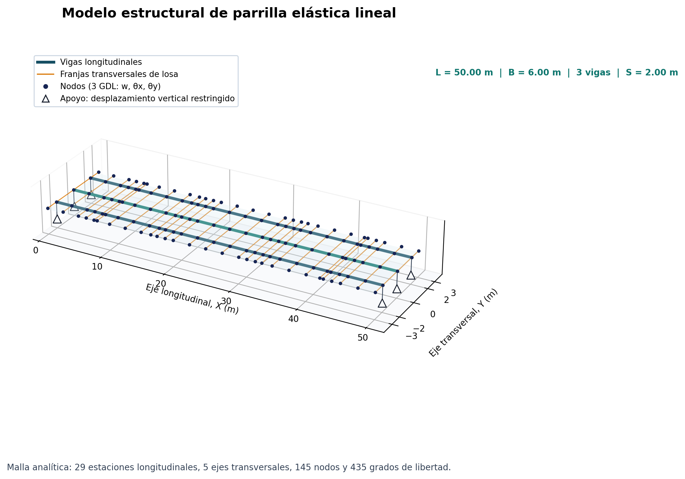
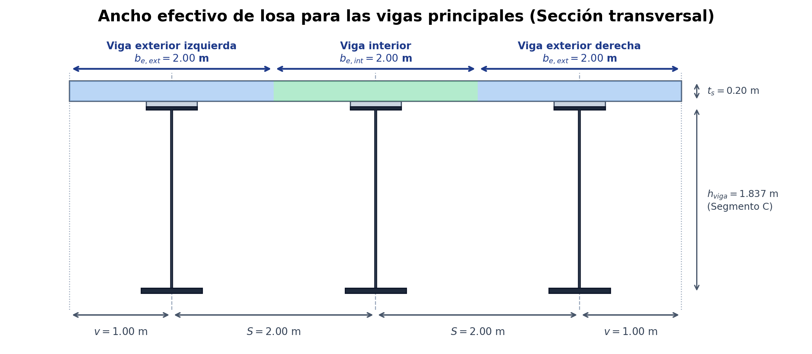
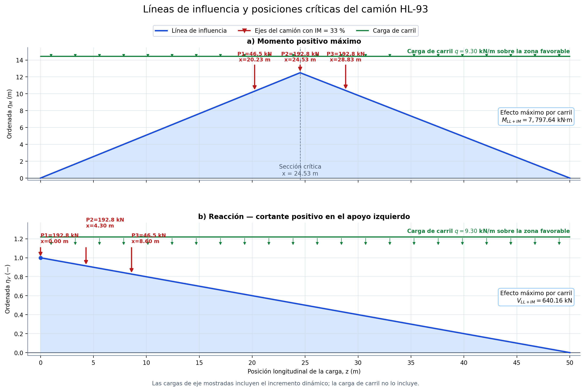
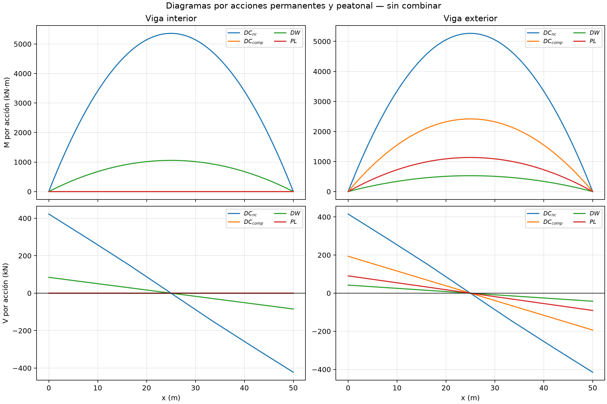
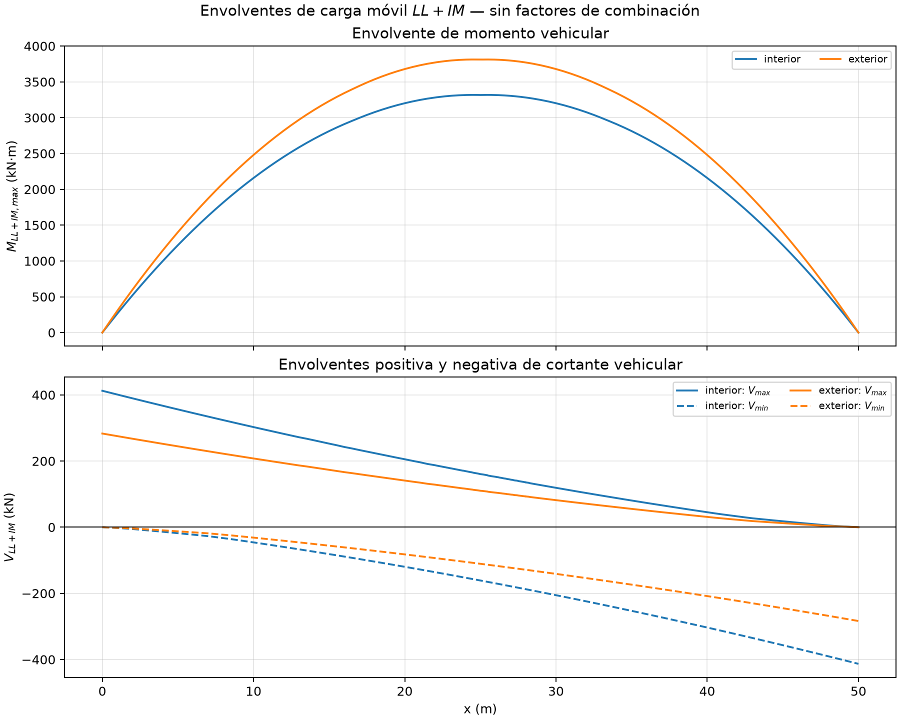
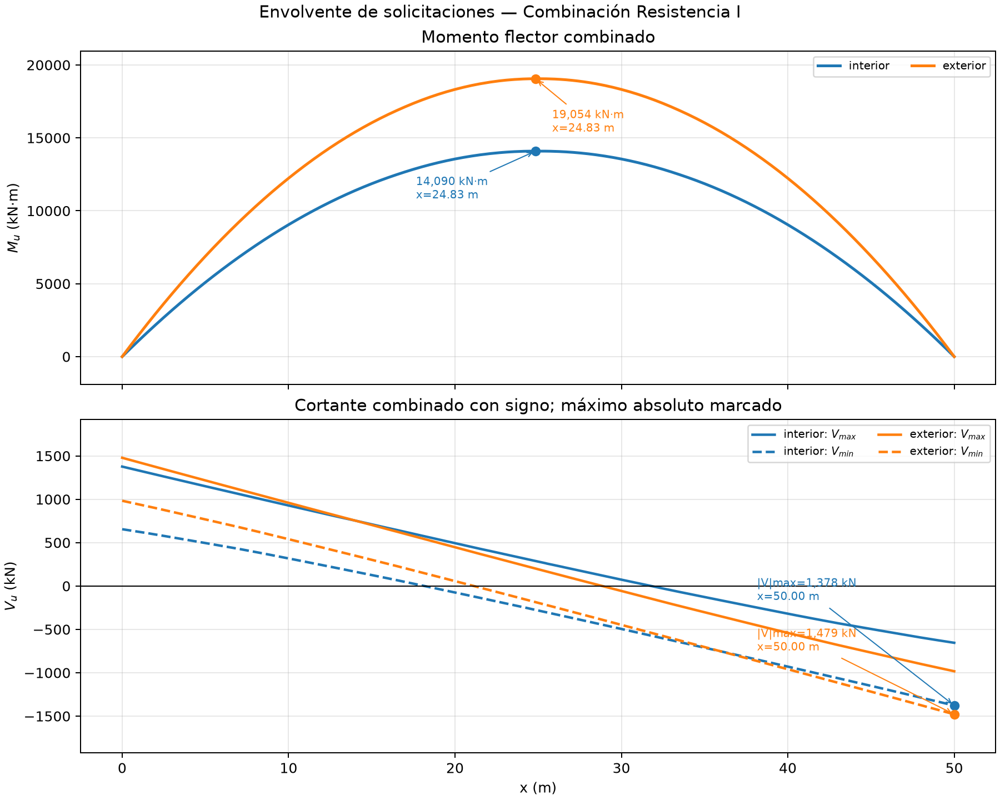
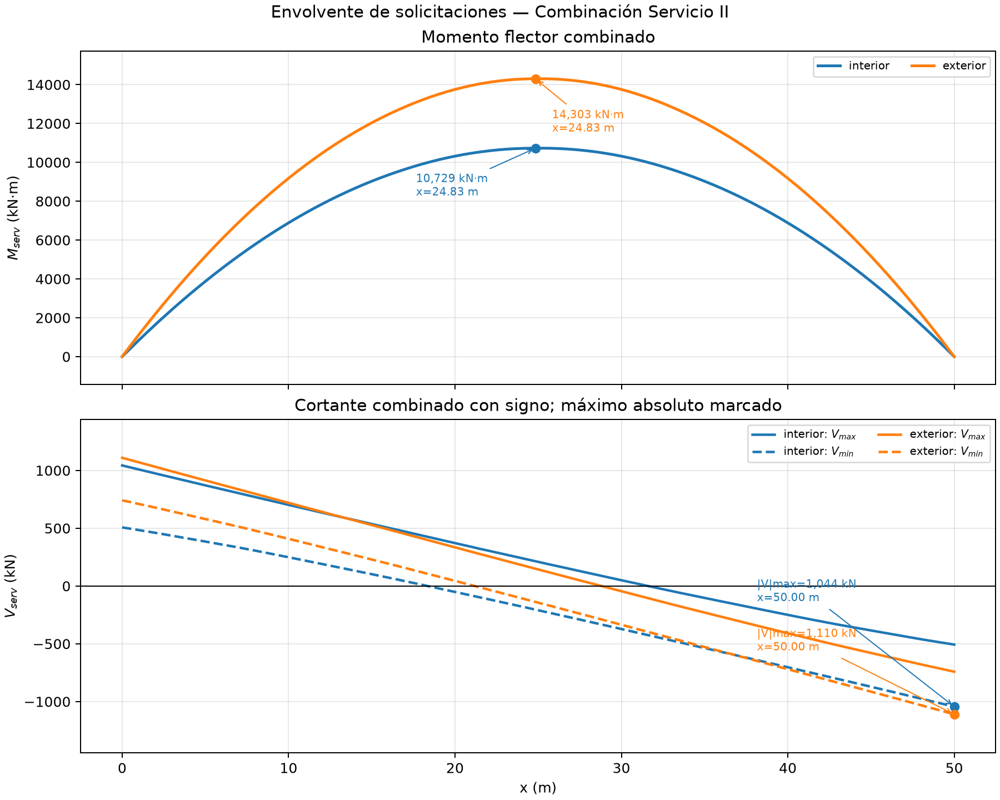
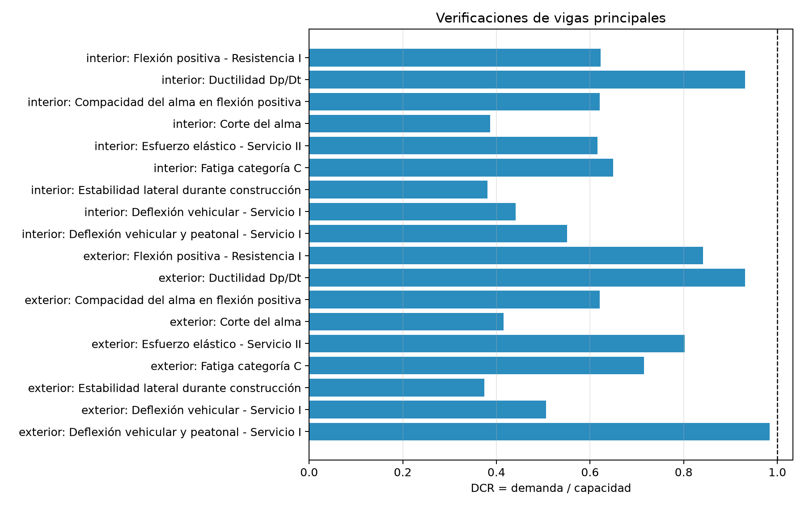

## MEMORIA DE CÁLCULO CALC-EST-2026-005-R01

### Diseño de la viga principal metálica compuesta acero-concreto

**Proyecto:** Creación de los servicios de transitabilidad mediante Puente Molinohuayco, distrito de Chilcas, provincia de La Mar, departamento de Ayacucho  
**CUI:** 2508483  
**Elemento:** Vigas principales de la superestructura  
**Configuración estructural:** PROPUESTA-R00  
**Estado:** para evaluación técnica  
**Revisión documental:** R01  
**Fecha de actualización:** 17/09/2026  
**Sistema de unidades:** kN, m, mm, kN·m y MPa  
**Ejecución de referencia:** 20260917T132241-0500  
**Elaborado por:** Ing. Paolo De la Calle — Especialista de Estructuras

### 1. Resultado

La sección propuesta para las vigas principales **CUMPLE** las verificaciones de Resistencia, Servicio, Fatiga y construcción incluidas en esta memoria. Se encuentran confirmados el diseño y detalle de los conectores de corte, rigidizadores, diafragmas y arriostramientos permanentes y temporales; por tanto, se acredita la acción compuesta y las condiciones de estabilidad consideradas en el análisis.

La viga exterior controla las verificaciones de flexión, Servicio II, fatiga y deflexión. La condición numérica más exigente de todo el diseño es la deflexión vehicular y peatonal combinada de la viga exterior:

$$
\delta_{LL+IM+PL}=49.21\ \mathrm{mm},
\qquad
\delta_{lim}=50.00\ \mathrm{mm},
\qquad
D/C=0.984
$$

El resumen de resultados es el siguiente:

| Verificación                                | Viga interior D/C | Viga exterior D/C | Condición crítica                          | Estado |
| ------------------------------------------- | ----------------: | ----------------: | ------------------------------------------ | ------ |
| Flexión positiva — Resistencia I            |             0.622 |         **0.841** | $M_u=19\,054$ kN·m; $M_{cap}=22\,647$ kN·m | Cumple |
| Ductilidad $D_p/D_t$                        |         **0.931** |         **0.931** | $0.3909/0.42$                              | Cumple |
| Compacidad del alma                         |             0.621 |             0.621 | $56.19/90.53$                              | Cumple |
| Corte del alma                              |             0.387 |         **0.416** | $V_u=1479$ kN; $V_{cap}=3559$ kN           | Cumple |
| Esfuerzo elástico — Servicio II             |             0.616 |         **0.803** | $\sigma=263.0$ MPa; límite $327.8$ MPa     | Cumple |
| Fatiga — categoría C                        |             0.649 |         **0.715** | $\Delta\sigma=49.32$ MPa; CAFL = 69 MPa    | Cumple |
| Estabilidad lateral durante construcción    |             0.381 |             0.374 | cribado con $L_b=6.25$ m y $C_b=1.0$       | Cumple |
| Deflexión vehicular — Servicio I            |             0.441 |             0.506 | $\delta_{LL}=31.65$ mm; límite 62.50 mm    | Cumple |
| Deflexión vehicular y peatonal — Servicio I |             0.551 |         **0.984** | $\delta_{LL+PL}=49.21$ mm; límite 50.00 mm | Cumple |

### 2. Objeto y alcance

La presente memoria desarrolla el análisis y diseño de las vigas principales de sección compuesta acero-concreto del Puente Molinohuayco para la configuración PROPUESTA-R00. Se verifican:

- propiedades de la sección de acero y de las secciones compuestas de corto y largo plazo;
- cargas permanentes aplicadas antes y después de activar la acción compuesta;
- carga vehicular HL-93 y su distribución transversal;
- Resistencia I en flexión positiva y corte;
- ductilidad y compacidad del alma;
- esfuerzos elásticos de Servicio II;
- fatiga de categoría C;
- estabilidad lateral durante la etapa no compuesta;
- deflexión por carga viva y deformación permanente.

El alcance corresponde a vigas rectas de placas, simplemente apoyadas y con construcción no apuntalada. La memoria no reproduce el cálculo detallado de conectores de corte, rigidizadores, diafragmas, empalmes, soldaduras, apoyos ni arriostramientos; su diseño y detalle confirmados se incorporan como condiciones de compatibilidad del sistema resistente evaluado.

### 3. Documentos y criterios de diseño

Se consideran los siguientes documentos y criterios:

- Manual de Puentes MTC 2018.
- MTC 2018, numeral 2.4.3.2, para carga viva vehicular.
- MTC 2018, numeral 2.4.5, para combinaciones y factores de carga.
- MTC 2018, numeral 2.6.4.2.2, para distribución de carga viva.
- MTC 2018, numerales 2.9.2 a 2.9.5, para miembros de acero.
- MTC 2018, numeral 2.9.5.0.1.1, para sección compuesta.
- MTC 2018, numeral 2.9.5.0.3, para construcción.
- MTC 2018, numeral 2.9.5.0.4, para servicio.
- MTC 2018, numerales 2.9.4.6 y 2.9.5.0.5, para fatiga.
- MTC 2018, numerales 2.9.5.0.6 a 2.9.5.0.8, para flexión positiva.
- MTC 2018, numeral 2.9.5.0.9, para corte.
- Configuración técnica PROPUESTA-R00 y metrado de cargas de las vigas principales.

La base normativa de las disposiciones del Manual de Puentes MTC 2018 corresponde a AASHTO LRFD 2014, séptima edición, con Interim 2015, según la configuración adoptada para el cálculo.

### 4. Datos de entrada

#### 4.1 Geometría global

| Parámetro                    | Símbolo |   Valor | Estado   |
| ---------------------------- | ------- | ------: | -------- |
| Luz simplemente apoyada      | $L$     | 50.00 m | definido |
| Número de vigas principales  | $N_g$   |       3 | definido |
| Separación entre vigas       | $S$     |  2.00 m | definido |
| Ancho de calzada             | $B_c$   |  4.00 m | definido |
| Ancho total de veredas       | $B_v$   |  2.00 m | definido |
| Ancho total del tablero      | $B$     |  6.00 m | definido |
| Voladizo exterior            | $v$     |  1.00 m | definido |
| Número de carriles de diseño | —       |       1 | definido |
| Espesor de losa              | $t_s$   |  0.20 m | definido |
| Altura de haunch             | $h_h$   |  0.05 m | definido |
| Ancho de haunch              | $b_h$   |  0.50 m | definido |

#### 4.2 Materiales

| Material                           | Propiedad                | Símbolo    |       Valor |
| ---------------------------------- | ------------------------ | ---------- | ----------: |
| Concreto                           | resistencia especificada | $f'_c$     |   27.46 MPa |
| Concreto                           | peso unitario            | $\gamma_c$ |  24.0 kN/m³ |
| Acero estructural ASTM A709 Gr. 50 | fluencia                 | $F_y$      |     345 MPa |
| Acero estructural ASTM A709 Gr. 50 | resistencia última       | $F_u$      |     450 MPa |
| Acero estructural                  | módulo de elasticidad    | $E_s$      | 200 000 MPa |
| Acero estructural                  | peso unitario            | $\gamma_s$ |  77.0 kN/m³ |
| Acero de refuerzo                  | fluencia                 | $f_y$      |     420 MPa |

#### 4.3 Secciones de la viga

La viga es simétrica respecto del centro de luz. El alma y el ala superior son constantes; el espesor del ala inferior aumenta hacia el centro para acompañar la demanda de momento positivo.

| Segmento | Intervalo $x$ | Alma $h_w\times t_w$ | Ala superior $b_{fs}\times t_{fs}$ | Ala inferior $b_{fi}\times t_{fi}$ |
| -------- | ------------: | -------------------: | ---------------------------------: | ---------------------------------: |
| A-I      |     0.0–8.0 m |         1743 × 19 mm |                        500 × 32 mm |                        600 × 25 mm |
| B-I      |    8.0–16.5 m |         1743 × 19 mm |                        500 × 32 mm |                        600 × 32 mm |
| C-I      |   16.5–25.0 m |         1743 × 19 mm |                        500 × 32 mm |                        600 × 50 mm |
| C-D      |   25.0–33.5 m |         1743 × 19 mm |                        500 × 32 mm |                        600 × 50 mm |
| B-D      |   33.5–42.0 m |         1743 × 19 mm |                        500 × 32 mm |                        600 × 32 mm |
| A-D      |   42.0–50.0 m |         1743 × 19 mm |                        500 × 32 mm |                        600 × 25 mm |

#### 4.4 Arriostramiento considerado

Para el cribado de estabilidad durante construcción se consideran puntos de arriostramiento en $x=0$, 6.25, 12.50, 18.75, 25.00, 31.25, 37.50, 43.75 y 50.00 m. Por tanto, la longitud no arriostrada adoptada es:

$$
L_b=6.25\ \mathrm{m}
$$

La geometría, rigidez y capacidad de estos arriostramientos están confirmadas para la disposición indicada.

### 5. Modelo estructural y etapas resistentes

Cada viga principal se idealiza como un elemento simplemente apoyado. La distribución transversal de la carga vehicular se determina mediante una parrilla elástica lineal formada por tres vigas longitudinales y franjas transversales de losa. Los apoyos restringen el desplazamiento vertical en los extremos y permiten el giro compatible con la condición simplemente apoyada.

**Figura 1.** Idealización tridimensional de la parrilla elástica lineal: tres vigas longitudinales, franjas transversales de losa, nodos con desplazamiento vertical y dos giros, y restricciones verticales en los extremos de cada viga.

Se diferencian las siguientes etapas:

1. **Etapa no compuesta.** La viga de acero resiste su peso propio, los elementos metálicos adicionales y el peso del concreto fresco de la losa y el haunch. La construcción se considera no apuntalada.
2. **Etapa compuesta de largo plazo.** La sección compuesta resiste las cargas permanentes aplicadas después del endurecimiento del concreto, la superficie de rodadura y las cargas peatonales.
3. **Etapa compuesta de corto plazo.** La sección compuesta resiste la carga vehicular y sus efectos dinámicos.

La superposición de esfuerzos se realiza con las propiedades correspondientes a cada etapa. La contribución de la losa no se aplica a las cargas que actúan antes de que se active la acción compuesta.

El modelo transversal representa la continuidad de la losa. La rigidez propia de los diafragmas confirmados no se incorpora de manera explícita, por lo que la distribución se mantiene basada en la rigidez de la losa y las vigas longitudinales.

### 6. Propiedades de sección

#### 6.1 Módulo del concreto y relación modular

Para concreto de peso normal se adopta:

$$
E_c=0.043\,\gamma^{1.5}\sqrt{f'_c}
$$

con $\gamma$ en kg/m³. Para $\gamma=2447.3$ kg/m³ y $f'_c=27.46$ MPa:

$$
E_c=27\,280.6\ \mathrm{MPa}
$$

La relación modular de corto plazo y la relación efectiva de largo plazo son:

$$
n=\frac{E_s}{E_c}=7.3312
$$

$$
n_{LP}=3n=21.9936
$$

#### 6.2 Ancho efectivo de losa

Para la viga interior:

$$
b_{e,int}=\min\left(\frac{L}{4},\ S,\ 12t_s+\max\left[t_w,\frac{b_{fs}}{2}\right]\right)
$$

$$
b_{e,int}=\min(12\,500,\ 2000,\ 2650)=2000\ \mathrm{mm}
$$

Para la viga exterior:

$$
b_{e,ext}=\frac{S}{2}+\min\left(\frac{L}{8},\ v,\ 6t_s+\max\left[\frac{t_w}{2},\frac{b_{fs}}{4}\right]\right)
$$

$$
b_{e,ext}=1000+\min(6250,\ 1000,\ 1325)=2000\ \mathrm{mm}
$$

Ambos tipos de viga tienen un ancho efectivo de losa igual a 2.00 m.

**Figura 2.** Ancho efectivo de losa adoptado para las vigas interiores y exteriores de la sección compuesta.

### 7. Acciones

#### 7.1 Cargas permanentes por etapa

Las cargas lineales se obtienen del metrado manual de cargas (Ref.: `analisis_superestructura/documentos/vigas_principales/memoria_metrado_manual_cargas_molinohuayco.md`). A continuación se sintetiza la obtención de cada componente.

##### 7.1.1 Parámetros de entrada

| Símbolo    | Descripción                  |  Valor | Unidad |
| ---------- | ---------------------------- | -----: | ------ |
| $L$        | Luz entre apoyos             |  50.00 | m      |
| $S$        | Separación entre vigas       |   2.00 | m      |
| $B_c$      | Ancho de calzada             |   4.00 | m      |
| $B_v$      | Ancho total de veredas       |   2.00 | m      |
| $t_s$      | Espesor de losa              |   0.20 | m      |
| $b_h$      | Ancho del haunch             |   0.45 | m      |
| $h_h$      | Espesor del haunch           |   0.05 | m      |
| $\gamma_c$ | Peso unitario del concreto   |  24.00 | kN/m³  |
| $\gamma_s$ | Peso unitario del acero      |  77.00 | kN/m³  |
| $t_a$      | Espesor de carpeta asfáltica |  0.075 | m      |
| $\gamma_a$ | Peso unitario del asfalto    | 22.555 | kN/m³  |
| $q_{PL}$   | Carga peatonal superficial   |  3.628 | kN/m²  |
| $w_b$      | Peso de una baranda          |  2.942 | kN/m   |

La distribución transversal asigna un ancho tributario de 2.00 m a cada viga. La calzada de 4.00 m se ubica entre los ejes de las vigas exteriores: la viga interior recibe 2.00 m de carpeta asfáltica y cada viga exterior recibe 1.00 m de carpeta. Cada vereda de 1.00 m descarga sobre la viga exterior adyacente.

##### 7.1.2 Peso propio del acero estructural

**Vigas principales.** El área de la sección se obtiene de sus placas ($A_s=b_{fs}t_{fs}+h_wt_w+b_{fi}t_{fi}$) y **no se incluye** dentro de `dc_no_compuesta_adicional`:

| Corte | Segmentos | Ala inferior (mm) | $A_s$ (mm²) | $w=A_s\gamma_s$ (kN/m) | Longitud (m) |
| ----- | --------- | ----------------: | ----------: | ---------------------: | -----------: |
| A–A   | A-I, A-D  |                25 |   $64\,117$ |                  4.937 |        16.00 |
| B–B   | B-I, B-D  |                32 |   $68\,317$ |                  5.260 |        17.00 |
| C–C   | C-I, C-D  |                50 |   $79\,117$ |                  6.092 |        17.00 |

Peso medio longitudinal (secuencia A–B–C–C–B–A, $L=50.00$ m):

$$
\overline{w}_s=\frac{16(4.937)+17(5.260)+17(6.092)}{50}=5.440\ \mathrm{kN/m\ por\ viga}
$$

**Elementos secundarios.** Peso lineal equivalente por viga, referido a $L=50.00$ m:

| Componente          | Detalle y peso unitario                                                                                                                 |    Cantidad por viga | $w$ por viga (kN/m)                                                                                                      |
| ------------------- | --------------------------------------------------------------------------------------------------------------------------------------- | -------------------: | ------------------------------------------------------------------------------------------------------------------------ |
| Conectores de corte | Canal 127 × 150 mm; $A_{con}=4.83(127-2\times8.13)+2(44.50)(8.13)=1258.44\ \mathrm{mm}^2$; $W_{con,1}=0.00125844(0.150)(77)=0.01454$ kN |               265 u. | $265(0.01454)/50=0.077$                                                                                                  |
| Rigidizadores       | Placas $1748\times200\times16$ mm; $V_{rig,par}=2(1.748)(0.200)(0.016)=0.0111872\ \mathrm{m}^3$                                         |             33 pares | $33(0.0111872)(77)/50=0.569$                                                                                             |
| Diafragmas          | $A_d=33.04\ \mathrm{in}^2=0.02132\ \mathrm{m}^2$; panel de 2.00 m: $W_{d,p}=0.02132(2.00)(77)=3.283$ kN                                 | 9 líneas × 2 paneles | Interior, un panel equivalente por línea: $9(3.283)/50=0.591$; exterior, medio panel por línea: $9(0.5)(3.283)/50=0.295$ |

DC no compuesta adicional (conectores + rigidizadores + diafragmas):

$$
w_{DC,nc,int}=0.077+0.569+0.591=1.237\approx1.24\ \mathrm{kN/m}
\qquad
w_{DC,nc,ext}=0.077+0.569+0.295=0.941\approx0.94\ \mathrm{kN/m}
$$

##### 7.1.3 Losa, haunch y cargas posteriores

**Losa y haunch** (ancho tributario 2.00 m en las tres vigas):

$$
w_{losa+h}=2.00(0.20)(24.0)+0.45(0.05)(24.0)=9.60+0.54=10.14\ \mathrm{kN/m\ por\ viga}
$$

Por la condición constructiva **no apuntalada**, estos pesos se resisten con la viga de acero sola antes del endurecimiento del concreto (etapa `DC_nc`). Después del endurecimiento, se forma la sección compuesta y la memoria representa los pesos posteriores mediante la acción `DC compuesta posterior` sobre la viga exterior.

**DC compuesta posterior** — solo vigas exteriores; la losa estructural de 0.20 m ya está incluida en el ancho tributario. Se añade el recrecido de la vereda (1.00 × 0.20 m) y la baranda ($w_b=0.300\times9.80665=2.942$ kN/m):

$$
w_{DC,c,ext}=1.00(0.20)(24.0)+2.942=7.742\approx7.74\ \mathrm{kN/m}
\qquad
w_{DC,c,int}=0.00\ \mathrm{kN/m}
$$

**DW — carpeta asfáltica** ($t_a=0.075$ m; $\gamma_a=2.30\times9.80665=22.555\ \mathrm{kN/m}^3$). La viga interior recibe 2.00 m de carpeta y cada viga exterior 1.00 m:

$$
w_{DW,int}=2.00(0.075)(22.555)=3.38\ \mathrm{kN/m}
\qquad
w_{DW,ext}=1.00(0.075)(22.555)=1.69\ \mathrm{kN/m}
$$

Control transversal: $3.383+2(1.692)=6.767=4.00(0.075)(22.555)$ kN/m $\checkmark$

**PL — carga peatonal** ($q_{PL}=3.628\ \mathrm{kN/m}^2$). Cada vereda de 1.00 m descarga sobre su viga exterior:

$$
w_{PL,ext}=1.00(3.628)=3.63\ \mathrm{kN/m}
\qquad
w_{PL,int}=0.00\ \mathrm{kN/m}
$$

Control transversal: $2(3.628)=7.257=B_vq_{PL}$ kN/m $\checkmark$

##### 7.1.4 Resumen de cargas por viga

| Acción                 | Viga interior (kN/m) | Viga exterior (kN/m) | Etapa resistente        |
| ---------------------- | -------------------: | -------------------: | ----------------------- |
| Peso propio de viga    |                5.440 |                5.440 | acero sola              |
| DC metálica adicional  |                 1.24 |                 0.94 | acero sola              |
| Losa fresca + haunch   |                10.14 |                10.14 | acero sola (no apuntalada) |
| DC compuesta posterior |                 0.00 |                 7.74 | compuesta, largo plazo  |
| DW (carpeta asfáltica) |                 3.38 |                 1.69 | compuesta, largo plazo  |
| PL (peatonal)          |                 0.00 |                 3.63 | compuesta, largo plazo  |

#### 7.2 Carga vehicular HL-93

La carga vehicular comprende:

- camión de diseño de 35 + 145 + 145 kN, con separación frontal de 4.30 m y separación posterior variable entre 4.30 y 9.00 m;
- tándem de dos ejes de 110 kN separados 1.20 m;
- carga de carril de 9.30 kN/m;
- incremento dinámico de 33 % para resistencia y servicio, aplicado a los ejes vehiculares;
- incremento dinámico de 15 % para fatiga.

Para una carga puntual unitaria situada en $z$, la ordenada de la línea de influencia de momento en la sección $x$ es:

$$
\eta_M(x,z)=
\begin{cases}
\dfrac{z(L-x)}{L}, & z\leq x \\
\dfrac{x(L-z)}{L}, & z>x
\end{cases}
$$

La envolvente por carril, antes de la distribución transversal de la sección 8, alcanza:

$$
M_{LL+IM,\,carril}=7797.64\ \mathrm{kN\cdot m}
$$

con el máximo longitudinal en $x\approx24.53$ m. Gobierna el camión de diseño con separación posterior de 4.30 m y el eje posterior interior próximo al centro de luz; el tándem y la carga de carril se incluyen en la envolvente, pero no gobiernan el momento máximo.

**Figura 3.** Líneas de influencia de momento positivo y reacción de apoyo, con las posiciones críticas del camión de diseño. Las cargas de eje incluyen el incremento dinámico de 33 % y la carga de carril actúa sobre la zona favorable.

### 8. Distribución transversal

La parrilla considera la rigidez flexional y torsional de las vigas longitudinales, la rigidez transversal de la losa y el desplazamiento del carril de diseño. El factor de presencia múltiple de 1.20 se incluye en los factores de momento y corte; no se aplica al factor de fatiga.

| Efecto  | Viga interior | Viga exterior |
| ------- | ------------: | ------------: |
| Momento |       0.42549 |       0.48887 |
| Corte   |       0.64536 |       0.44304 |
| Fatiga  |       0.36720 |       0.40445 |

Los factores corresponden a respuestas globales de las vigas y no representan esfuerzos locales de la losa.

### 9. Combinaciones de carga

#### 9.1 Correspondencia entre cargas y símbolos

Las cargas nominales del cuadro 7.1.4 se asignan a los símbolos de las combinaciones según la siguiente tabla:

| Símbolo en combinación | Carga nominal (7.1.4)                           | Factor de carga (Resistencia I) | Factor de carga (Servicio II) | Factor de carga (Servicio I) |
| ---------------------- | ----------------------------------------------- | ------------------------------: | ----------------------------: | ---------------------------: |
| $DC_{nc}$              | Peso propio de viga + DC metálica adicional     |                            1.25 |                           1.0 |                          1.0 |
| $DC_{comp}$            | Losa fresca + haunch + DC compuesta posterior   |                            1.25 |                           1.0 |                          1.0 |
| $DW$                   | Carpeta asfáltica                               |                            1.50 |                           1.0 |                          1.0 |
| $LL+IM$                | Carga vehicular HL-93 (con incremento dinámico) |                            1.75 |                          1.30 |                          1.0 |
| $PL$                   | Carga peatonal                                  |                            1.75 |                           1.0 |                          1.0 |

> **Nota:** La separación de etapas resistente se mantiene en todas las combinaciones. Las cargas que actúan antes de la acción compuesta ($DC_{nc}$) se calculan con la sección de acero sola; las que actúan después ($DC_{comp}$, $DW$, $PL$) se calculan con la sección compuesta (módulo de largo plazo para permanente, módulo de corto plazo para carga viva).

#### 9.2 Combinaciones utilizadas

**Resistencia I** — para verificación de capacidad última:

$$
U=1.25(DC_{nc}+DC_{comp})+1.50DW+1.75(LL+IM)+1.75PL
$$

**Servicio II** — para verificación de esfuerzos elásticos:

$$
U=(DC_{nc}+DC_{comp})+DW+1.30(LL+IM)+PL
$$

**Servicio I** — para verificación de deflexiones:

$$
U=(DC_{nc}+DC_{comp})+DW+1.0(LL+IM)+PL
$$

> La combinación Servicio I utiliza factores unitarios sobre todas las acciones. Para la verificación de deflexión por carga viva únicamente se considera $(LL+IM)$; para la deflexión vehicular y peatonal combinada se considera $(LL+IM)+PL$. Los límites son $L/800$ para carga viva y $L/1000$ para la combinación vehicular y peatonal, conforme a MTC 2018.

**Fatiga I** — para verificación de amplitud de esfuerzos:

$$
U=1.75\,\Delta LL
$$

### 10. Resultados del análisis

#### 10.1 Momentos máximos

| Acción                  |   Viga interior |   Viga exterior |
| ----------------------- | --------------: | --------------: |
| $M_{DC,nc}$             |       5361 kN·m |       5267 kN·m |
| $M_{DC,comp}$           |          0 kN·m |       2419 kN·m |
| $M_{DW}$                |       1056 kN·m |        528 kN·m |
| $M_{PL}$                |          0 kN·m |       1134 kN·m |
| $M_{LL+IM}$ distribuido |       3318 kN·m |       3812 kN·m |
| $M_u$, Resistencia I    | **14 090 kN·m** | **19 054 kN·m** |
| $M_{ser}$, Servicio II  | **10 729 kN·m** | **14 303 kN·m** |

Los máximos de las acciones permanentes ocurren en el centro de luz; $M_u$ y $M_{ser}$ se presentan en la sección $x=24.83$ m.

**Figura 4.** Diagramas de acciones permanentes separados según la etapa no compuesta y compuesta.

**Figura 5.** Envolvente longitudinal de carga vehicular con incremento dinámico y distribución transversal.

#### 10.2 Cortantes máximos de Resistencia I

| Viga     | $V_u$ máximo | Ubicación crítica |
| -------- | -----------: | ----------------: |
| Interior |      1378 kN |     apoyo derecho |
| Exterior |      1479 kN |     apoyo derecho |

#### 10.3 Deformaciones

| Componente                       | Viga interior | Viga exterior |
| -------------------------------- | ------------: | ------------: |
| DC no compuesta, acero sola      |     170.91 mm |     167.91 mm |
| DC compuesta + DW                |      22.60 mm |      63.06 mm |
| **Deformación permanente total** | **193.51 mm** | **230.97 mm** |
| Carga viva $LL+IM$               |      27.55 mm |      31.65 mm |
| Carga peatonal $PL$              |       0.00 mm |      17.55 mm |

### 11. Verificación de flexión positiva — Resistencia I

La resistencia plástica se obtiene equilibrando las fuerzas de compresión en la losa y el acero con las fuerzas de tracción en el acero. Para el segmento C:

$$
M_p=28\,437.8\ \mathrm{kN\cdot m}
$$

Debido a la posición del eje neutro plástico, la capacidad disponible incorpora la reducción por ductilidad:

$$
R_d=1.07-0.70\frac{D_p}{D_t}
=1.07-0.70(0.390878)=0.796385
$$

$$
M_{cap}=M_pR_d
=28\,437.8(0.796385)
=22\,647.4\ \mathrm{kN\cdot m}
$$

| Viga     | Demanda $M_u$ | Capacidad $M_{cap}$ |       D/C | Estado |
| -------- | ------------: | ------------------: | --------: | ------ |
| Interior |   14 090 kN·m |         22 647 kN·m |     0.622 | Cumple |
| Exterior |   19 054 kN·m |         22 647 kN·m | **0.841** | Cumple |

**Figura 6.** Envolvente de momento y cortante para Resistencia I.

### 12. Ductilidad y compacidad del alma

#### 12.1 Ductilidad

La condición exigida para la profundidad del eje neutro plástico es:

$$
\frac{D_p}{D_t}\leq0.42
$$

Para el segmento C, que controla la flexión positiva, el eje neutro plástico se ubica a 1271.24 mm desde la fibra inferior. La altura total de la sección compuesta es:

$$
D_t=1837+50+200=2087\ \mathrm{mm}
$$

Por tanto:

$$
D_p=2087-1271.24=815.76\ \mathrm{mm}
$$

$$
\frac{D_p}{D_t}=\frac{815.76}{2087}=0.3909
$$

$$
D/C=\frac{0.3909}{0.42}=0.931<1.00
$$

La sección **cumple**.

#### 12.2 Compacidad del alma

La esbeltez del alma comprimida en el estado plástico se evalúa mediante:

$$
\lambda_w=\frac{2D_{cp}}{t_w}
$$

Para $D_{cp}=533.76$ mm y $t_w=19$ mm:

$$
\lambda_w=\frac{2(533.76)}{19}=56.19
$$

El límite es:

$$
\lambda_{w,lim}=3.76\sqrt{\frac{E_s}{F_y}}
=3.76\sqrt{\frac{200\,000}{345}}
=90.53
$$

$$
D/C=\frac{56.19}{90.53}=0.621<1.00
$$

El alma cumple la condición de compacidad utilizada para flexión positiva.

### 13. Verificación a corte

Aunque los rigidizadores están confirmados, la capacidad se evalúa conservadoramente sin acreditar acción de campo de tensión. Se adopta $k=5$ y:

$$
\frac{h_w}{t_w}=\frac{1743}{19}=91.74
$$

Como esta relación supera el límite correspondiente, el coeficiente de pandeo por corte es:

$$
C=\frac{1.57E_sk}{F_y(h_w/t_w)^2}=0.5408
$$

La capacidad evaluada del alma es:

$$
V_{cap}=0.58F_yh_wt_wC
$$

$$
V_{cap}=0.58(345)(1743)(19)(0.5408)=3583\ \mathrm{kN}
$$

| Viga     | Demanda $V_u$ | Capacidad $V_{cap}$ |       D/C | Estado |
| -------- | ------------: | ------------------: | --------: | ------ |
| Interior |       1378 kN |             3559 kN |     0.387 | Cumple |
| Exterior |       1479 kN |             3559 kN | **0.416** | Cumple |

### 14. Verificación de Servicio II

El esfuerzo elástico se obtiene superponiendo las acciones según la etapa resistente:

$$
\sigma=
\frac{M_{DC,nc}}{W_s}
+\frac{M_{DC,comp}+M_{DW}+M_{PL}}{W_{LP}}
+\frac{1.30M_{LL+IM}}{W_{CP}}
$$

La verificación considera ambas fibras extremas del acero en todas las estaciones.

El límite utilizado es:

$$
\sigma_{lim}=0.95F_y=0.95(345)=327.75\ \mathrm{MPa}
$$

| Viga     | $\sigma_{max}$ | $\sigma_{lim}$ |       D/C | Estado |
| -------- | -------------: | -------------: | --------: | ------ |
| Interior |      202.0 MPa |     327.75 MPa |     0.616 | Cumple |
| Exterior |      263.0 MPa |     327.75 MPa | **0.803** | Cumple |

**Figura 7.** Envolvente de acciones correspondiente a Servicio II.

### 15. Verificación de fatiga

La viga se evalúa con categoría de detalle C y umbral de amplitud constante:

$$
CAFL=69\ \mathrm{MPa}
$$

El rango de esfuerzos se determina con la sección compuesta de corto plazo:

$$
\Delta\sigma=
1.75\max\left(
\frac{\Delta M}{W_{CP,sup}},
\frac{\Delta M}{W_{CP,inf}}
\right)
$$

| Viga     | $\Delta\sigma$ |      CAFL |       D/C | Estado |
| -------- | -------------: | --------: | --------: | ------ |
| Interior |      44.78 MPa | 69.00 MPa |     0.649 | Cumple |
| Exterior |      49.32 MPa | 69.00 MPa | **0.715** | Cumple |

Los detalles confirmados —soldaduras, empalmes, uniones de rigidizadores y accesorios— corresponden a una categoría igual o más favorable que C, condición utilizada en esta verificación.

### 16. Estabilidad durante construcción

Durante el vaciado, el concreto fresco carga la viga de acero sola. Se efectúa un cribado elástico conservador del ala superior comprimida con $C_b=1.0$ y $L_b=6.25$ m.

Para $b_{fs}=500$ mm:

$$
r_t=\frac{b_{fs}}{\sqrt{12}}=144.34\ \mathrm{mm}
$$

$$
\frac{L_b}{r_t}=\frac{6250}{144.34}=43.30
$$

$$
F_{cr}=\min\left(F_y,\frac{\pi^2E_s}{(L_b/r_t)^2}\right)
=345\ \mathrm{MPa}
$$

Con el módulo resistente superior del segmento central, $W_{s,sup}=40\,835\,562\ \mathrm{mm}^3$:

$$
M_{cap,cons}=F_{cr}W_{s,sup}=14\,088\ \mathrm{kN\cdot m}
$$

| Viga     | $M_{DC,nc}$ | $M_{cap,cons}$ |       D/C | Estado |
| -------- | ----------: | -------------: | --------: | ------ |
| Interior |   5361 kN·m |    14 088 kN·m | **0.381** | Cumple |
| Exterior |   5267 kN·m |    14 088 kN·m |     0.374 | Cumple |

Este control se aplica conjuntamente con el diseño confirmado de diafragmas y arriostramientos permanentes y temporales. Durante la ejecución debe conservarse la longitud no arriostrada máxima de 6.25 m y la secuencia de montaje y vaciado prevista en dicho diseño.

### 17. Deflexiones y contraflecha

#### 17.1 Deflexión por carga viva — Servicio I

Se evalúa la deflexión debida únicamente a la carga vehicular $(LL+IM)$, conforme a la combinación de Servicio I (sección 9.2):

$$
\delta_{LL+IM}=1.0(LL+IM)
$$

El límite adoptado es:

$$
\delta_{lim}=\frac{L}{800}=\frac{50\,000}{800}=62.50\ \mathrm{mm}
$$

| Viga     | $\delta_{LL+IM}$ | $\delta_{lim}$ |   D/C | Estado |
| -------- | ---------------: | -------------: | ----: | ------ |
| Interior |         27.55 mm |       62.50 mm | 0.441 | Cumple |
| Exterior |         31.65 mm |       62.50 mm | 0.506 | Cumple |

#### 17.2 Deflexión vehicular y peatonal combinada — Servicio I

Se evalúa la deflexión debida a la suma de carga vehicular y peatonal $(LL+IM)+PL$, conforme a la combinación de Servicio I (sección 9.2):

$$
\delta_{LL+IM+PL}=1.0(LL+IM)+1.0(PL)
$$

El límite adoptado es:

$$
\delta_{lim}=\frac{L}{1000}=\frac{50\,000}{1000}=50.00\ \mathrm{mm}
$$

| Viga     | $\delta_{LL+IM+PL}$ | $\delta_{lim}$ |       D/C | Estado |
| -------- | ------------------: | -------------: | --------: | ------ |
| Interior |            27.55 mm |       50.00 mm |     0.551 | Cumple |
| Exterior |            49.21 mm |       50.00 mm | **0.984** | Cumple |

La deflexión vehicular y peatonal combinada de la viga exterior constituye la condición gobernante del diseño con D/C = 0.984.

La deformación permanente acumulada calculada es 193.51 mm para la viga interior y 230.97 mm para la exterior (sección 10.3). La contraflecha de fabricación no debe definirse copiando directamente estos valores: deberá conciliarse con la geometría final, las tolerancias, la secuencia de vaciado, la edad del concreto, las cargas efectivamente presentes en cada etapa y el perfil vertical requerido del tablero.

### 18. Resumen gráfico de utilización

**Figura 8.** Relaciones demanda/capacidad de las vigas interior y exterior. La deflexión vehicular y peatonal de la viga exterior es la condición gobernante.

### 19. Condiciones de aplicación y coordinación

El cumplimiento declarado considera confirmados los conectores de corte, rigidizadores, diafragmas y arriostramientos permanentes y temporales. Para conservar la validez del diseño durante fabricación y construcción se requiere:

1. Ejecutar los conectores de corte conforme a su distribución, resistencia, separación y geometría aprobadas.
2. Mantener los rigidizadores de apoyo e intermedios establecidos en el detalle confirmado. La capacidad a corte presentada es conservadora y no acredita acción de campo de tensión.
3. Mantener la disposición de diafragmas y una longitud no arriostrada máxima de 6.25 m durante montaje y vaciado.
4. Respetar la secuencia de montaje y vaciado considerada en el diseño de los arriostramientos temporales.
5. Trasladar a planos las posiciones de cambio de espesor de las alas y los empalmes y transiciones aprobados.
6. Conservar en soldaduras, empalmes y accesorios una categoría de fatiga igual o más favorable que C.
7. Definir la contraflecha final y las tolerancias de fabricación y montaje a partir de las deformaciones calculadas.
8. Verificar la correspondencia entre la geometría, las cargas, las secciones y los planos estructurales emitidos para construcción.

### 20. Conclusiones

1. La configuración estructural evaluada corresponde a una luz simplemente apoyada de 50.00 m, con tres vigas metálicas de placas separadas 2.00 m y losa de concreto de 0.20 m.
2. La construcción se considera no apuntalada; por ello, la viga de acero sola resiste su peso, los elementos metálicos adicionales y el concreto fresco de losa y haunch.
3. La viga exterior gobierna la flexión positiva con $M_u=19\,054$ kN·m frente a una capacidad de 22 647 kN·m, con D/C = 0.841. La viga interior presenta D/C = 0.622.
4. La ductilidad del segmento central presenta $D_p/D_t=0.3909\leq0.42$ y D/C = 0.931.
5. El alma cumple por compacidad y por corte. Para la viga exterior, $V_u=1479$ kN frente a $V_{cap}=3559$ kN, con D/C = 0.416; no se acredita acción de campo de tensión.
6. La viga exterior cumple Servicio II con D/C = 0.803 y fatiga de categoría C con D/C = 0.715.
7. La deflexión por carga viva de la viga exterior es D/C = 0.506. La deflexión vehicular y peatonal combinada de la viga exterior constituye la condición gobernante con D/C = 0.984.
8. Las deformaciones permanentes calculadas son 193.51 mm en la viga interior y 230.97 mm en la exterior; deben utilizarse como referencia para establecer la contraflecha definitiva.
9. La estabilidad durante construcción cumple con D/C máximo de 0.381 para una longitud no arriostrada máxima confirmada de 6.25 m y el sistema de arriostramiento permanente y temporal aprobado.
10. El resultado global es **CUMPLE**, considerando confirmados el diseño y detalle de conectores de corte, rigidizadores, diafragmas y arriostramientos permanentes y temporales. La fabricación y construcción deberán respetar las condiciones de aplicación indicadas en esta memoria.
11. Se recomienda revisar la conveniencia de incrementar la sección de la viga exterior o reducir la carga peatonal para mejorar el margen de la verificación de deflexión vehicular y peatonal, cuyo D/C de 0.984 deja un margen del 1.6 %.
