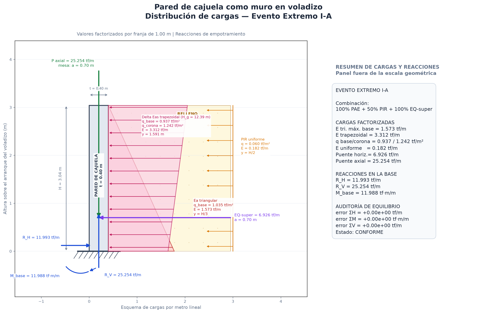

## MEMORIA DE CÁLCULO CALC-EST-2026-006-R00

### Diseño estructural en la base de la cajuela del estribo derecho

**Proyecto:** Creación de los servicios de transitabilidad mediante Puente Molinohuayco, distrito de Chilcas, provincia de La Mar, departamento de Ayacucho  
**CUI:** 2508483  
**Elemento:** Base de la cajuela del estribo derecho  
**Estado:** para evaluación técnica  
**Revisión:** R00  
**Fecha de actualización:** 15/09/2026  
**Sistema de unidades:** tf, m, tf·m, mm, MPa y cm²/m  
**Elaborado por:** Ing. Paolo De la Calle — Especialista de Estructuras

### 1. Resultado

La pared de la cajuela de 0.40 m de espesor **cumple** por flexión, cortante, acero mínimo y control de fisuración para las acciones consideradas. El diseño se realiza sobre una franja vertical de 1.00 m y la sección crítica se ubica en la base de la cajuela, inmediatamente debajo de la mesa de apoyo.

La fuerza sísmica de la superestructura se aplica en la mesa de apoyo. Por ello, respecto de la sección analizada, su brazo es independiente y vale:

$$
a_{EQ}=0.70\ \mathrm{m}
$$

El armado adoptado es:

| Dirección y cara                  |                           Demanda o requisito | Refuerzo adoptado                | $A_{s,disp}$ |    D/C gobernante | Estado |
| --------------------------------- | --------------------------------------------: | -------------------------------- | -----------: | ----------------: | ------ |
| Vertical, cara frontal/no relleno |                       $A_{s,req}=9.540$ cm²/m | Ø5/8" @ 205 mm                   |  9.655 cm²/m |    0.988 por área | Cumple |
| Vertical, cara posterior/relleno  | $M_u=11.988$ tf·m/m; $A_{s,req}=10.298$ cm²/m | Ø5/8" @ 190 mm                   | 10.418 cm²/m | 0.989 por flexión | Cumple |
| Horizontal, cada cara             |                       $A_{s,req}=3.600$ cm²/m | **Ø1/2" @ 300 mm**               |  4.223 cm²/m |    0.853 por área | Cumple |
| Cortante                          |                             $V_u=11.993$ tf/m | Concreto: $\phi V_c=22.991$ tf/m |            — |             0.522 | Cumple |

Los anclajes del acero vertical se resuelven con ganchos estándar de 90° dentro de la mesa: $l_{dg}=300$ mm en la cara frontal y $l_{dg}=240$ mm en la cara posterior, frente a 700 mm disponibles.

Gobierna el **Evento Extremo I-A** en el sentido directo, con tracción en la cara posterior/relleno. Para la inversión sísmica gobierna el Evento Extremo I-B inverso, con $M_u=1.972$ tf·m/m en la cara frontal; en esta cara controla el acero mínimo de flexión.

### 2. Objeto y alcance

Diseñar la pared de la cajuela del estribo derecho por metro lineal, considerando:

- empuje activo estático del relleno;
- incremento sísmico del empuje de tierras;
- sobrecarga equivalente del relleno;
- inercia sísmica propia de la pared;
- frenado de la superestructura;
- fuerza sísmica horizontal de la superestructura aplicada en la mesa de apoyo;
- flexión directa e inversión sísmica;
- cortante, cuantías mínimas, distribución horizontal y fisuración en servicio.

La memoria desarrolla el diseño en el cuello (base) de la mesa de apoyo.

### 3. Documentos y criterios de diseño

- Manual de Puentes MTC 2018.
- Manual de Puentes MTC 2018, Artículo 2.6.5.6.2.4 (5.11.2.4 AASHTO) para la longitud de desarrollo, los factores de modificación y el confinamiento de ganchos estándar en tracción.
- Norma Técnica E.060 Concreto Armado del Reglamento Nacional de Edificaciones, Tabla 7.1 para diámetros de doblado y numeral 12.5 como referencia complementaria de ganchos; en cada verificación de anclaje se adopta el criterio más restrictivo entre MTC 2018 y E.060.
- CALC-EST-2026-002-R00, para las reacciones de la superestructura y los parámetros generales del estribo derecho.
- Geometría vigente del estribo derecho del Puente Molinohuayco.

Para Evento Extremo I se consideran las dos concurrencias del artículo 2.8.1.1.14.1 del Manual de Puentes MTC 2018:

$$
\text{I-A}: 100\%\,PAE+50\%\,PIR
$$

$$
\text{I-B}: \max(50\%\,PAE,PA)+100\%\,PIR
$$

Las denominaciones I-A e I-B se utilizan en esta memoria para distinguir ambas concurrencias y formar su envolvente; no corresponden a nombres independientes de combinaciones del Manual.

### 4. Geometría, materiales y acciones

#### 4.1 Geometría de la franja analizada

| Parámetro                                     | Símbolo  |   Valor |
| --------------------------------------------- | -------- | ------: |
| Ancho de franja                               | $b$      |  1.00 m |
| Espesor de pared                              | $h$      |  0.40 m |
| Altura local sobre la sección analizada       | $H_c$    |  3.04 m |
| Altura global del diagrama de empuje          | $H_g$    | 12.39 m |
| Recubrimiento, cara frontal/no relleno        | $c_f$    |   50 mm |
| Recubrimiento, cara posterior/relleno         | $c_r$    |   75 mm |
| Brazo de frenado desde la sección             | $a_{BR}$ |  1.00 m |
| Brazo de la fuerza sísmica de superestructura | $a_{EQ}$ |  0.70 m |

La referencia vertical se fija con $y=0$ en la sección de diseño, ubicada debajo de la mesa de apoyo. La fuerza $EQ_{super}$ actúa en $y=0.70$ m; por tanto, la sección está por debajo de su línea de acción y debe incorporar el momento $EQ_{super}(0.70)$.

**Figura 1.** Idealización de la franja de 1.00 m, sección en la base bajo la mesa de apoyo y acciones del Evento Extremo I-A.

#### 4.2 Materiales

| Material          | Propiedad                      |                     Valor |
| ----------------- | ------------------------------ | ------------------------: |
| Concreto          | $f'_c$                         |   280 kgf/cm² = 27.46 MPa |
| Acero de refuerzo | $f_y$                          | 4200 kgf/cm² = 411.88 MPa |
| Concreto          | peso específico $\gamma_c$     |                2.40 tf/m³ |
| Relleno           | peso específico $\gamma_r$     |                1.80 tf/m³ |
| Relleno           | ángulo de fricción $\phi'$     |                     39.8° |
| Interfaz          | fricción muro–relleno $\delta$ |                     19.9° |

Se adoptan $\phi=0.90$ para flexión, $\phi=0.85$ para cortante según E.060 y $\phi=0.90$ para el control de cortante según MTC. En cada verificación se utiliza la resistencia de diseño más restrictiva.

#### 4.3 Acciones de la superestructura por metro de estribo

| Acción  |      Valor |
| ------- | ---------: |
| $DC$    | 25.98 tf/m |
| $DW$    |  2.88 tf/m |
| $PL$    |  3.08 tf/m |
| $LL+IM$ | 12.95 tf/m |
| $BR$    |  1.63 tf/m |

Los parámetros sísmicos adoptados son $k_h=0.125$, $k_v=0.05$ y una fuerza sísmica de superestructura igual al 24 % de $DC+DW$:

$$
EQ_{super}=0.24(25.98+2.88)=6.926\ \mathrm{tf/m}
$$

Su aporte al momento en la base de la cajuela es:

$$
M_{EQ}=EQ_{super}a_{EQ}=6.926(0.70)=4.848\ \mathrm{tf\cdot m/m}
$$

### 5. Modelo y empujes de tierra

La pared se idealiza como un voladizo vertical de 0.40 m de espesor y 3.04 m de altura, evaluado por una franja de 1.00 m. La compresión axial de la superestructura se cuantifica, pero no se utiliza para aumentar la resistencia a flexión.

Los coeficientes de empuje resultantes y sus componentes normales son:

| Coeficiente     |       Resultante | Componente normal a la pared |
| --------------- | ---------------: | ---------------------------: |
| Activo estático |    $K_a=0.20113$ |            $K_{a,n}=0.18912$ |
| Activo sísmico  | $K_{ae}=0.27404$ |           $K_{ae,n}=0.25768$ |

El ángulo sísmico utilizado en Mononobe–Okabe es:

$$
\psi=\tan^{-1}\left(\frac{k_h}{1-k_v}\right)=7.496^\circ
$$

El incremento sísmico $\Delta E_{as}$ se obtiene del diagrama global de altura $H_g=12.39$ m y se recorta sobre los 3.04 m correspondientes a la cajuela. En consecuencia, sobre la franja local actúa como trapecio y no como un triángulo independiente de 3.04 m.

### 6. Combinaciones y demandas

#### 6.1 Sentido directo

| Estado             | Combinación                                 | $V$ (tf/m) | $M$ en la base (tf·m/m) | $P_u$ (tf/m) |
| ------------------ | ------------------------------------------- | ---------: | ----------------------: | -----------: |
| Servicio I         | $E_a+E_s+BR$                                |      3.834 |                   4.183 |       44.890 |
| Resistencia I-a    | $1.50E_a+1.75E_s+1.75BR$                    |      6.317 |                   6.923 |       53.307 |
| Resistencia I-b    | $1.50E_a+1.75E_s+1.75BR$                    |      6.317 |                   6.923 |       64.848 |
| Evento Extremo I-A | $100\%PAE+50\%PIR+100\%EQ_{super}$          |     11.993 |              **11.988** |       25.254 |
| Evento Extremo I-B | $\max(50\%PAE,PA)+100\%PIR+100\%EQ_{super}$ |      9.734 |                   8.834 |       25.254 |

La descomposición del momento gobernante I-A es:

| Componente                         | Momento (tf·m/m) |
| ---------------------------------- | ---------------: |
| Empuje activo $E_a$                |            1.594 |
| Incremento sísmico $\Delta E_{as}$ |            5.268 |
| 50 % de inercia propia $PIR$       |            0.277 |
| Fuerza sísmica de superestructura  |            4.848 |
| **Total**                          |       **11.988** |

#### 6.2 Inversión sísmica

Se verifica también el sentido en el que $PIR$ y $EQ_{super}$ actúan hacia el relleno. La presión de tierras se mantiene en sentido contrario. Un momento inverso positivo produce tracción en la cara frontal/no relleno.

| Caso inverso               | $M_{terreno}$ | $M_{PIR}$ | $M_{EQ}$ | $M_{inv}$ | $V_{inv}$ |
| -------------------------- | ------------: | --------: | -------: | --------: | --------: |
| Evento Extremo I-A inverso |         6.862 |     0.277 |    4.848 |    -1.737 |     2.224 |
| Evento Extremo I-B inverso |         3.431 |     0.554 |    4.848 | **1.972** |     4.849 |

El momento I-B inverso se utiliza para diseñar la cara frontal. El signo negativo del I-A inverso indica que no invierte la tracción respecto del sentido directo.

### 7. Diseño a flexión del acero vertical

Para una sección rectangular por metro de ancho:

$$
a=\frac{A_sf_y}{0.85f'_cb}
$$

$$
\phi M_n=\phi A_sf_y\left(d-\frac{a}{2}\right)
$$

El acero requerido en cada cara es la envolvente:

$$
A_{s,req}=\max(A_{s,calc},A_{s,min\,flex},A_{s,rt\,E.060},A_{s,rt\,MTC})
$$

#### 7.1 Cara frontal/no relleno

| Parámetro                   |                Resultado |
| --------------------------- | -----------------------: |
| Demanda, I-B inverso        |       $M_u=1.972$ tf·m/m |
| Peralte efectivo            |             $d=342.1$ mm |
| Acero calculado por flexión | $A_{s,calc}=1.531$ cm²/m |
| Mínimo de flexión E.060     |  $A_{s,min}=9.540$ cm²/m |
| Mínimo de temperatura E.060 |              3.600 cm²/m |
| Mínimo de temperatura MTC   |              2.328 cm²/m |
| Acero requerido             |  $A_{s,req}=9.540$ cm²/m |
| Refuerzo adoptado           |       **Ø5/8" @ 205 mm** |
| Acero dispuesto             | $A_{s,disp}=9.655$ cm²/m |
| Resistencia                 | $\phi M_n=12.173$ tf·m/m |
| D/C por área                |                    0.988 |
| D/C por flexión             |                    0.162 |

Controla el mínimo de flexión de la E.060.

#### 7.2 Cara posterior/relleno

| Parámetro                           |                 Resultado |
| ----------------------------------- | ------------------------: |
| Demanda, Evento Extremo I-A directo |       $M_u=11.988$ tf·m/m |
| Peralte efectivo                    |              $d=317.1$ mm |
| Acero calculado por flexión         | $A_{s,calc}=10.298$ cm²/m |
| Mínimo de flexión E.060             |   $A_{s,min}=8.842$ cm²/m |
| Mínimo de temperatura E.060         |               3.600 cm²/m |
| Mínimo de temperatura MTC           |               2.328 cm²/m |
| Acero requerido                     |  $A_{s,req}=10.298$ cm²/m |
| Refuerzo adoptado                   |        **Ø5/8" @ 190 mm** |
| Acero dispuesto                     | $A_{s,disp}=10.418$ cm²/m |
| Resistencia                         |  $\phi M_n=12.123$ tf·m/m |
| D/C por área                        |                     0.988 |
| D/C por flexión                     |                 **0.989** |

La cara posterior/relleno cumple y gobierna el diseño a flexión.

### 8. Diseño del acero horizontal

El acero horizontal se dispone en las dos caras. Para una franja de 1.00 m y un espesor de 0.40 m, el mínimo por retracción y temperatura de la E.060, distribuido entre ambas caras, es:

$$
A_{s,h,E.060}=\frac{0.0018(100)(40)}{2}=3.600\ \mathrm{cm^2/m\ por\ cara}
$$

El mínimo MTC/AASHTO calculado para la sección es 2.328 cm²/m por cara; por tanto:

$$
A_{s,h,req}=\max(3.600,2.328)=3.600\ \mathrm{cm^2/m}
$$

Para barras Ø1/2", $A_b=1.267$ cm². El espaciamiento teórico por área es:

$$
s_{teo}=\frac{1.267(1000)}{3.600}=351.9\ \mathrm{mm}
$$

Se adopta un espaciamiento menor y constructivamente regular:

$$
\boxed{\text{Acero horizontal: Ø1/2\" @ 300 mm en ambas caras}}
$$

$$
A_{s,h,disp}=1.267\frac{1000}{300}=4.223\ \mathrm{cm^2/m}
$$

$$
D/C=\frac{3.600}{4.223}=0.853<1.00\qquad\therefore\quad\text{Cumple}
$$

La separación adoptada también es menor que el límite general de 400 mm.

### 9. Verificación a cortante y compresión axial

Se evalúa la sección con el menor peralte efectivo, $d=317.1$ mm. Las resistencias de diseño obtenidas son:

| Criterio | $\phi V_c$ (tf/m) |
| -------- | ----------------: |
| E.060    |            24.481 |
| MTC      |        **22.991** |

Se adopta la menor resistencia:

$$
D/C_V=\frac{V_u}{\phi V_c}=\frac{11.993}{22.991}=0.522<1.00
$$

La compresión axial media correspondiente al Evento Extremo I-A es:

$$
\sigma_a=0.619\ \mathrm{MPa}
$$

$$
\frac{\sigma_a}{f'_c}=0.0225
$$

Este valor se presenta como control informativo y no se acredita para incrementar la resistencia nominal a flexión.

### 10. Control de fisuración y desplazamiento

La fisuración se verifica con el momento de Servicio I, $M_s=4.183$ tf·m/m, y con el acero finalmente dispuesto.

| Cara               | $f_s$ de servicio | Límite $0.60f_y$ | Separación dispuesta | Separación límite | Estado |
| ------------------ | ----------------: | ---------------: | -------------------: | ----------------: | ------ |
| Frontal/no relleno |         138.0 MPa |        247.1 MPa |               205 mm |            599 mm | Cumple |
| Posterior/relleno  |         138.0 MPa |        247.1 MPa |               190 mm |            481 mm | Cumple |

El desplazamiento estimado en la corona bajo Servicio I es:

| Rigidez considerada        | Desplazamiento |
| -------------------------- | -------------: |
| Sección bruta $I_g$        |        1.53 mm |
| Rigidez reducida $0.35I_g$ |        4.36 mm |

Estos valores corresponden al modelo de franja en voladizo y no representan deformaciones locales de las placas de apoyo.

### 11. Anclaje con gancho estándar de 90° y detalle del armado

El acero vertical Ø5/8" se ancla mediante **ganchos estándar de 90°** dentro de la mesa. La longitud de desarrollo del gancho se mide desde la sección crítica en la base de la cajuela hasta el extremo exterior del gancho. Conforme al Artículo 2.6.5.6.2.4.1 del Manual de Puentes MTC 2018 (5.11.2.4.1 AASHTO), la longitud básica de anclaje es:

$$
\ell_{hb}=\frac{38.0\,d_b}{60.0}\left(\frac{f_y}{\sqrt{f'_c}}\right)
$$

con $d_b$ en in y $f_y$, $f'_c$ en ksi, expresión equivalente en unidades métricas a:

$$
l_{dg}=0.24\frac{f_y}{\sqrt{f'_c}}d_b
$$

donde $f_y$ y $f'_c$ se expresan en MPa y $d_b$ en mm. Además, el mismo artículo exige que la longitud de desarrollo no sea menor que el más pequeño de:

$$
l_{dg}\ge\min(8d_b,\ 6.0\ \mathrm{in}=152.4\ \mathrm{mm})
$$

Para Ø5/8", $d_b=15.875$ mm. La longitud básica resulta:

$$
l_{dg,b}=0.24\frac{411.88}{\sqrt{27.46}}(15.875)=299.5\ \mathrm{mm}
$$

#### 11.1 Cara frontal/no relleno

El recubrimiento frontal es 50 mm, menor que los 63.5 mm (2.5 in) que el Artículo 2.6.5.6.2.4.2 (5.11.2.4.2 AASHTO) exige como recubrimiento lateral normal al plano del gancho para aplicar el factor reductor. En consecuencia, no se aplica reducción:

$$
l_{dg,f}=\max\left(299.5,\min[8(15.875),152.4]\right)=299.5\ \mathrm{mm}
$$

Se adopta:

$$
\boxed{l_{dg,f}=300\ \mathrm{mm}}
$$

#### 11.2 Cara posterior/relleno

El recubrimiento posterior es 75 mm, mayor que los 63.5 mm (2.5 in) exigidos como recubrimiento lateral normal al plano del gancho. Si el detalle garantiza además un recubrimiento no menor que 50.8 mm (2.0 in) sobre la extensión recta del gancho, el Artículo 2.6.5.6.2.4.2 (5.11.2.4.2 AASHTO) permite el factor 0.80:

$$
l_{dg,r}=\max\left(0.80(299.5),\min[8(15.875),152.4]\right)=239.6\ \mathrm{mm}
$$

El criterio de la E.060 (factor 0.70, 210 mm) es menos restrictivo que el del MTC 2018; se adopta el valor gobernante:

$$
\boxed{l_{dg,r}=240\ \mathrm{mm}}
$$

#### 11.3 Geometría del gancho y comprobación de cabida

Para una barra Ø5/8", el gancho estándar de 90° requiere una extensión recta de $12d_b$ y un diámetro interior mínimo de doblado de $6d_b$:

$$
l_{ext}=12d_b=12(15.875)=190.5\ \mathrm{mm}
$$

$$
D_i=6d_b=6(15.875)=95.3\ \mathrm{mm}
$$

Para el detalle se adoptan una extensión recta de **200 mm** y un diámetro interior de doblado no menor que **100 mm**.

La mesa proporciona 700 mm entre la sección crítica y la cota de aplicación de la fuerza sísmica de superestructura. Esta longitud es mayor que el desarrollo requerido en ambas caras:

| Cara               | $l_{dg,req}$ | Longitud disponible |   D/C | Estado |
| ------------------ | -----------: | ------------------: | ----: | ------ |
| Frontal/no relleno |       300 mm |              700 mm | 0.429 | Cumple |
| Posterior/relleno  |       240 mm |              700 mm | 0.343 | Cumple |

La cabida deberá materializarse manteniendo el recubrimiento indicado, el diámetro interior de doblado y la extensión recta completa. Los ganchos se orientarán hacia el interior de la mesa y no hacia la superficie expuesta.

Conforme al Artículo 2.6.5.6.2.4.3 (5.11.2.4.3 AASHTO), en extremos discontinuos de elementos con recubrimiento lateral y recubrimiento superior o inferior menores que 64 mm (2.5 in), el gancho debe encerrarse en estribos o zunchos con separación no mayor que $3d_b$ a lo largo de toda la longitud de desarrollo $\ell_{dh}$. El recubrimiento frontal es 50 mm < 64 mm; por tanto, el detalle deberá garantizar recubrimientos no menores que 64 mm alrededor de la cola doblada dentro de la mesa o disponer dicho confinamiento. En esta cara no se acredita ningún factor reductor, por lo que la exigencia no modifica el $l_{dg,f}$ adoptado.

#### 11.4 Acero horizontal y requisitos del plano

El cambio a gancho estándar corresponde al acero vertical. Las barras horizontales Ø1/2" @ 300 mm deberán prolongarse y anclarse en los retornos laterales. Como referencia de coordinación, su longitud básica de desarrollo recto es 912 mm; si la barra califica como refuerzo superior, se considera 1186 mm.

El plano de armado deberá mostrar expresamente:

- Ø5/8" @ 205 mm vertical en la cara frontal/no relleno, con gancho estándar de 90° y $l_{dg}=300$ mm;
- Ø5/8" @ 190 mm vertical en la cara posterior/relleno, con gancho estándar de 90° y $l_{dg}=240$ mm;
- extensión recta del gancho no menor que 200 mm y diámetro interior de doblado no menor que 100 mm;
- recubrimiento no menor que 50.8 mm (2.0 in) sobre la extensión recta del gancho, condición para acreditar el factor 0.80 del Artículo 2.6.5.6.2.4.2;
- recubrimientos no menores que 64 mm alrededor de la cola doblada dentro de la mesa o, en su defecto, estribos que encierren el gancho con separación no mayor que $3d_b=47.6$ mm según el Artículo 2.6.5.6.2.4.3;
- Ø1/2" @ 300 mm horizontal en ambas caras;
- anclaje de las barras horizontales en los retornos laterales, sin terminar barras en esquinas reentrantes;
- refuerzo local adicional alrededor de placas, apoyos, juntas o aberturas cuando se definan sus dimensiones finales.

### 12. Conclusiones

1. La sección de diseño está ubicada en la base de la cajuela, inmediatamente debajo de la mesa de apoyo. La fuerza sísmica de la superestructura actúa por encima de ella y se incorpora con un brazo de 0.70 m.
2. El Evento Extremo I-A directo gobierna la cara posterior/relleno con $M_u=11.988$ tf·m/m y $V_u=11.993$ tf/m.
3. La inversión sísmica gobierna la cara frontal con el Evento Extremo I-B inverso y $M_u=1.972$ tf·m/m; en esta cara controla el acero mínimo de flexión.
4. Se adopta acero vertical Ø5/8" @ 205 mm en la cara frontal y Ø5/8" @ 190 mm en la cara posterior.
5. Se adopta acero horizontal **Ø1/2" @ 300 mm en ambas caras**, que proporciona 4.223 cm²/m frente a 3.600 cm²/m requeridos, con D/C = 0.853.
6. La pared cumple a cortante con D/C = 0.522 y cumple el control de fisuración bajo Servicio I.
7. Los anclajes verticales con gancho estándar de 90° cumplen según el Artículo 2.6.5.6.2.4 del Manual de Puentes MTC 2018: se requieren 300 mm en la cara frontal y 240 mm en la cara posterior, frente a 700 mm disponibles. Se adoptan una extensión recta de 200 mm y un diámetro interior de doblado no menor que 100 mm.
8. El resultado global de la pared de cajuela es **CUMPLE**, sujeto a trasladar el armado y los ganchos indicados al plano estructural y a efectuar el diseño local de las zonas de apoyo cuando se disponga de la geometría definitiva de placas y juntas.
