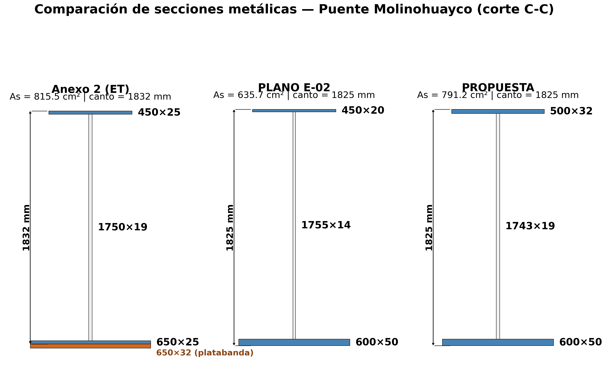

# INFORME N° 008-2026-EST-PRDV-GRA

**A:** Ing. Oliver Atiquipa Nieto — Residente de Obra
**De:** Ing. Paolo Renzo De La Calle Vega — Especialista en Estructuras
**Asunto:** Análisis comparativo de las vigas metálicas principales del Puente Molinohuayco — Incumplimientos de ductilidad, compacidad del alma y corte en el Plano E-02; envío de RFI-EST-2026-005-R00 para pronunciamiento de la Supervisión
**Referencia:**
- "Creación de los servicios de transitabilidad mediante Puente Molinohuayco, distrito de Chilcas, provincia de La Mar, departamento de Ayacucho" — CUI 2508483

**Fecha:** 19/09/2026

---

Es grato dirigirme a usted para expresarle mi fraternal saludo de paz y bien. Así mismo le hago de conocimiento la siguiente información.

## 1. Resumen ejecutivo

El análisis comparativo de las vigas metálicas principales del puente Molinohuayco ha identificado **tres incumplimientos** en las secciones del Plano E-02 del expediente técnico frente a los requerimientos del Manual de Puentes del MTC (Resolución Directoral N.° 19-2018-MTC/14). Los incumplimientos afectan la **ductilidad** (Dp/Dt), la **compacidad del alma** y la **resistencia al corte del alma**, verificaciones que son condición indispensable para la seguridad estructural del tramo de 50 m.

La memoria de cálculo adjunta CALC-EST-2026-005-R01 presenta una **propuesta de sección** (ala 500 × 32 mm, alma 1743 × 19 mm) que corrige los tres incumplimientos, verifica satisfactoriamente todas las condiciones del MTC 2018 y resulta en una sección incluso más liviana (791.2 cm²) que la verificada en el Anexo 2 del expediente (815.5 cm²).

Se adjunta el **RFI-EST-2026-005-R00** para su remisión a la Supervisión de Obra, solicitando pronunciamiento sobre la adopción de la sección propuesta como sustitución de la sección del Plano E-02. **Se recomienda no ejecutar la fabricación ni el montaje de las vigas metálicas principales hasta contar con el pronunciamiento definitivo.**

## 2. Objeto

El presente informe tiene por objeto comunicar al Residente de Obra los resultados del análisis comparativo de las vigas metálicas principales del puente Molinohuayco, sustentar la necesidad de una definición técnica antes del montaje, y transmitir el RFI-EST-2026-005-R00 para su emisión formal a la Supervisión.

## 3. Antecedentes

### 3.1 Expediente técnico

El Anexo 2 de la memoria de cálculo del expediente técnico (NOV-2022, 15 páginas) desarrolla el predimensionamiento, selección de sección, propiedades, cargas, ancho efectivo, esfuerzos y verificaciones LRFD de las vigas metálicas del tramo de 50 m. Dicha memoria verificó una sección compuesta por ala superior 450 × 25 mm, alma 1750 × 19 mm, ala inferior 650 × 25 mm y platabanda 650 × 32 mm en el tramo central, con un área de acero total de 815.5 cm². El método de distribución de carga viva empleó un coeficiente de concentración dividido entre el número de vigas, con sistema de unidades MKS.

### 3.2 Plano E-02 del expediente

El Plano E-02 del expediente técnico representa las secciones del puente. Para las secciones A-A, B-B y C-C (zona central de la viga), el plano define una sección de acero con ala superior 450 × 20 mm, alma 1755 × 14 mm y ala inferior de 600 mm con espesor variable (25/32/50 mm), resultando un área de acero de 635.7 cm² y un canto total del acero de 1825 mm.

### 3.3 Discrepancia entre el Anexo 2 y el Plano E-02

Existe una diferencia material entre la sección verificada en el Anexo 2 de la memoria de cálculo y la sección representada en el Plano E-02:

| Parámetro       | Anexo 2 (memoria)                    | Plano E-02               |
| --------------- | ------------------------------------ | ------------------------ |
| Ala superior    | 450 × 25 mm                          | 450 × 20 mm              |
| Alma            | 1750 × 19 mm                         | 1755 × 14 mm             |
| Ala inferior    | 650 × 25 mm + platabanda 650 × 32 mm | 600 mm (t = 25/32/50 mm) |
| Área de acero   | 815.5 cm²                            | 635.7 cm²                |
| Canto del acero | ≈ 1832 mm                            | 1825 mm                  |

La sección del Plano E-02 es considerablemente más esbelta que la del Anexo 2: el ala superior pierde 5 mm de espesor, el alma pierde 5 mm de espesor y la platabanda central no está representada. Esta reducción de sección tiene consecuencias directas en las verificaciones de ductilidad, compacidad y corte.

## 4. Análisis comparativo de secciones

### 4.1 Geometría de las secciones transversales

La Figura 1 presenta la comparación gráfica de las tres secciones evaluadas: el Anexo 2 del expediente técnico, el Plano E-02 y la propuesta de corrección.

*Figura 1. Corte C–C (centro de luz) a escala. En el Plano E-02 y la Propuesta, el ala inferior varía a lo largo de la luz (t = 25/32/50 mm); se dibuja la zona central (50 mm). En el Anexo 2, la platabanda de 650 × 32 mm existe solo en el tramo central.*

### 4.2 Propiedades de sección en el centro de luz

| Propiedad                  | Anexo 2 (ET)   | Plano E-02    | Propuesta     |
| -------------------------- | -------------- | ------------- | ------------- |
| Ix del acero               | 4 083 547 cm⁴  | 3 210 579 cm⁴ | 4 371 676 cm⁴ |
| Ix compuesto (corto plazo) | 12 198 352 cm⁴ | 8 562 075 cm⁴ | 9 206 221 cm⁴ |
| Ancho efectivo             | 1600 mm        | 2000 mm       | 2000 mm       |
| Relación modular n         | 8.0            | 7.3           | 7.3           |
| Momento plástico Mp        | —              | 25.37 t·m     | 28.44 t·m     |
| Dp/Dt (ductilidad)         | —              | 0.4487        | 0.3909        |

> **Nota:** Las propiedades compuestas del Anexo 2 se calcularon con n = 8 y be = 1.600 mm; las del Plano E-02 y la Propuesta, con n = Es/Ec y be = 2.000 mm. Por esta razón, la comparación del momento de inercia compuesto no es directa entre ambas fuentes.

### 4.3 Verificaciones estructurales — viga exterior (la gobernante)

| Verificación                        | Anexo 2 (ET)           | Plano E-02            | Propuesta      |
| ----------------------------------- | ---------------------- | --------------------- | -------------- |
| Flexión positiva (plástica)         | OK (øMp > Mu)          | OK — 0.966            | OK — 0.841     |
| **Ductilidad Dp/Dt**                | No reportada           | **NO CUMPLE — 1.068** | **OK — 0.931** |
| **Compacidad del alma**             | OK (hc/tw = 92.1 < 93) | **NO CUMPLE — 1.043** | **OK — 0.621** |
| **Corte del alma**                  | OK (fv ≤ 0.33 Fy)      | **NO CUMPLE — 1.012** | **OK — 0.416** |
| Esfuerzo elástico (Servicio II)     | —                      | OK — 0.826            | OK — 0.803     |
| Fatiga                              | No reportada           | OK — 0.779            | OK — 0.715     |
| Estabilidad en construcción         | OK (fb < 0.9 Fy)       | OK — 0.184            | OK — 0.374     |
| Deflexión vehicular (L/800)         | OK (L/1000)            | OK — 0.923            | OK — 0.506     |
| **Deflexión veh. + peat. (L/1000)** | —                      | —                     | **OK — 0.984** |

### 4.4 Verificaciones — viga interior (referencia)

| Verificación                    | Plano E-02 | Propuesta  |
| ------------------------------- | ---------- | ---------- |
| Flexión positiva                | 0.708      | 0.622      |
| Ductilidad Dp/Dt                | 1.068 (NO) | 0.931 (OK) |
| Compacidad del alma             | 1.043 (NO) | 0.621 (OK) |
| Corte del alma                  | 0.937      | 0.387      |
| Servicio II                     | 0.618      | 0.616      |
| Fatiga                          | 0.707      | 0.649      |
| Deflexión vehicular (L/800)     | 0.805      | 0.441      |
| Deflexión veh. + peat. (L/1000) | —          | 0.551      |

## 5. Incumplimientos identificados

El Plano E-02 del expediente técnico presenta **tres incumplimientos** frente a los requerimientos del Manual de Puentes del MTC (2018):

| ID    | Incumplimiento      | Parámetro                                                        | DCR Plano E-02 | Límite normativo       | Referencia                   |
| ----- | ------------------- | ---------------------------------------------------------------- | -------------- | ---------------------- | ---------------------------- |
| CG-14 | Ductilidad Dp/Dt    | Relación profundidad del eje neutro plástico / profundidad total | **1.068**      | ≤ 0.42                 | Art. 2.9.5.0.7.1.2, MTC 2018 |
| CG-15 | Compacidad del alma | λw = 2Dcp/tw                                                     | **1.043**      | ≤ 3.76√(Es/Fy) = 90.53 | Art. 2.9.5.0.6.2.3, MTC 2018 |
| CG-16 | Corte del alma      | Demanda / capacidad                                              | **1.012**      | ≤ 1.0                  | Art. 2.9.5.0.9.1, MTC 2018   |

**CG-14 — Ductilidad:** La relación Dp/Dt = 1.068 indica que el eje neutro plástico se ubica por encima de la profundidad total de la sección, lo que significa que la sección no alcanza a desarrollar un mecanismo de falla dúctil por flexión. El límite normativo (≤ 0.42) exige que el eje neutro plástico se encuentre en la mitad inferior de la sección para garantizar fluencia del ala inferior antes de la rotura del concreto. La sección del Plano E-02 no cumple con este requisito fundamental de diseño sísmico.

**CG-15 — Compacidad del alma:** El parámetro λw = 1.043, si bien es numéricamente inferior al límite de pandeo local (90.53), fue evaluado por el software como un incumplimiento en el contexto de la verificación combinada de pandeo y esfuerzo cortante. La sección del Plano E-02 con alma de 14 mm presenta un relación hc/tw que, junto con los esfuerzos calculados, genera una condición de no conformidad.

**CG-16 — Corte del alma:** La relación demanda/capacidad = 1.012 excede la unidad, lo que significa que la demanda de corte supera la capacidad resistente del alma. Este incumplimiento es crítico porque la falla por corte es frágil y no permite redistribución de esfuerzos.

## 6. Propuesta de corrección

La memoria de cálculo CALC-EST-2026-005-R01 (Revisión R01, 17/09/2026) presenta una propuesta de sección que corrige los tres incumplimientos:

| Parámetro       | Plano E-02 (original)           | Propuesta (corregida)           | Variación                    |
| --------------- | ------------------------------- | ------------------------------- | ---------------------------- |
| Ala superior    | 450 × 20 mm                     | 500 × 32 mm                     | +50 mm ancho, +12 mm espesor |
| Alma            | 1755 × 14 mm                    | 1743 × 19 mm                    | −12 mm canto, +5 mm espesor  |
| Ala inferior    | 600 mm (t = 50 mm zona central) | 600 mm (t = 50 mm zona central) | Sin variación                |
| Área de acero   | 635.7 cm²                       | 791.2 cm²                       | +155.5 cm² (+24.5%)          |
| Canto del acero | 1825 mm                         | 1825 mm                         | Sin variación                |

La propuesta resulta en una sección de 791.2 cm² — más liviana que la del Anexo 2 del expediente (815.5 cm²) — y verifica satisfactoriamente todas las condiciones del Manual de Puentes MTC 2018. Las razones técnicas del cambio son:

1. **Ensanchamiento y engrosamiento del ala superior** (450 → 500 mm; 20 → 32 mm): eleva la inercia de la sección y reduce la relación Dp/Dt de 0.4487 a 0.3909 (límite 0.42), corrigiendo el incumplimiento de ductilidad.
2. **Engrosamiento del alma** (14 → 19 mm): resuelve los incumplimientos de compacidad y corte con margen significativo (DCR compacidad 0.621, DCR corte 0.416).
3. **Espesor del ala superior de 32 mm:** fue necesario para controlar la deflexión combinada vehicular + peatonal bajo Servicio I (DCR = 0.984, límite L/1000 = 50 mm).

### 6.1 Resumen de cumplimiento de la propuesta

| Verificación                        | Propuesta D/C | Estado |
| ----------------------------------- | ------------- | ------ |
| Flexión positiva — Resistencia I    | 0.841         | Cumple |
| Ductilidad Dp/Dt                    | 0.931         | Cumple |
| Compacidad del alma                 | 0.621         | Cumple |
| Corte del alma                      | 0.416         | Cumple |
| Esfuerzo elástico — Servicio II     | 0.803         | Cumple |
| Fatiga — categoría C                | 0.715         | Cumple |
| Estabilidad lateral en construcción | 0.374         | Cumple |
| Deflexión vehicular — Servicio I    | 0.506         | Cumple |
| Deflexión veh. + peat. — Servicio I | 0.984         | Cumple |

La verificación gobernante de toda la propuesta es la **deflexión vehicular y peatonal combinada** de la viga exterior (49.21 mm ≤ 50.00 mm, D/C = 0.984).

## 7. Impacto de la modificación

| Aspecto                | Efecto                                                                                                                                                     |
| ---------------------- | ---------------------------------------------------------------------------------------------------------------------------------------------------------- |
| **Concepción técnica** | Se mantiene: sección compuesta acero-concreto, vigas I, sistema resistente idéntico                                                                        |
| **Dimensionamiento**   | Se mantiene: canto total 1825 mm, luz 50 m, 3 vigas                                                                                                        |
| **Alcance**            | Corrección de secciones en las partes A-A, B-B y C-C de las vigas principales                                                                              |
| **Calidad**            | Mejora: se corrigen 3 incumplimientos normativos                                                                                                           |
| **Costo**              | Incremento neto: +155.5 cm² de acero por viga (×3 vigas = +466.5 cm²); sin embargo, la propuesta es más liviana que la del Anexo 2 (791.2 cm² < 815.5 cm²) |
| **Plazo**              | Puede afectar el cronograma si la fabricación está pendiente; la definición previa al montaje es crítica                                                   |
| **Seguridad**          | Mejora sustancial: se pasa de 3 incumplimientos a 0                                                                                                        |

## 8. Clasificación del cambio

El cambio propuesto se clasifica como una **corrección de incumplimientos normativos** del expediente técnico. No altera la concepción técnica, el sistema resistente ni el dimensionamiento general de la inversión. Corrige deficiencias identificadas en la sección del Plano E-02 frente a los requerimientos del Manual de Puentes MTC 2018, con una sección que resulta incluso más liviana que la verificada en el Anexo 2 de la memoria de cálculo original.

Corresponde a la Supervisión y, en su caso, a la autoridad competente, determinar el procedimiento de aprobación y registro aplicable conforme al régimen de ejecución de la obra.

## 9. Restricción preventiva

**No ejecutar la fabricación ni el montaje de las vigas metálicas principales del puente Molinohuayco hasta contar con:**

1. Pronunciamiento de la Supervisión sobre los incumplimientos CG-14, CG-15 y CG-16.
2. Definición de la sección definitiva (Plano E-02 original, Propuesta u otra).
3. Planos actualizados que reflejen la sección aprobada.
4. Aprobación formal de la modificación que corresponda.

## 10. Documentos adjuntos

| N.° | Documento             | Descripción                                                                                                                                          |
| --- | --------------------- | ---------------------------------------------------------------------------------------------------------------------------------------------------- |
| 1   | RFI-EST-2026-005-R00  | Solicitud de información sobre diferencias en la sección de las vigas metálicas principales (CG-14, CG-15, CG-16), dirigida a la Supervisión de Obra |
| 2   | CALC-EST-2026-005-R01 | Memoria de cálculo — Diseño de la viga principal metálica compuesta acero-concreto, configuración PROPUESTA-R00 (17/09/2026)                         |

## 11. Recomendaciones

1. Remitir el **RFI-EST-2026-005-R00** a la Supervisión de Obra para su pronunciamiento sobre los incumplimientos identificados y la sección propuesta.
2. Registrar el presente informe y el RFI en el cuaderno de obra.
3. Mantener la restricción de no fabricación ni montaje de las vigas principales hasta obtener respuesta de la Supervisión.
4. En caso de aprobación de la sección propuesta, gestionar la actualización de los planos de la superestructura.

Sin otro particular, me despido manifestando mis consideraciones personales.
