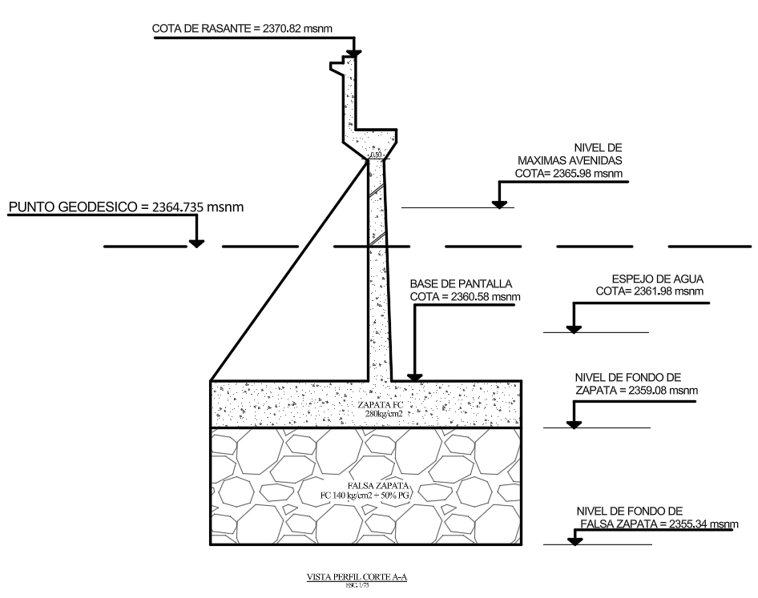

# Descripción de la figura «Niveles»

La figura presenta la **vista de perfil del corte A–A**, a escala 1:75, de una estructura de apoyo del puente. En el esquema se distinguen la pantalla de concreto, la zapata y la falsa zapata, junto con las principales referencias altimétricas del terreno, el cauce y la cimentación. Todas las cotas están expresadas en metros sobre el nivel del mar (msnm).

## Niveles indicados

Ordenados desde la mayor hasta la menor elevación, los niveles mostrados son los siguientes:

| Referencia | Cota (msnm) | Descripción |
|---|---:|---|
| Cota de rasante | 2370.82 | Elevación superior correspondiente a la rasante del puente. |
| Nivel de máximas avenidas | 2365.98 | Máximo nivel de agua considerado para una avenida o crecida. |
| Punto geodésico | 2364.735 | Referencia altimétrica empleada para el control de cotas. |
| Espejo de agua | 2361.98 | Nivel de la superficie del agua representado en el corte. |
| Base de pantalla | 2360.58 | Cota de encuentro de la pantalla con la parte superior de la zapata. |
| Fondo de zapata | 2359.08 | Elevación de la cara inferior de la zapata de concreto. |
| Fondo de falsa zapata | 2355.34 | Elevación inferior de la falsa zapata o bloque de concreto de regularización. |

## Configuración estructural

La pantalla se desarrolla verticalmente desde la zapata hasta la zona de la rasante y presenta un trasdós inclinado en su parte inferior. La zapata se representa como un bloque rectangular de concreto con una resistencia especificada de **f’c = 280 kg/cm²**. Debajo se dispone una falsa zapata de mayor espesor, indicada con **f’c = 140 kg/cm² + 50 % P.G.**; la sigla P.G. corresponde usualmente a piedra grande en este tipo de detalle.

## Relaciones verticales principales

- La rasante se encuentra **4.84 m** por encima del nivel de máximas avenidas.
- El nivel de máximas avenidas está **4.00 m** por encima del espejo de agua mostrado.
- El espejo de agua se ubica **1.40 m** por encima de la base de la pantalla.
- Entre la base de la pantalla y el fondo de la zapata existe una diferencia vertical de **1.50 m**, correspondiente al espesor representado de la zapata.
- Entre el fondo de la zapata y el fondo de la falsa zapata hay **3.74 m**.
- La diferencia total entre la rasante y el fondo de la falsa zapata es de **15.48 m**.

En conjunto, la figura permite relacionar la geometría vertical de la estructura de apoyo y su cimentación con los niveles hidráulicos del cauce y con la referencia geodésica del proyecto.
