# INFORME N.º 010-2026-EST-PRDV-GRA

**A:** ING. OLIVER ATIQUIPA NIETO
RESIDENTE DE OBRA

**DE:** ING. PAOLO RENZO DE LA CALLE VEGA
ESPECIALISTA EN ESTRUCTURAS

**ASUNTO:** INFORME DE LA ESPECIALIDAD DE ESTRUCTURAS PARA LA VALORIZACIÓN FÍSICA CORRESPONDIENTE A SETIEMBRE DE 2026

**REFERENCIA:**

a) Proyecto: «Creación de los servicios de transitabilidad mediante Puente Molinohuayco, distrito de Chilcas, provincia de La Mar, departamento de Ayacucho» — CUI N.º 2508483.

**FECHA:** Ayacucho, 30 de setiembre de 2026.

__________________________________________________________________________________

Por medio del presente, remito el informe técnico de la especialidad de estructuras correspondiente al periodo comprendido entre el **01 y el 30 de setiembre de 2026**, como sustento complementario de la valorización física mensual de la obra indicada en la referencia.

El informe identifica las partidas de estructuras con actividad durante el periodo, describe el avance observable, registra los controles técnicos efectuados y vincula la evidencia documental y fotográfica disponible.

Sin otro particular, me despido manifestando mis consideraciones personales.

Atentamente,

## 1. Objeto y alcance

### 1.1. Objeto

Documentar, desde la especialidad de estructuras, las actividades físicas observadas durante setiembre de 2026 en la subestructura del puente, específicamente en el frente de los estribos, así como los documentos técnicos elaborados con relación a la revisión de las vigas metálicas principales de la superestructura.

### 1.2. Alcance

El informe comprende:

- las actividades vinculadas con la colocación de concreto con piedra grande en falsa zapata, el encofrado de cara no vista bajo agua, el acero de refuerzo y el curado con aditivo en la subestructura de los estribos;
- el seguimiento técnico efectuado sobre la preparación del frente, el armado y el avance constructivo de la falsa zapata;
- los documentos de ingeniería elaborados durante el periodo, referidos al análisis comparativo de las vigas metálicas principales; y
- las restricciones técnicas que condicionan la continuidad de determinados trabajos.

La cuantificación de metrados, el cálculo de porcentajes, la determinación de importes y la aprobación de la valorización corresponden a los registros y responsables competentes de la valorización consolidada.

## 2. Resumen del avance físico observado

Durante setiembre se registraron actividades en el frente de los **estribos**, principalmente en la colocación del **concreto f’c = 140 kg/cm² con incorporación de 50 % de piedra grande** en la falsa zapata, el armado y arriostramiento del **encofrado de cara no vista bajo agua**, el seguimiento del **acero de refuerzo fy = 4 200 kg/cm²** y la ejecución del **curado con aditivo** sobre las superficies expuestas.

La evidencia disponible muestra la secuencia constructiva desde la preparación del frente y el acondicionamiento del encofrado hasta la colocación, distribución y nivelación del concreto con piedra grande, con apoyo de maquinaria y cuadrilla de obra. Al cierre del periodo se observa el avance acumulado de la falsa zapata con superficies de concreto terminadas y sectores en proceso de continuación.

Paralelamente, en gabinete se elaboró el **INFORME N.º 008-2026-EST-PRDV-GRA** sobre el análisis comparativo de las vigas metálicas principales del puente, con sustento en la **CALC-EST-2026-005-R01** y la remisión del **RFI-EST-2026-005-R00** a la Supervisión de Obra. Estos documentos identifican tres diferencias técnicas en la sección del Plano E-02 (CG-14, CG-15 y CG-16) y presentan una alternativa de sección para pronunciamiento.

## 3. Actividades ejecutadas por partida

**Tabla N.º 1 — Matriz cualitativa de partidas con actividad durante setiembre de 2026**

| Partida     | Descripción                                                       | Frente                           | Actividad observada o reportada                                                                                                                        | Control de la especialidad                                                                                                                                  | Evidencia                                                              | Situación al 30/09/2026                                                               |
| ----------- | ----------------------------------------------------------------- | -------------------------------- | ------------------------------------------------------------------------------------------------------------------------------------------------------ | ----------------------------------------------------------------------------------------------------------------------------------------------------------- | ---------------------------------------------------------------------- | ------------------------------------------------------------------------------------- |
| 01.02.01.05 | Concreto f’c = 140 kg/cm² + 50 % de piedra grande en falsa zapata | Estribos (falsa zapata)          | Colocación, extendido y nivelación de concreto con incorporación de piedra grande en los sectores encofrados de la falsa zapata                        | Seguimiento visual de la secuencia constructiva, extendido, distribución de piedra grande y nivelación superficial; apoyo de equipo mecánico y cuadrilla    | Fotografías N.º 01, N.º 03, N.º 06, N.º 07, N.º 10 y N.º 11            | Actividad registrada durante el periodo; avance acumulado de la falsa zapata visible. |
| 01.02.01.09 | Encofrado y desencofrado de cara no vista bajo agua               | Estribos (falsa zapata)          | Armado, alineamiento, arriostramiento y cierre de paneles de encofrado; seguimiento de la continuidad del encofrado durante la colocación del concreto | Inspección del armado, alineación y condición del encofrado; registro de la presencia de agua en sectores deprimidos del frente                             | Fotografías N.º 04, N.º 05, N.º 07, N.º 08 y N.º 09                    | Actividad registrada durante el periodo.                                              |
| 01.02.01.11 | Acero de refuerzo fy = 4 200 kg/cm²                               | Estribos (falsa zapata y frente) | Inspección visual del acero existente, su disposición general, continuidad y compatibilidad con el avance del encofrado y el concreto                  | Seguimiento de la disposición general, continuidad, protección y compatibilidad del refuerzo con los trabajos de encofrado y concreto del periodo           | Fotografías N.º 02 y N.º 04                                            | Actividad registrada durante el periodo.                                              |
| 01.02.01.12 | Curado con aditivo en superficie de concreto                      | Estribos (falsa zapata)          | Aplicación de aditivo de curado sobre las superficies de concreto expuestas después de la colocación y el acabado de la falsa zapata                   | Seguimiento de la atención de las superficies expuestas; documentación del producto, rendimiento y cobertura corresponde a los registros de calidad de obra | No registrada con imagen explícita en el panel fotográfico del periodo | Actividad reportada durante el periodo.                                               |

Las partidas de la Tabla N.º 1 se identifican por la actividad observada y los registros disponibles.

## 4. Control técnico de estructuras

### 4.1. Concreto con piedra grande en falsa zapata

El seguimiento de campo se concentró en la secuencia de colocación del concreto f’c = 140 kg/cm² con incorporación de 50 % de piedra grande en los sectores encofrados de la falsa zapata. Se registró el extendido y la nivelación del concreto, la distribución manual de la piedra grande y el apoyo de maquinaria (minicargador y excavadora) dentro del frente de trabajo en distintas fechas del periodo.

La evidencia fotográfica permite documentar la actividad y la secuencia constructiva de forma cualitativa. La conformidad de dosificación, producción, ensayos y metrados debe verificarse con los registros de control de calidad correspondientes.

### 4.2. Encofrado de cara no vista bajo agua

Se efectuó el seguimiento del armado, alineamiento, arriostramiento y cierre de los paneles de encofrado empleados para delimitar los sectores de la falsa zapata. Se observó la continuidad de los elementos de contención durante la colocación del concreto y la presencia de agua en sectores deprimidos del frente.

La revisión técnica consideró la condición visible del encofrado y su compatibilidad con la geometría del elemento. La liberación del encofrado y el desencofrado deben sustentarse en los controles de campo y registros correspondientes.

### 4.3. Acero de refuerzo

Se efectuó la inspección visual del acero de refuerzo existente en el frente del estribo y de su interacción con las zonas en proceso de acondicionamiento, encofrado y vaciado. El seguimiento consideró la disposición general, continuidad, protección y compatibilidad del refuerzo con el avance de los trabajos del periodo.

La conformidad de diámetros, separaciones, longitudes de desarrollo, empalmes y recubrimientos debe verificarse con los planos controlados y los registros de inspección antes del vaciado del elemento estructural correspondiente.

### 4.4. Documentos técnicos elaborados — Vigas metálicas principales

Durante el periodo se elaboró el **INFORME N.º 008-2026-EST-PRDV-GRA** (19/09/2026), que comunica al Residente de Obra los resultados del análisis comparativo de las secciones de las vigas metálicas principales. El informe identifica las diferencias **CG-14, CG-15 y CG-16**, vinculadas con la ductilidad, la compacidad del alma y la resistencia al corte de la sección indicada en el Plano E-02, y presenta como alternativa técnica una sección con ala superior de 500 × 32 mm y alma de 1 743 × 19 mm (canto total 1 825 mm) para evaluación y pronunciamiento de la Supervisión.

Como sustento se adjuntaron el **RFI-EST-2026-005-R00** (consulta formal a la Supervisión) y la **CALC-EST-2026-005-R01** (memoria de cálculo de la viga principal metálica compuesta, revisión con fecha 17/09/2026).

## 5. Documentos técnicos vinculados

**Tabla N.º 2 — Documentos elaborados durante setiembre de 2026**

|  N.º | Documento                                                                                   | Fecha      | Vinculación con la ejecución física                                                   | Estado al 30/09/2026                                                                                |
| ---: | ------------------------------------------------------------------------------------------- | ---------- | ------------------------------------------------------------------------------------- | --------------------------------------------------------------------------------------------------- |
|    1 | INFORME N.º 008-2026-EST-PRDV-GRA — Análisis comparativo de las vigas metálicas principales | 19/09/2026 | Comunica las diferencias CG-14, CG-15 y CG-16 y la alternativa técnica de sección     | Elaborado; remitido al Residente para tramitación ante la Supervisión de Obra.                      |
|    2 | RFI-EST-2026-005-R00 — Consulta sobre diferencias en la sección de las vigas principales    | 19/09/2026 | Documenta CG-14, CG-15 y CG-16; solicita pronunciamiento sobre la sección a adoptar   | Preparado como adjunto del Informe 008; pendiente de respuesta de la Supervisión.                   |
|    3 | CALC-EST-2026-005-R01 — Memoria de cálculo de la viga principal metálica compuesta          | 17/09/2026 | Sustento técnico de la consulta; compara sección del Plano E-02 con sección propuesta | Adjunto al Informe 008; sustenta que la alternativa corrige los tres incumplimientos identificados. |

Los estados consignados en la Tabla N.º 2 reflejan la situación técnico-administrativa al 30/09/2026. La adopción de cualquier sección definitiva para las vigas metálicas queda condicionada al pronunciamiento de la Supervisión y a las aprobaciones administrativas y técnicas que correspondan, debiendo mantenerse la restricción preventiva de no ejecutar la construcción de la cajuela hasta contar con dicha definición.

## 6. Restricciones y asuntos pendientes

**Tabla N.º 3 — Restricciones y acciones requeridas**

| ID    | Asunto                                                                 | Situación al 30/09/2026                                                                                             | Acción requerida                                                                           | Evidencia de cierre                            |
| ----- | ---------------------------------------------------------------------- | ------------------------------------------------------------------------------------------------------------------- | ------------------------------------------------------------------------------------------ | ---------------------------------------------- |
| RP-06 | Definición de la sección definitiva de las vigas metálicas principales | Pendiente; se cuenta con sección propuesta en CALC-EST-2026-005-R01 pero sin aprobación técnica ni administrativa   | Contar con pronunciamiento de la Supervisión antes de autorizar la construcción de cajuela | Pronunciamiento aprobatorio de la Supervisión. |
| RP-07 | Construcción de cajuelas                                               | Restricción preventiva vigente hasta disponer de la definición técnica de vigas aprobada por la Supervisión         | No ejecutar la construcción de cajuela hasta disponer de la definición técnica.            | Pronunciamiento aprobatorio de la Supervisión. |

## 7. Conclusiones y recomendaciones

### 7.1. Conclusiones

1. Durante setiembre de 2026 se registró actividad física en el frente de los estribos asociada con las partidas de concreto f’c = 140 kg/cm² + 50 % de piedra grande en falsa zapata, encofrado y desencofrado de cara no vista bajo agua, acero de refuerzo fy = 4 200 kg/cm² y curado con aditivo en superficie de concreto.

2. La evidencia fotográfica muestra la evolución cualitativa del frente desde la preparación y el acondicionamiento del encofrado hasta la colocación, distribución y nivelación del concreto con piedra grande, con apoyo de maquinaria y cuadrilla en distintas fechas del periodo.

3. En gabinete se elaboró el INFORME N.º 008-2026-EST-PRDV-GRA (19/09/2026), que identifica las diferencias CG-14, CG-15 y CG-16 en la sección de las vigas metálicas principales indicada en el Plano E-02 —ductilidad, compacidad del alma y resistencia al corte— y presenta una alternativa técnica de sección para evaluación y pronunciamiento de la Supervisión de Obra.

4. El RFI-EST-2026-005-R00 fue preparado como adjunto del Informe N.º 008-2026-EST-PRDV-GRA para su remisión formal a la Supervisión, encontrándose pendiente de pronunciamiento al cierre del periodo.

5. La CALC-EST-2026-005-R01, con fecha de revisión 17/09/2026, sustenta técnicamente que la alternativa propuesta corrige los tres incumplimientos identificados en la sección del Plano E-02, sin que ello reemplace el pronunciamiento de la Supervisión ni la aprobación administrativa que corresponda.

### 7.2. Recomendaciones

1. **Reiterar pronunciamiento al RFI sobre vigas metálicas:** Reiterar pronunciamiento al RFI-EST-2026-005-R00 ante la Supervisión de Obra, a fin de obtener el pronunciamiento sobre la sección definitiva que debe adoptarse para las vigas metálicas principales y los documentos técnicos controlados que deberán actualizarse.

2. **Restricción preventiva de construcción de cajuela:** Mantener vigente la restricción técnica de no ejecutar la cajuela hasta contar con el pronunciamiento aprobatorio de la Supervisión y las aprobaciones técnicas y administrativas habilitantes.

3. **Control de calidad de las partidas ejecutadas:** Conservar y gestionar en el expediente de obra los registros de control de calidad correspondientes a las partidas ejecutadas en el periodo, incluyendo protocolos de vaciado, ensayos de resistencia del concreto, registros de aplicación del aditivo de curado y partes de encofrado y desencofrado.

## 8. Panel fotográfico

### 8.1. Miércoles 02/09/2026

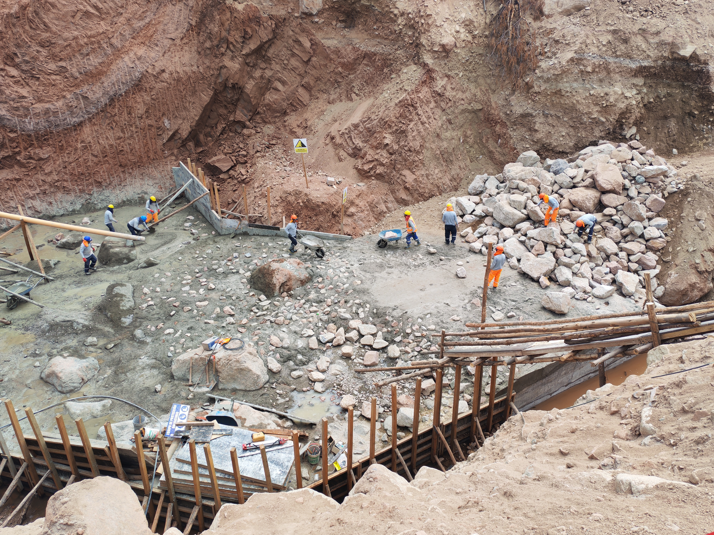

**Fotografía N.º 01.** Colocación, extendido y nivelación de concreto con incorporación de piedra grande en el área encofrada de la falsa zapata.

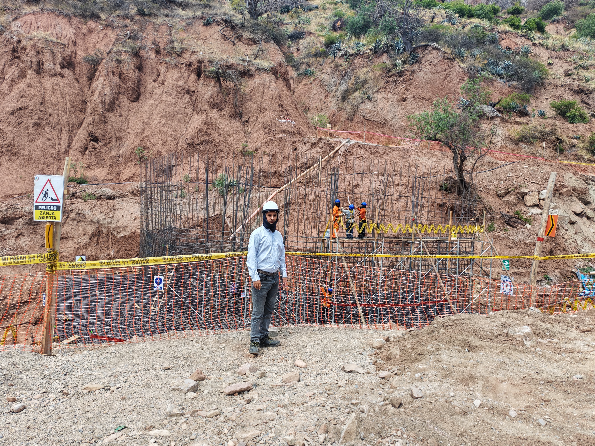

**Fotografía N.º 02.** Inspección visual del frente de la subestructura; se observa el acero de refuerzo expuesto y la delimitación de la zona de trabajo mediante señalización y barreras de seguridad.

### 8.2. Jueves 03/09/2026

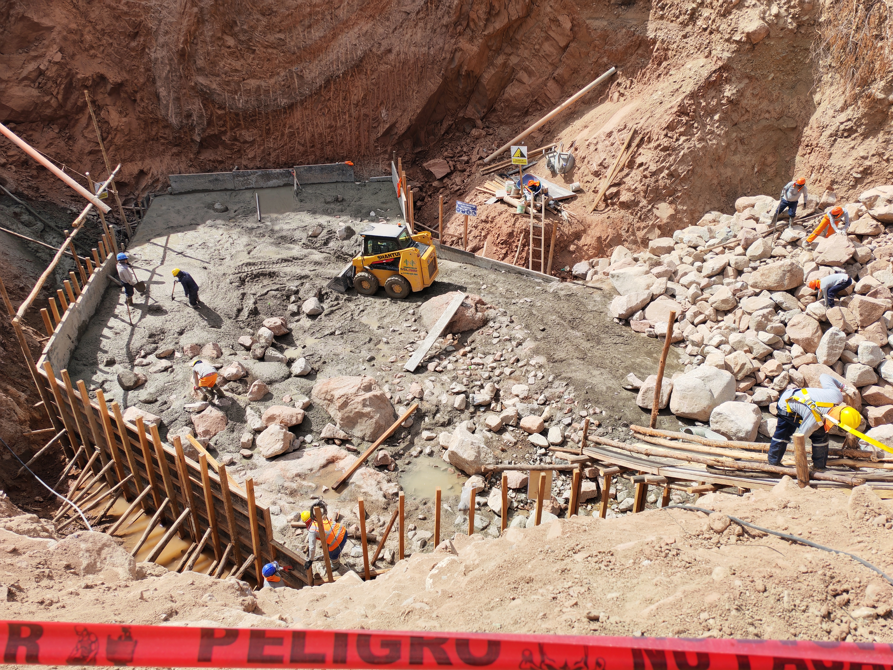

**Fotografía N.º 03.** Distribución y acomodo del concreto en la falsa zapata con apoyo de minicargador, cuadrilla de obra y colocación de piedra grande.

### 8.3. Viernes 11/09/2026

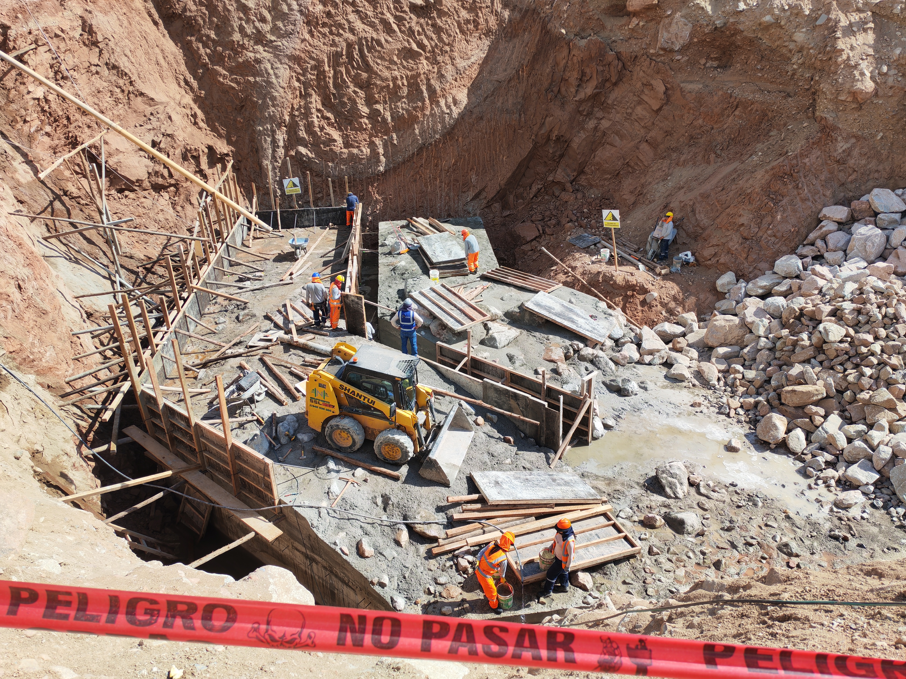

**Fotografía N.º 04.** Vista general del avance de la falsa zapata, con sectores encofrados, superficies ya colocadas y trabajos de acondicionamiento para continuar el vaciado.

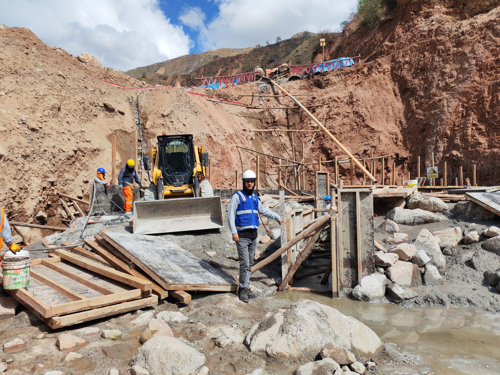

**Fotografía N.º 05.** Inspección del encofrado y de las condiciones visibles del frente; se observa presencia de agua en el sector deprimido contiguo al panel.

### 8.4. Sábado 12/09/2026

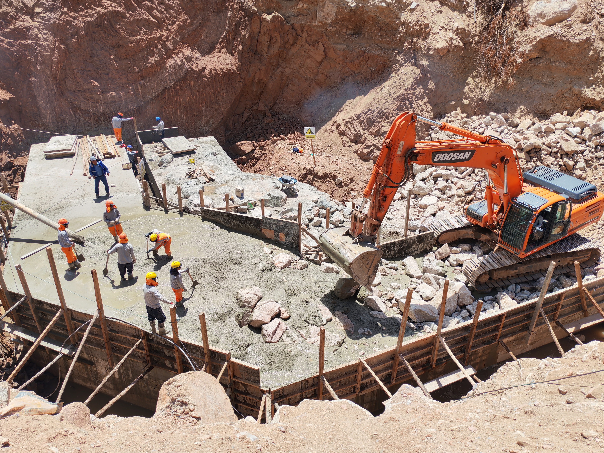

**Fotografía N.º 06.** Colocación y nivelación de concreto con piedra grande en la falsa zapata; la excavadora apoya el manejo de materiales dentro del frente.

### 8.5. Lunes 14/09/2026

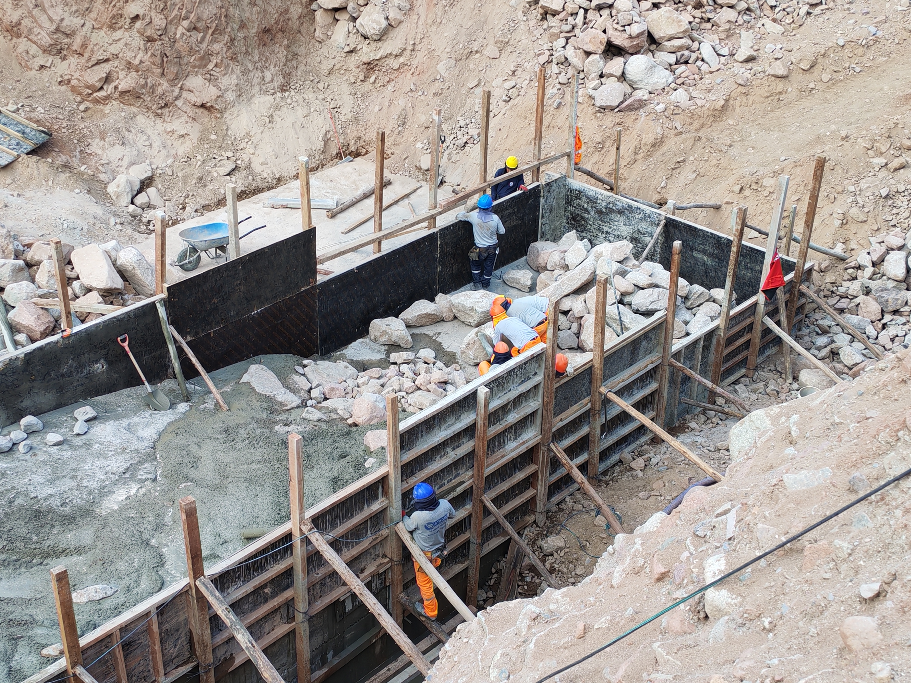

**Fotografía N.º 07.** Colocación manual y distribución de piedra grande dentro del sector delimitado por el encofrado de cara no vista.

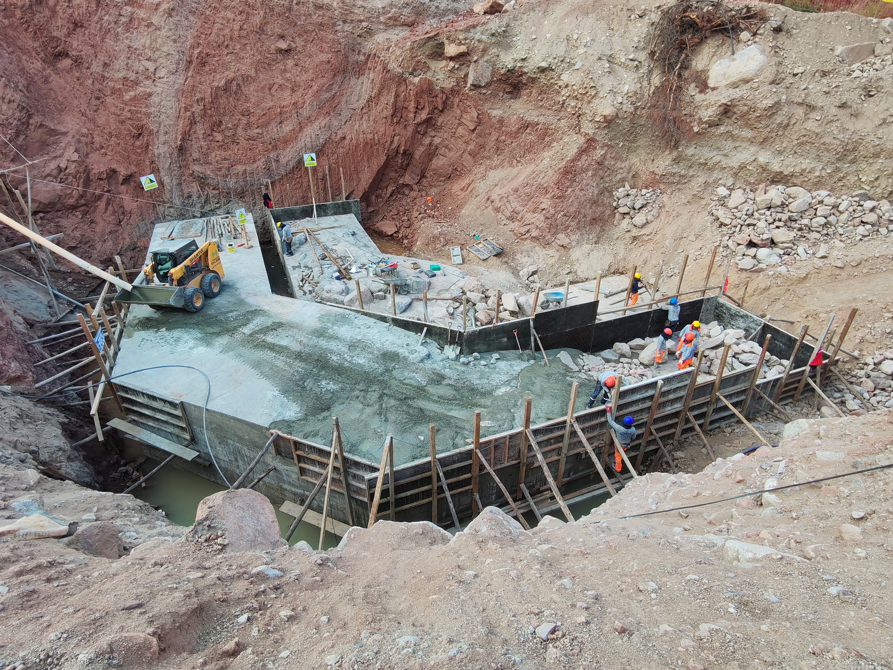

**Fotografía N.º 08.** Vista general del avance de la falsa zapata, con superficies de concreto terminadas y continuación de trabajos en el sector encofrado.

### 8.6. Jueves 17/09/2026

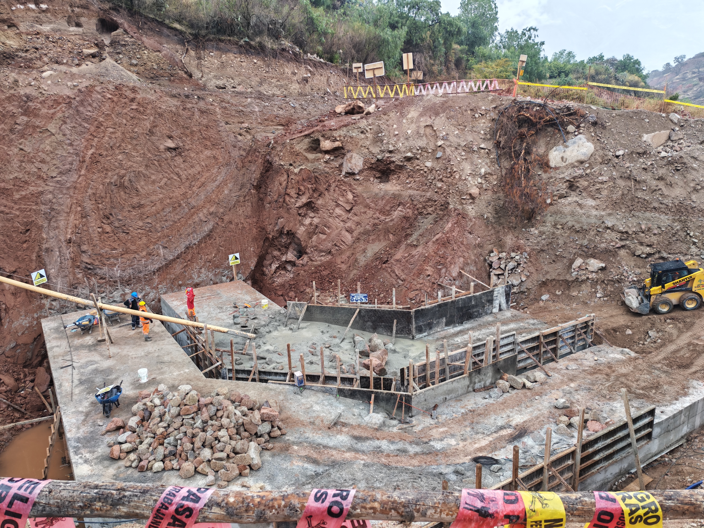

**Fotografía N.º 09.** Acondicionamiento y preparación de un nuevo sector encofrado para la continuación de los trabajos de concreto en la falsa zapata.

### 8.7. Viernes 18/09/2026

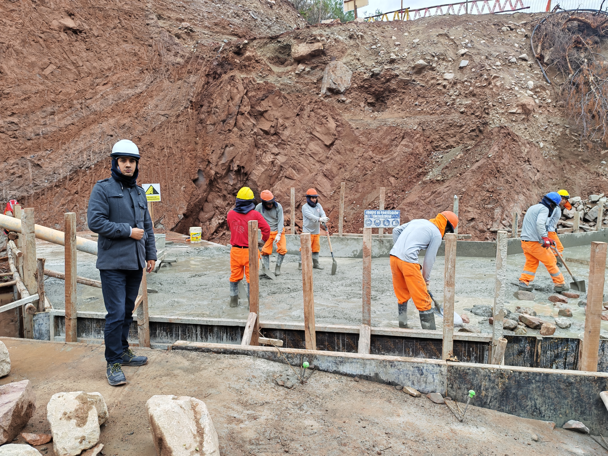

**Fotografía N.º 10.** Colocación, extendido y nivelación manual del concreto por la cuadrilla, con seguimiento del especialista en estructuras.

### 8.8. Sábado 19/09/2026

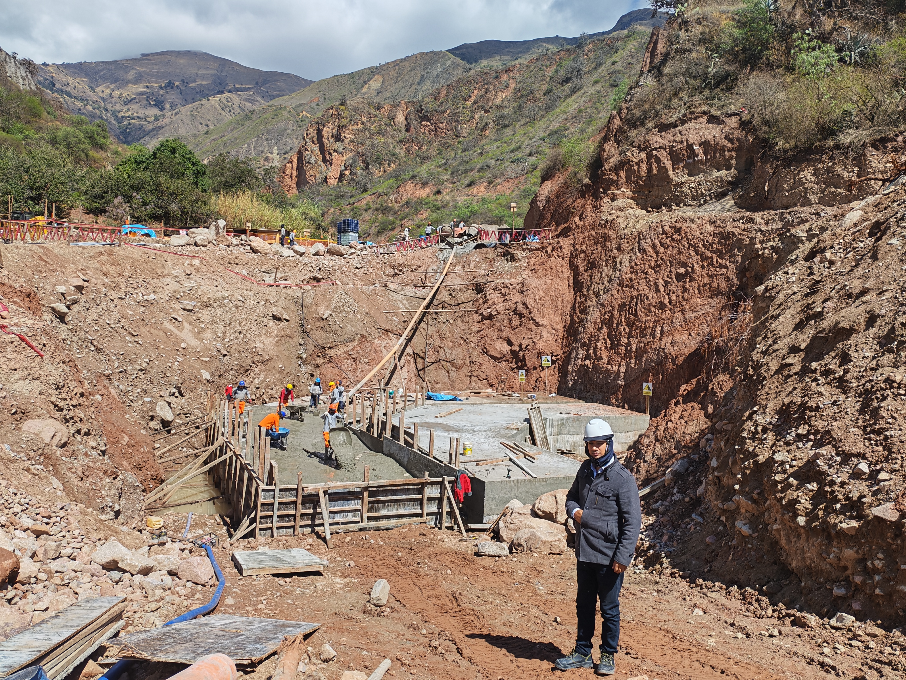

**Fotografía N.º 11.** Continuación de la colocación y acabado del concreto en el sector frontal de la falsa zapata; vista general del frente y del avance acumulado.
