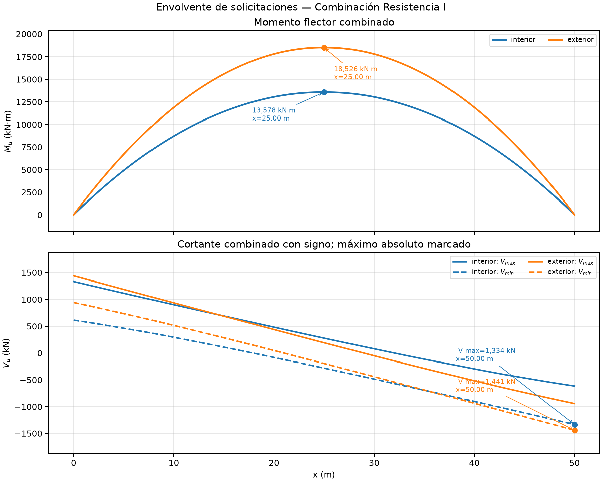

# Memoria de cálculo manual del análisis longitudinal de vigas principales

## Puente Molinohuayco — desarrollo didáctico de pregrado

**Revisión:** PRELIMINAR-R00  
**Sistema de unidades de cálculo:** N, mm y MPa  
**Presentación de resultados:** kN, m, kN·m y mm  
**Modelo:** viga I de placas, recta, simplemente apoyada, de sección variable  
**Normativa declarada en los datos:** Manual de Puentes MTC 2018, con base AASHTO LRFD 2014, 7.ª edición, Interim 2015  
**Método declarado:** secuencia de Bartra, pp. 113–165, actualizada al MTC 2018

> **Resultado del análisis.** El equilibrio global es satisfactorio, con error relativo máximo de $3.28\times10^{-16}$. La viga exterior gobierna las demandas de Resistencia I, con $M_u=17\,614.76\ \text{kN·m}$ y $V_u=1\,421.09\ \text{kN}$. La viga interior gobierna la deformación vehicular, con $63.95\ \text{mm}>L/800=62.50\ \text{mm}$. Estos resultados corresponden a análisis de demandas; no constituyen por sí solos la verificación integral de la resistencia de las vigas.

---

## 1. Objetivo y alcance académico

El objetivo es reconstruir manualmente la formulación que conduce a las propiedades, cargas, reacciones, envolventes y deformaciones registradas para las vigas principales. El desarrollo se organiza como material de un curso de pregrado: primero se establece el modelo físico, luego se deducen las ecuaciones y finalmente se sustituyen los datos del puente.

Se desarrollan:

1. propiedades de la viga metálica variable;
2. ancho efectivo y sección transformada de corto y largo plazo;
3. equilibrio plástico de la sección compuesta;
4. cargas permanentes por etapa;
5. factores de distribución transversal;
6. líneas de influencia y barrido del HL-93;
7. reacciones, cortantes y momentos por integración;
8. combinaciones de Resistencia I y Servicio II;
9. deformaciones mediante integración de la curvatura;
10. verificaciones independientes de equilibrio y orden de magnitud.

Quedan fuera del alcance el diseño detallado de conectores, rigidizadores, diafragmas y arriostramientos, así como la comprobación completa de resistencia, fatiga y estabilidad. La geometría, las secciones y los elementos transversales permanecen pendientes de confirmación documental.

## 2. Modelo físico, hipótesis y convención de signos

La superestructura posee tres vigas longitudinales separadas $2.00\ \text{m}$. Cada viga se idealiza como una barra de Euler–Bernoulli simplemente apoyada, con luz:

\[
L=50.00\ \text{m}=50\,000\ \text{mm}
\]

Las hipótesis principales son:

- comportamiento lineal elástico para la obtención de fuerzas internas y deformaciones;
- deformaciones pequeñas y ausencia de efectos de segundo orden en el análisis longitudinal;
- apoyos ideales: desplazamiento vertical nulo en $x=0$ y $x=L$;
- sección metálica constante dentro de cada segmento y variable por escalones a lo largo de la luz;
- acción no compuesta para las acciones asignadas a la viga de acero sola;
- acción compuesta de largo plazo para $DC_{comp}+DW$;
- acción compuesta de corto plazo para carga vehicular;
- distribución transversal mediante factores aproximados;
- momento positivo sagante;
- deformación vertical negativa hacia abajo;
- $1\ \text{N/mm}=1\ \text{kN/m}$.

La discretización contiene 101 estaciones:

\[
\Delta x=\frac{50\,000}{101-1}=500\ \text{mm}=0.50\ \text{m}
\]

El vehículo avanza en incrementos de $0.25\ \text{m}$, mientras que la separación variable de ejes posteriores se examina en incrementos de $0.30\ \text{m}$.

## 3. Datos de entrada

### 3.1 Geometría global

| Parámetro | Símbolo | Valor | Estado |
|---|---:|---:|---|
| Luz simplemente apoyada | $L$ | 50.00 m | Pendiente de confirmación |
| Número de vigas | $N_g$ | 3 | Pendiente de confirmación |
| Separación entre vigas | $S$ | 2.00 m | Pendiente de confirmación |
| Ancho de calzada | $B_c$ | 4.00 m | Pendiente de confirmación |
| Ancho total de veredas | $B_v$ | 2.00 m | Pendiente de confirmación |
| Ancho total de tablero | $B$ | 6.00 m | Pendiente de confirmación |
| Voladizo desde viga exterior | $e_o$ | 1.00 m | Pendiente de confirmación |
| Carriles de diseño | $N_L$ | 1 | Pendiente de confirmación |
| Espesor de losa | $t_s$ | 0.20 m | Pendiente de confirmación |
| Altura de haunch | $h_h$ | 0.05 m | Pendiente de confirmación |
| Ancho de haunch | $b_h$ | 0.45 m | Pendiente de confirmación |

### 3.2 Materiales

| Material | Propiedad | Valor |
|---|---|---:|
| Concreto | $f'_c$ | 27.46 MPa |
| Concreto | $\gamma_c$ | 24.0 kN/m³ |
| Acero estructural ASTM A709 Gr. 50 | $F_y$ | 345 MPa |
| Acero estructural ASTM A709 Gr. 50 | $F_u$ | 450 MPa |
| Acero estructural | $E_s$ | 200 000 MPa |
| Acero estructural | $\gamma_s$ | 77.0 kN/m³ |
| Acero de refuerzo | $f_y$ | 420 MPa |

### 3.3 Sección longitudinal variable

El alma y el ala superior permanecen constantes:

\[
h_w=1\,755\ \text{mm},\quad t_w=14\ \text{mm}
\]

\[
b_{fs}=450\ \text{mm},\quad t_{fs}=20\ \text{mm}
\]

El ala inferior tiene $b_{fi}=600\ \text{mm}$ y espesor variable.

| Grupo | Intervalos | $t_{fi}$ | Altura total de acero |
|---|---|---:|---:|
| A | 0.00–8.00 m y 42.00–50.00 m | 25 mm | 1 800 mm |
| B | 8.00–16.50 m y 33.50–42.00 m | 32 mm | 1 807 mm |
| C | 16.50–33.50 m | 50 mm | 1 825 mm |

## 4. Propiedades de la sección metálica

### 4.1 Ecuaciones generales

La sección se descompone en ala inferior, alma y ala superior. Para cada rectángulo $i$:

\[
A_i=b_i t_i,\qquad I_{i,c}=\frac{b_i t_i^3}{12}
\]

La posición del centroide, medida desde la fibra inferior, es:

\[
\bar y_s=\frac{\sum A_i y_i}{\sum A_i}
\]

Por el teorema de ejes paralelos:

\[
I_s=\sum\left[I_{i,c}+A_i(y_i-\bar y_s)^2\right]
\]

Los módulos elásticos son:

\[
S_{inf}=\frac{I_s}{\bar y_s},\qquad
S_{sup}=\frac{I_s}{h_s-\bar y_s}
\]

### 4.2 Ejemplo completo: grupo C

Las áreas y centroides de los tres rectángulos son:

| Componente | Área $A_i$ (mm²) | $y_i$ (mm) |
|---|---:|---:|
| Ala inferior $600\times50$ | 30 000 | 25.0 |
| Alma $14\times1\,755$ | 24 570 | 927.5 |
| Ala superior $450\times20$ | 9 000 | 1 815.0 |
| **Total** | **63 570** | — |

Por tanto:

\[
\bar y_s=
\frac{30\,000(25)+24\,570(927.5)+9\,000(1\,815)}{63\,570}
=627.240\ \text{mm}
\]

El cálculo de inercia se detalla a continuación.

| Componente | $I_{i,c}$ (mm⁴) | $A_i d_i^2$ (mm⁴) | Aporte total (mm⁴) |
|---|---:|---:|---:|
| Ala inferior | $6.250\times10^6$ | $1.08808\times10^{10}$ | $1.08871\times10^{10}$ |
| Alma | $6.30635\times10^9$ | $2.21513\times10^9$ | $8.52148\times10^9$ |
| Ala superior | $3.000\times10^5$ | $1.26970\times10^{10}$ | $1.26973\times10^{10}$ |
| **Total** | — | — | **$3.21058\times10^{10}$** |

Así:

\[
S_{inf}=\frac{3.21058\times10^{10}}{627.240}
=5.11858\times10^7\ \text{mm}^3
\]

\[
S_{sup}=\frac{3.21058\times10^{10}}{1\,825-627.240}
=2.68049\times10^7\ \text{mm}^3
\]

### 4.3 Resumen de las tres secciones

| Grupo | $A_s$ (mm²) | $\bar y_s$ (mm) | $I_s$ (mm⁴) | $S_{inf}$ (mm³) | $S_{sup}$ (mm³) | Masa (kg/m) |
|---|---:|---:|---:|---:|---:|---:|
| A | 48 570 | 792.092 | $2.46858\times10^{10}$ | $3.11653\times10^7$ | $2.44921\times10^7$ | 381.27 |
| B | 52 770 | 735.771 | $2.71327\times10^{10}$ | $3.68765\times10^7$ | $2.53285\times10^7$ | 414.24 |
| C | 63 570 | 627.240 | $3.21058\times10^{10}$ | $5.11858\times10^7$ | $2.68049\times10^7$ | 499.02 |

La masa lineal se comprueba mediante:

\[
m_s=A_s(10^{-6})\rho_s
\]

Para el grupo C, usando $\rho_s=7\,850\ \text{kg/m}^3$:

\[
m_s=63\,570(10^{-6})(7\,850)=499.02\ \text{kg/m}
\]

## 5. Sección compuesta transformada

### 5.1 Módulo del concreto y relación modular

La densidad de masa del concreto se obtiene a partir de su peso unitario:

\[
\rho_c=\frac{24(1\,000)}{9.80665}=2\,447.32\ \text{kg/m}^3
\]

El módulo del concreto se calcula con:

\[
E_c=0.043\rho_c^{1.5}\sqrt{f'_c}
\]

\[
E_c=0.043(2\,447.32)^{1.5}\sqrt{27.46}
=27\,280.64\ \text{MPa}
\]

La relación modular de corto plazo es:

\[
n=\frac{E_s}{E_c}
=\frac{200\,000}{27\,280.64}
=7.3312
\]

Para representar efectos de largo plazo se adopta $n_L=3n$:

\[
n_L=21.9936
\]

### 5.2 Ancho efectivo de losa

Para la viga interior:

\[
b_{eff,int}=\min\left(\frac{L}{4},S,12t_s+\max\left(t_w,\frac{b_{fs}}{2}\right)\right)
\]

\[
b_{eff,int}=\min(12\,500,2\,000,2\,400+225)=2\,000\ \text{mm}
\]

Para la viga exterior se suma la mitad de la separación y el ancho efectivo del lado exterior:

\[
b_{eff,ext}=\frac{S}{2}+\min\left(\frac{L}{8},e_o,6t_s+\max\left(\frac{t_w}{2},\frac{b_{fs}}{4}\right)\right)
\]

\[
b_{eff,ext}=1\,000+\min(6\,250,1\,000,1\,200+112.5)
=2\,000\ \text{mm}
\]

En consecuencia, las propiedades compuestas son iguales para las vigas interior y exterior.

### 5.3 Ecuaciones de transformación

El concreto se transforma a acero reduciendo su ancho:

\[
b'_s=\frac{b_{eff}}{n},\qquad A'_c=b'_s t_s
\]

El centroide de la losa se encuentra en:

\[
y_c=h_s+h_h+\frac{t_s}{2}
\]

El eje neutro de la sección transformada es:

\[
\bar y_{tr}=\frac{A_s\bar y_s+A'_c y_c}{A_s+A'_c}
\]

La inercia transformada resulta:

\[
I_{tr}=I_s+A_s(\bar y_s-\bar y_{tr})^2
+\frac{b'_s t_s^3}{12}+A'_c(y_c-\bar y_{tr})^2
\]

### 5.4 Ejemplo completo de corto plazo: grupo C

\[
b'_s=\frac{2\,000}{7.3312}=272.806\ \text{mm}
\]

\[
A'_c=272.806(200)=54\,561.28\ \text{mm}^2
\]

\[
y_c=1\,825+50+100=1\,975\ \text{mm}
\]

\[
A_{tr}=63\,570+54\,561.28=118\,131.28\ \text{mm}^2
\]

\[
\bar y_{tr}=
\frac{63\,570(627.240)+54\,561.28(1\,975)}{118\,131.28}
=1\,249.730\ \text{mm}
\]

Los cuatro aportes a la inercia son:

\[
I_s=3.21058\times10^{10}\ \text{mm}^4
\]

\[
A_s(\bar y_s-\bar y_{tr})^2=2.46329\times10^{10}\ \text{mm}^4
\]

\[
I'_c=\frac{272.806(200)^3}{12}=1.81871\times10^8\ \text{mm}^4
\]

\[
A'_c(y_c-\bar y_{tr})^2=2.87001\times10^{10}\ \text{mm}^4
\]

Por tanto:

\[
I_{tr,CP}=8.56207\times10^{10}\ \text{mm}^4
\]

### 5.5 Ejemplo de largo plazo: grupo C

Al reemplazar $n$ por $n_L=21.9936$:

\[
b'_{s,L}=90.935\ \text{mm},\qquad A'_{c,L}=18\,187.09\ \text{mm}^2
\]

\[
A_{tr,L}=81\,757.09\ \text{mm}^2
\]

\[
\bar y_{tr,L}=927.053\ \text{mm}
\]

\[
I_{tr,LP}=5.78535\times10^{10}\ \text{mm}^4
\]

La menor inercia de largo plazo representa la menor contribución efectiva del concreto ante acciones sostenidas.

### 5.6 Resumen de propiedades compuestas

| Grupo | $I_{CP}$ (mm⁴) | $\bar y_{CP}$ (mm) | $I_{LP}$ (mm⁴) | $\bar y_{LP}$ (mm) |
|---|---:|---:|---:|---:|
| A | $5.93193\times10^{10}$ | 1 404.680 | $4.24876\times10^{10}$ | 1 107.549 |
| B | $6.73219\times10^{10}$ | 1 356.576 | $4.73653\times10^{10}$ | 1 048.785 |
| C | $8.56207\times10^{10}$ | 1 249.730 | $5.78535\times10^{10}$ | 927.053 |

## 6. Equilibrio plástico de la sección compuesta

Este cálculo proporciona un momento plástico nominal de referencia; todavía no incorpora todos los límites de resistencia ni un factor $\phi$.

Se adopta acero perfectamente plástico a $F_y$ y un bloque uniforme de concreto de $0.85f'_c$. La posición del eje neutro plástico $y_p$ satisface:

\[
\sum T_s=\sum C_s+C_c
\]

Para el grupo C se obtiene:

\[
y_p=1\,144.001\ \text{mm}
\]

El eje neutro se ubica dentro del alma. Las fuerzas resultantes son:

| Bloque | Fuerza (kN) | Brazo a $y_p$ (mm) | Momento (kN·m) |
|---|---:|---:|---:|
| Ala inferior en tracción | 10 350.000 | 1 119.001 | 11 581.661 |
| Alma en tracción | 5 284.025 | 547.001 | 2 890.364 |
| Alma en compresión | 3 192.625 | 330.499 | 1 055.161 |
| Ala superior en compresión | 3 105.000 | 670.999 | 2 083.452 |
| Losa en compresión | 9 336.400 | 830.999 | 7 758.539 |

Comprobación del equilibrio axial:

\[
T_s=10\,350.000+5\,284.025=15\,634.025\ \text{kN}
\]

\[
C_s+C_c=3\,192.625+3\,105.000+9\,336.400
=15\,634.025\ \text{kN}
\]

Sumando los momentos de todos los bloques respecto de $y_p$:

\[
M_p=25\,369.18\ \text{kN·m}
\]

La profundidad desde la fibra superior hasta el eje plástico es:

\[
D_p=2\,075-1\,144.001=930.999\ \text{mm}
\]

\[
\frac{D_p}{D_t}=\frac{930.999}{2\,075}=0.44867
\]

Los resultados plásticos por grupo son:

| Grupo | $y_p$ (mm) | $M_p$ (kN·m) | $D_p/D_t$ |
|---|---:|---:|---:|
| A | 1 654.715 | 18 127.50 | 0.19282 |
| B | 1 511.715 | 20 421.58 | 0.26509 |
| C | 1 144.001 | 25 369.18 | 0.44867 |

## 7. Cargas permanentes por etapa

### 7.1 Peso propio del acero

El peso lineal de cada sección es:

\[
w_s=A_s(10^{-6})\gamma_s
\]

| Grupo | $w_s$ (kN/m) |
|---|---:|
| A | 3.73989 |
| B | 4.06329 |
| C | 4.89489 |

Al peso propio se suma $DC_{nc,ad}$: $1.24\ \text{kN/m}$ para la viga interior y $0.94\ \text{kN/m}$ para la exterior.

| Grupo | $DC_{nc}$, interior | $DC_{nc}$, exterior |
|---|---:|---:|
| A | 4.97989 kN/m | 4.67989 kN/m |
| B | 5.30329 kN/m | 5.00329 kN/m |
| C | 6.13489 kN/m | 5.83489 kN/m |

### 7.2 Concreto de losa y haunch

El ancho tributario de concreto es $2.00\ \text{m}$ tanto para la viga interior como para la exterior:

\[
b_{trib,int}=S=2.00\ \text{m}
\]

\[
b_{trib,ext}=\frac{S}{2}+e_o=1.00+1.00=2.00\ \text{m}
\]

Peso de losa:

\[
w_{losa}=b_{trib}t_s\gamma_c
=2.00(0.20)(24)=9.60\ \text{kN/m}
\]

Peso del haunch:

\[
w_h=b_hh_h\gamma_c
=0.45(0.05)(24)=0.54\ \text{kN/m}
\]

\[
w_{conc}=9.60+0.54=10.14\ \text{kN/m}
\]

La construcción está declarada como apuntalada. Por ello, el concreto fresco se asigna al bloque compuesto del registro de análisis. La viga exterior recibe además $7.74\ \text{kN/m}$:

| Acción | Interior | Exterior |
|---|---:|---:|
| $DC_{comp}$ | 10.14 kN/m | 17.88 kN/m |
| $DW$ | 3.38 kN/m | 1.69 kN/m |
| $PL$ | 0.00 kN/m | 3.63 kN/m |

> La idealización de construcción apuntalada debe conciliarse con la secuencia real de apoyos temporales y transferencia de carga. La presente separación reproduce las etapas declaradas, pero no sustituye el análisis explícito del apuntalamiento.

## 8. Respuesta a cargas distribuidas

### 8.1 Equilibrio general

Para una carga variable $w(x)$, las reacciones se obtienen de:

\[
W=\int_0^Lw(x)\,dx
\]

\[
R_B=\frac{1}{L}\int_0^Lw(x)x\,dx,
\qquad R_A=W-R_B
\]

En una sección $x$:

\[
V(x)=R_A-\int_0^xw(\xi)\,d\xi
\]

\[
M(x)=R_Ax-x\int_0^xw(\xi)\,d\xi
+\int_0^xw(\xi)\xi\,d\xi
\]

Las integrales se evalúan con la regla trapezoidal en estaciones de $0.50\ \text{m}$. Para una carga constante, las expresiones se reducen a:

\[
R_A=R_B=\frac{wL}{2},\quad
V(x)=w\left(\frac L2-x\right),\quad
M(x)=\frac{wx(L-x)}{2}
\]

### 8.2 Comprobación en el centro para cargas constantes

Para $DC_{comp}=10.14\ \text{kN/m}$ de la viga interior:

\[
M_{DC,comp}(L/2)=\frac{wL^2}{8}
=\frac{10.14(50)^2}{8}=3\,168.75\ \text{kN·m}
\]

Para $DW=3.38\ \text{kN/m}$:

\[
M_{DW}(L/2)=\frac{3.38(50)^2}{8}=1\,056.25\ \text{kN·m}
\]

Para la viga exterior:

\[
M_{DC,comp}=\frac{17.88(50)^2}{8}=5\,587.50\ \text{kN·m}
\]

\[
M_{DW}=528.125\ \text{kN·m},\qquad
M_{PL}=1\,134.375\ \text{kN·m}
\]

La carga $DC_{nc}$ varía por segmentos. Su integración da en el centro:

\[
M_{DC,nc,int}=1\,793.603\ \text{kN·m}
\]

\[
M_{DC,nc,ext}=1\,699.853\ \text{kN·m}
\]

### 8.3 Reacciones permanentes

| Viga | $R_A$ | $R_B$ | Suma |
|---|---:|---:|---:|
| Interior | 475.189 kN | 474.938 kN | 950.127 kN |
| Exterior | 709.689 kN | 709.438 kN | 1 419.127 kN |

La diferencia de $0.251\ \text{kN}$ entre apoyos proviene de la representación por estaciones de los cambios de sección. En el modelo continuo perfectamente simétrico ambas reacciones deben coincidir. La diferencia relativa es pequeña y no altera los resultados globales.

## 9. Factores de distribución transversal

### 9.1 Conversión de variables

Las expresiones aproximadas se evalúan en unidades inglesas:

\[
S=\frac{2.00}{0.3048}=6.5617\ \text{ft}
\]

\[
L=\frac{50.00}{0.3048}=164.0420\ \text{ft}
\]

\[
t_s=\frac{0.20}{0.0254}=7.8740\ \text{in}
\]

Para la sección representativa C:

\[
e_g=h_s+h_h+\frac{t_s}{2}-\bar y_s
\]

\[
e_g=1\,825+50+100-627.240=1\,347.760\ \text{mm}
\]

El parámetro de rigidez longitudinal es:

\[
K_g=n\left(I_s+A_se_g^2\right)
\]

\[
K_g=1.08192\times10^{12}\ \text{mm}^4
=2.59933\times10^6\ \text{in}^4
\]

Se define:

\[
\lambda=\frac{K_g}{12Lt_s^3}=2.70481
\]

### 9.2 Viga interior

Para momento se evalúan dos expresiones:

\[
g_{m1}=0.06+\left(\frac S{14}\right)^{0.4}
\left(\frac SL\right)^{0.3}\lambda^{0.1}
=0.370589
\]

\[
g_{m2}=0.075+\left(\frac S{9.5}\right)^{0.6}
\left(\frac SL\right)^{0.2}\lambda^{0.1}
=0.539730
\]

\[
g_{m,int}=\max(g_{m1},g_{m2})=0.539730
\]

Para corte:

\[
g_{v1}=0.36+\frac S{25}=0.622467
\]

\[
g_{v2}=0.20+\frac S{12}-\left(\frac S{35}\right)^2
=0.711659
\]

\[
g_{v,int}=0.711659
\]

Para fatiga se elimina el factor de presencia múltiple incluido en la expresión de un carril:

\[
g_{f,int}=\frac{g_{m1}}{1.20}=0.308824
\]

### 9.3 Viga exterior por regla de la palanca

La primera línea de rueda se ubica a $0.60\ \text{m}$ de la viga exterior y la segunda a $2.40\ \text{m}$. Solo la primera queda entre las dos vigas consideradas:

\[
R_{ext,1}=\frac{2.00-0.60}{2.00}=0.70
\]

Cada línea representa la mitad del carril y se aplica presencia múltiple $m=1.20$:

\[
g_{pal}=1.20\left(\frac{0.70}{2}+0\right)=0.42
\]

Los factores exteriores adoptados son:

\[
g_{m,ext}=0.420000,qquad
g_{v,ext}=0.426996,qquad
g_{f,ext}=\frac{0.42}{1.20}=0.350000
\]

### 9.4 Advertencia de aplicabilidad

La geometría tiene solo tres vigas, mientras que el dominio declarado de la expresión aproximada exige al menos cuatro. Por ello, los factores calculados requieren contraste mediante un análisis transversal refinado. Esta advertencia es decisiva, pues afecta directamente las demandas vehiculares y la conclusión de deformación.

## 10. Carga móvil HL-93 mediante líneas de influencia

### 10.1 Vehículos y carga de carril

| Componente | Magnitud |
|---|---:|
| Eje frontal del camión | 35 kN |
| Cada eje posterior | 145 kN |
| Separación frontal | 4.30 m |
| Separación posterior variable | 4.30 a 9.00 m |
| Cada eje del tándem | 110 kN |
| Separación del tándem | 1.20 m |
| Carga de carril | 9.30 kN/m |
| Incremento dinámico general | 33 % |
| Incremento dinámico de fatiga | 15 % |

El incremento dinámico se aplica a los ejes, no a la carga de carril:

\[
P_{fr}=35(1.33)=46.55\ \text{kN}
\]

\[
P_{post}=145(1.33)=192.85\ \text{kN}
\]

### 10.2 Línea de influencia de momento

Para una carga unitaria situada en $z$, la ordenada de momento en la sección $x$ es:

\[
\eta_M(x,z)=
\begin{cases}
\dfrac{z(L-x)}{L}, & z\le x\\[6pt]
\dfrac{x(L-z)}{L}, & z>x
\end{cases}
\]

La respuesta de un grupo de ejes es:

\[
M_P(x)=\sum_jP_j\eta_M(x,z_j)
\]

La carga de carril actuando en toda la luz produce:

\[
M_q(x)=\frac{qx(L-x)}{2}
\]

### 10.3 Ejemplo manual del camión crítico en el centro

En $x=25.00\ \text{m}$, el camión crítico tiene su primer eje en $z_1=20.65\ \text{m}$ y separación posterior $4.30\ \text{m}$:

\[
z_1=20.65\ \text{m},\quad z_2=24.95\ \text{m},\quad z_3=29.25\ \text{m}
\]

Las ordenadas de la línea de influencia son:

\[
\eta_1=10.325\ \text{m},\quad
\eta_2=12.475\ \text{m},\quad
\eta_3=10.375\ \text{m}
\]

Momento de ejes:

\[
M_P=46.55(10.325)+192.85(12.475)+192.85(10.375)
=4\,887.251\ \text{kN·m}
\]

Momento de carga de carril:

\[
M_q=\frac{9.3(25)(50-25)}{2}
=2\,906.250\ \text{kN·m}
\]

Momento longitudinal de un carril, antes de la distribución:

\[
M_{HL93}=4\,887.251+2\,906.250
=7\,793.501\ \text{kN·m}
\]

Al distribuirlo:

\[
M_{LL+IM,int}=7\,793.501(0.539730)
=4\,206.385\ \text{kN·m}
\]

\[
M_{LL+IM,ext}=7\,793.501(0.420000)
=3\,273.271\ \text{kN·m}
\]

El máximo de la envolvente ocurre en la estación $x=24.50\ \text{m}$:

\[
M_{HL93,max}=7\,796.252\ \text{kN·m}
\]

\[
M_{LL+IM,int,max}=4\,207.870\ \text{kN·m}
\]

\[
M_{LL+IM,ext,max}=3\,274.426\ \text{kN·m}
\]

### 10.4 Línea de influencia de corte

La ordenada de corte en la cara izquierda de la sección es:

\[
\eta_V(x,z)=
\begin{cases}
-\dfrac{z}{L}, & z\le x\\[6pt]
\dfrac{L-z}{L}, & z>x
\end{cases}
\]

Para maximizar cada signo, la carga de carril se coloca solo sobre el sector de la línea de influencia que tiene ese signo:

\[
V_{q,+}=\frac{q(L-x)^2}{2L}
\]

\[
V_{q,-}=-\frac{qx^2}{2L}
\]

Las envolventes longitudinales sin distribución alcanzan:

\[
V_{HL93,+}=639.167\ \text{kN}\quad (x=0)
\]

\[
V_{HL93,-}=-640.158\ \text{kN}\quad (x=L)
\]

Después de aplicar $g_v$, el máximo absoluto vehicular es aproximadamente $455.58\ \text{kN}$ para la viga interior y $273.35\ \text{kN}$ para la exterior.

### 10.5 Rango de fatiga

Para fatiga se desplaza un camión único con $IM=15\%\$, sin carga de carril. El rango se define como:

\[
\Delta M_f=M_{max}-\min(M_{min},0)
\]

La envolvente longitudinal sin distribución alcanza:

\[
\Delta M_{f,base}=4\,229.203\ \text{kN·m}
\]

Por tanto:

\[
\Delta M_{f,int}=4\,229.203(0.308824)
=1\,306.08\ \text{kN·m}
\]

\[
\Delta M_{f,ext}=4\,229.203(0.35)
=1\,480.22\ \text{kN·m}
\]

## 11. Combinaciones de carga

### 11.1 Resistencia I

La combinación empleada para momento es:

\[
M_u=1.25(M_{DC,nc}+M_{DC,comp})
+1.50M_{DW}+1.75M_{LL+IM}+1.75M_{PL}
\]

Para corte se calculan por separado las ramas positiva y negativa de carga viva y se retiene la mayor magnitud:

\[
V_u=\max\left(
|V_{perm}+1.75V_{LL,+}|,
|V_{perm}+1.75V_{LL,-}|
\right)
\]

donde:

\[
V_{perm}=1.25(V_{DC,nc}+V_{DC,comp})+1.50V_{DW}+1.75V_{PL}
\]

### 11.2 Ejemplo: momento de la viga interior en $x=25\ \text{m}$

\[
M_u=1.25(1\,793.603+3\,168.750)
+1.50(1\,056.250)+1.75(4\,206.385)
\]

\[
M_u=15\,148.49\ \text{kN·m}
\]

### 11.3 Ejemplo: momento de la viga exterior en $x=25\ \text{m}$

\[
\begin{aligned}
M_u={}&1.25(1\,699.853+5\,587.500)
+1.50(528.125)\\
&+1.75(3\,273.271)+1.75(1\,134.375)
\end{aligned}
\]

\[
M_u=17\,614.76\ \text{kN·m}
\]

### 11.4 Servicio II

La combinación utilizada es:

\[
M_{Serv,II}=M_{DC,nc}+M_{DC,comp}+M_{DW}
+1.30M_{LL+IM}+M_{PL}
\]

Para la viga interior en el centro:

\[
M_{Serv,II}=1\,793.603+3\,168.750+1\,056.250
+1.30(4\,206.385)
\]

\[
M_{Serv,II}=11\,486.90\ \text{kN·m}
\]

Para la viga exterior:

\[
\begin{aligned}
M_{Serv,II}={}&1\,699.853+5\,587.500+528.125\\
&+1.30(3\,273.271)+1\,134.375
\end{aligned}
\]

\[
M_{Serv,II}=13\,205.10\ \text{kN·m}
\]

## 12. Deformaciones por integración de curvaturas

### 12.1 Ecuación diferencial

Para cada etapa:

\[
\kappa(x)=\frac{M(x)}{E_sI(x)}
\]

Con la convención adoptada, la deformada se obtiene integrando dos veces:

\[
v''(x)=\kappa(x)
\]

Las condiciones de apoyo son:

\[
v(0)=0,\qquad v(L)=0
\]

La rotación inicial compatible resulta:

\[
\theta_0=-\frac{1}{L}\int_0^L(L-x)\kappa(x)\,dx
\]

La deformada en cualquier estación es:

\[
v(x)=\theta_0x+x\int_0^x\kappa(\xi)\,d\xi
-\int_0^x\xi\kappa(\xi)\,d\xi
\]

Todas las integrales se evalúan por trapecios. La inercia cambia con el segmento y la etapa:

| Acción | Inercia utilizada |
|---|---|
| $DC_{nc}$ | $I_s(x)$, acero solo |
| $DC_{comp}+DW$ | $I_{LP}(x)$, sección compuesta de largo plazo |
| Vehículo crítico $LL+IM$ | $I_{CP}(x)$, sección compuesta de corto plazo |

La carga peatonal no está incluida en la deformación permanente total registrada. Esta limitación debe tenerse presente al interpretar la contraflecha o el perfil final.

### 12.2 Resultados

| Componente | Interior | Exterior |
|---|---:|---:|
| $DC_{nc}$ | 77.06 mm | 73.00 mm |
| $DC_{comp}+DW$ | 103.01 mm | 149.10 mm |
| Permanente total registrada | 180.07 mm | 222.10 mm |
| $LL+IM$ | 63.95 mm | 49.76 mm |

Los valores negativos del registro representan desplazamiento hacia abajo; la tabla muestra magnitudes.

### 12.3 Límite de deformación vehicular

\[
\Delta_{lim}=\frac{L}{800}
=\frac{50\,000}{800}=62.50\ \text{mm}
\]

Viga interior:

\[
\frac{\Delta_{LL}}{\Delta_{lim}}
=\frac{63.9515}{62.50}=1.0232
\]

La excedencia es:

\[
63.9515-62.50=1.4515\ \text{mm}=2.32\%
\]

Viga exterior:

\[
\frac{\Delta_{LL}}{\Delta_{lim}}
=\frac{49.7650}{62.50}=0.7962
\]

Por tanto, respecto del límite configurado, la viga interior excede y la exterior no excede. La conclusión es preliminar porque depende de factores de distribución que están fuera de su dominio geométrico declarado.

## 13. Resumen de resultados por efecto

### 13.1 Momentos máximos

| Efecto | Interior (kN·m) | $x$ (m) | Exterior (kN·m) | $x$ (m) |
|---|---:|---:|---:|---:|
| $DC_{nc}$ | 1 793.60 | 25.00 | 1 699.85 | 25.00 |
| $DC_{comp}$ | 3 168.75 | 25.00 | 5 587.50 | 25.00 |
| $DW$ | 1 056.25 | 25.00 | 528.13 | 25.00 |
| $PL$ | 0.00 | — | 1 134.38 | 25.00 |
| $LL+IM$ | 4 207.87 | 24.50 | 3 274.43 | 24.50 |
| Rango de fatiga | 1 306.08 | 24.50 | 1 480.22 | 24.50 |
| Resistencia I | 15 148.49 | 25.00 | **17 614.76** | 25.00 |
| Servicio II | 11 486.90 | 25.00 | **13 205.10** | 25.00 |

### 13.2 Cortantes máximos absolutos

| Efecto | Interior (kN) | Exterior (kN) |
|---|---:|---:|
| $DC_{nc}$ | 137.19 | 129.69 |
| $DC_{comp}$ | 253.50 | 447.00 |
| $DW$ | 84.50 | 42.25 |
| $PL$ | 0.00 | 90.75 |
| $LL+IM$ | 455.58 | 273.35 |
| Resistencia I | 1 412.05 | **1 421.09** |

**Figura 1.** Envolventes longitudinales de momento y corte de Resistencia I para las vigas interior y exterior.

## 14. Verificaciones independientes

### 14.1 Equilibrio de las cargas permanentes

Se define el error relativo:

\[
\varepsilon=
\frac{|R_A+R_B-\int_0^Lw(x)dx|}
{\max(\int_0^Lw(x)dx,1)}
\]

Los valores máximos obtenidos son del orden de $10^{-16}$, muy inferiores a la tolerancia $10^{-8}$. Se satisface el equilibrio numérico global.

### 14.2 Condiciones de borde

En ambos tipos de viga:

\[
M(0)\approx M(L)\approx0
\]

\[
v(0)\approx v(L)\approx0
\]

Los residuos observados son del orden de $10^{-12}\ \text{kN·m}$ para momento y $10^{-13}\ \text{mm}$ para deformación, equivalentes a cero numérico.

### 14.3 Orden de magnitud del momento permanente

Una carga uniforme de $10\ \text{kN/m}$ sobre $50\ \text{m}$ produce:

\[
M_{max}=\frac{wL^2}{8}\approx3\,125\ \text{kN·m}
\]

Los momentos permanentes obtenidos, entre aproximadamente 500 y 5 600 kN·m por componente, son coherentes con este orden de magnitud.

### 14.4 Coherencia física

- El momento máximo se ubica cerca del centro de luz.
- El corte máximo se ubica en los apoyos.
- La deformación es nula en los apoyos y máxima cerca del centro.
- La viga exterior recibe menor proporción de carga viva de momento, pero mayores cargas permanentes y peatonales.
- La mayor rigidez del grupo C reduce la curvatura en el centro, donde el momento es mayor.

## 15. Guía de lectura y trazabilidad de los bloques de resultados

Los identificadores siguientes permiten relacionar las magnitudes de esta memoria con el registro estructurado del análisis.

| Bloque o identificador | Interpretación física | Desarrollo en esta memoria |
|---|---|---|
| `configuracion_normalizada_si` | Datos de geometría, materiales, cargas y factores | Secciones 2 y 3 |
| `x_mm` | Estaciones longitudinales | Sección 2 |
| `propiedades.acero` | $A_s, I_s, \bar y_s, S$ | Sección 4 |
| `propiedades.corto_plazo` | Sección transformada con $n$ | Sección 5 |
| `propiedades.largo_plazo` | Sección transformada con (3n) | Sección 5 |
| `propiedades.plastico` | $y_p, M_p, D_p/D_t$ | Sección 6 |
| `cargas_lineales_n_mm` | Acciones distribuidas por etapa | Sección 7 |
| `factores_distribucion` | $g_m, g_v, g_f$ | Sección 9 |
| `momentos_nmm` | Momentos por acción y combinación | Secciones 8, 10 y 11 |
| `cortantes_n` | Cortantes positivos, negativos y factorizados | Secciones 8, 10 y 11 |
| `deflexiones_mm` | Deformadas por etapa | Sección 12 |
| `reacciones_n` | Reacciones permanentes | Sección 8 |
| `equilibrio_relativo` | Residuo de equilibrio | Sección 14 |

Para convertir los resultados internos:

\[
M[\text{kN·m}]=\frac{M[\text{N·mm}]}{10^6}
\]

\[
V[\text{kN}]=\frac{V[\text{N}]}{10^3}
\]

Las listas poseen 101 valores en el mismo orden que `x_mm`; por ejemplo, el índice 50 corresponde a $x=25\,000\ \text{mm}=25.00\ \text{m}$.

## 16. Interpretación ingenieril y limitaciones

1. **Demanda gobernante.** La viga exterior controla Resistencia I por sus mayores cargas permanentes y peatonales, aunque su factor de distribución de momento vehicular es menor.
2. **Servicio gobernante.** La viga interior controla la deformación vehicular y excede en 2.32 % el límite configurado $L/800$.
3. **Distribución transversal.** La geometría queda fuera del dominio de aplicación declarado de las expresiones aproximadas. La comprobación con parrilla o elementos finitos puede modificar las demandas y la conclusión de deformación.
4. **Etapa constructiva.** Debe documentarse cómo trabaja el apuntalamiento y cuándo se transfieren las cargas a la sección compuesta.
5. **Acción compuesta.** Las propiedades compuestas requieren conectores capaces de desarrollar el grado de interacción supuesto; los conectores no están confirmados.
6. **Estabilidad y detalles.** Los arriostramientos y rigidizadores tampoco están confirmados. La respuesta de la barra longitudinal no demuestra estabilidad durante montaje o vaciado.
7. **Alcance de $M_p$.** El momento plástico calculado no es todavía una resistencia de diseño. Deben aplicarse los estados límite y factores correspondientes antes de compararlo formalmente con $M_u$.
8. **Deformación permanente.** El valor registrado no incluye $PL$, ni desarrolla contraflecha, tolerancias o perfil final; no debe adoptarse directamente como contraflecha de fabricación.

## 17. Conclusiones

1. La formulación manual reproduce las propiedades y solicitaciones principales del análisis con consistencia dimensional y equilibrio satisfactorio.
2. Para la sección central C se obtiene $A_s=63\,570\ \text{mm}^2$, $I_s=3.21058\times10^{10}\ \text{mm}^4$, $I_{CP}=8.56207\times10^{10}\ \text{mm}^4$ e $I_{LP}=5.78535\times10^{10}\ \text{mm}^4$.
3. El equilibrio plástico de la sección C da $y_p=1\,144.00\ \text{mm}$ y $M_p=25\,369.18\ \text{kN·m}$, sin que ello equivalga aún a resistencia de diseño.
4. El camión crítico en el centro produce $7\,793.50\ \text{kN·m}$ antes de la distribución transversal; después de distribuir, se obtienen $4\,206.38\ \text{kN·m}$ para la viga interior y $3\,273.27\ \text{kN·m}$ para la exterior.
5. La viga exterior gobierna Resistencia I: $M_u=17\,614.76\ \text{kN·m}$ y $V_u=1\,421.09\ \text{kN}$.
6. La viga interior gobierna la deformación vehicular: $63.95\ \text{mm}$, que excede en $1.45\ \text{mm}$ el límite configurado de $62.50\ \text{mm}$.
7. La condición del análisis es **preliminar y pendiente de verificación** hasta confirmar geometría, secciones, conectores, rigidizadores, arriostramientos, secuencia constructiva y distribución transversal refinada.

---

## Preguntas de comprobación para el estudiante

1. ¿Por qué el concreto se divide entre $n$ al transformar la sección a acero?
2. ¿Por qué se emplea una inercia diferente para $DC_{nc}$, $DC_{comp}+DW$ y $LL+IM$?
3. ¿Por qué la carga de carril no recibe incremento dinámico?
4. ¿Por qué el máximo momento vehicular aparece en $x=24.50\ \text{m}$ y no exactamente en el centro?
5. ¿Cómo cambiarían $M_{LL}$ y $Delta_{LL}$ si un análisis refinado redujera $g_{m,int}$ en 5 %?
6. ¿Por qué no es válido comparar directamente $M_u$ con $M_p$ y declarar cumplimiento?
7. ¿Qué efecto tendría una construcción no apuntalada sobre la distribución de esfuerzos por etapas?

