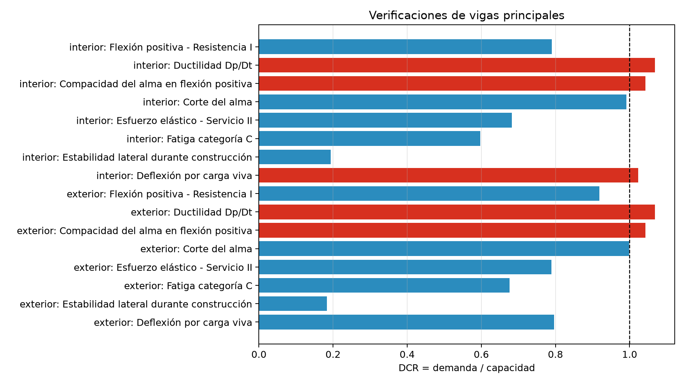

# Memoria de cálculo manual de verificaciones de diseño

## Vigas principales del Puente Molinohuayco — desarrollo didáctico de pregrado

**Revisión:** PRELIMINAR-R00  
**Sistema estructural:** tres vigas I de placas con tablero de concreto  
**Modelo longitudinal:** viga recta simplemente apoyada de 50.00 m  
**Material principal:** acero ASTM A709 Gr. 50, \(F_y=345\ \text{MPa}\)  
**Normativa declarada:** Manual de Puentes MTC 2018  
**Unidades internas:** N, mm y MPa

> **Resultado del diseño.** La condición global es **NO CUMPLE**. Las verificaciones que exceden su límite son la ductilidad \(D_p/D_t=0.4487>0.42\), la compacidad del alma \(94.43>90.53\) y la deflexión vehicular de la viga interior \(63.95>62.50\ \text{mm}\). El control global corresponde a ductilidad, con \(D/C=1.068\). La flexión positiva, el corte, el esfuerzo de Servicio II, la fatiga categoría C y el cribado de estabilidad constructiva presentan \(D/C\le1.0\), pero están sujetos a las limitaciones y validaciones externas indicadas en esta memoria.

---

## 1. Objetivo

El objetivo es explicar y reproducir manualmente las verificaciones de diseño efectuadas a partir de las demandas del análisis longitudinal. Para cada estado límite se presenta:

1. significado físico;
2. demanda;
3. capacidad o límite adoptado;
4. ecuación utilizada;
5. sustitución numérica;
6. relación demanda/capacidad;
7. condición de cumplimiento;
8. limitaciones del procedimiento.

Esta memoria continúa conceptualmente el análisis longitudinal, pero es autocontenida respecto de los datos necesarios para comprender las verificaciones.

## 2. Criterio general de aceptación

La relación demanda/capacidad se define como:

\[
D/C=\frac{\text{demanda}}{\text{capacidad o límite}}
\]

El criterio numérico es:

\[
D/C\le1.0\quad\Rightarrow\quad\text{cumple}
\]

\[
D/C>1.0\quad\Rightarrow\quad\text{no cumple}
\]

La condición global se determina así:

- **NO CUMPLE:** al menos una verificación numérica tiene \(D/C>1.0\);
- **CONDICIONAL:** todas las verificaciones numéricas cumplen, pero existen validaciones externas críticas pendientes;
- **CUMPLE:** todas las verificaciones cumplen y las validaciones externas están confirmadas.

En el presente caso existen verificaciones numéricas fallidas; por ello, el estado es **NO CUMPLE**, independientemente de las validaciones aún pendientes.

## 3. Resumen ejecutivo de verificaciones

| Verificación | Interior \(D/C\) | Estado | Exterior \(D/C\) | Estado |
|---|---:|---|---:|---|
| Flexión positiva — Resistencia I | 0.790 | Cumple | 0.919 | Cumple |
| Ductilidad \(D_p/D_t\) | **1.068** | **No cumple** | **1.068** | **No cumple** |
| Compacidad del alma | **1.043** | **No cumple** | **1.043** | **No cumple** |
| Corte del alma | 0.992 | Cumple | 0.998 | Cumple |
| Esfuerzo elástico — Servicio II | 0.682 | Cumple | 0.789 | Cumple |
| Fatiga categoría C | 0.597 | Cumple | 0.676 | Cumple |
| Estabilidad lateral en construcción | 0.194 | Cumple como cribado | 0.184 | Cumple como cribado |
| Deflexión por carga viva | **1.023** | **No cumple** | 0.796 | Cumple |

La ductilidad gobierna globalmente:

\[
\left(\frac{D}{C}\right)_{gob}
=\frac{0.448674}{0.42}
=1.06827
\]

**Figura 1.** Relaciones demanda/capacidad de las vigas interior y exterior. La línea vertical \(D/C=1.0\) separa las verificaciones que cumplen de las que no cumplen.

## 4. Datos necesarios para las verificaciones

### 4.1 Materiales

| Propiedad | Símbolo | Valor |
|---|---:|---:|
| Límite de fluencia del acero | \(F_y\) | 345 MPa |
| Módulo de elasticidad del acero | \(E_s\) | 200 000 MPa |
| Resistencia del concreto | \(f'_c\) | 27.46 MPa |
| Categoría de fatiga adoptada | — | C |
| Umbral de amplitud constante | \(\Delta F_{TH}\) | 69 MPa |

### 4.2 Geometría del alma y ala superior

\[
h_w=1\,755\ \text{mm},\qquad t_w=14\ \text{mm}
\]

\[
b_{fs}=450\ \text{mm},\qquad t_{fs}=20\ \text{mm}
\]

La geometría del alma es constante en todos los segmentos. El ala inferior cambia de espesor:

| Grupo | Intervalos | \(t_{fi}\) |
|---|---|---:|
| A | 0.00–8.00 m y 42.00–50.00 m | 25 mm |
| B | 8.00–16.50 m y 33.50–42.00 m | 32 mm |
| C | 16.50–33.50 m | 50 mm |

### 4.3 Propiedades relevantes

| Grupo | \(M_p\) (kN·m) | \(D_p/D_t\) | \(D_{cp}\) en alma (mm) |
|---|---:|---:|---:|
| A | 18 127.50 | 0.19282 | 125.285 |
| B | 20 421.58 | 0.26509 | 275.285 |
| C | 25 369.18 | 0.44867 | 660.999 |

Para la sección B, que gobierna servicio y fatiga en \(x=33.50\ \text{m}\):

| Propiedad | Valor (mm³) |
|---|---:|
| \(S_{s,sup}\), acero solo | \(2.53285\times10^7\) |
| \(S_{s,inf}\), acero solo | \(3.68765\times10^7\) |
| \(S_{LP,sup}\), sección de largo plazo | \(6.24695\times10^7\) |
| \(S_{LP,inf}\), sección de largo plazo | \(4.51621\times10^7\) |
| \(S_{CP,sup}\), sección de corto plazo | \(1.49463\times10^8\) |
| \(S_{CP,inf}\), sección de corto plazo | \(4.96263\times10^7\) |

### 4.4 Referencias declaradas para cada verificación

| Verificación | Referencia consignada |
|---|---|
| Flexión, ductilidad y compacidad | MTC 2018, 2.9.5.0.6–2.9.5.0.8, pp. 446–454 |
| Corte | MTC 2018, 2.9.5.0.9, pp. 454–457 |
| Esfuerzo elástico y deflexión | MTC 2018, 2.9.5.0.4, pp. 443–445 |
| Fatiga | MTC 2018, 2.9.4.6 y 2.9.5.0.5, pp. 397–403 y 445 |
| Construibilidad | MTC 2018, 2.9.5.0.3, pp. 441–443 |

Estas referencias forman parte de la trazabilidad declarada del cálculo. La presente memoria reconstruye las ecuaciones efectivamente utilizadas; no sustituye la comprobación independiente de cada expresión, límite y factor contra la edición contractual completa.

## 5. Verificación de flexión positiva — Resistencia I

### 5.1 Fundamento

La demanda es el momento factorizado de Resistencia I. La capacidad adoptada se obtiene reduciendo el momento plástico compuesto mediante un factor asociado a la posición del eje neutro plástico:

\[
M_{cap}=R_dM_p
\]

El factor de reducción se define por:

\[
R_d=
\begin{cases}
1.0, & D_p/D_t\le0.10\\[4pt]
1.07-0.70(D_p/D_t), & D_p/D_t>0.10
\end{cases}
\]

No se aplica en esta formulación un factor \(\phi\) independiente. Por ello, \(M_{cap}\) debe denominarse **capacidad adoptada en la verificación**, no \(\phi M_n\), salvo que se demuestre normativamente la equivalencia.

### 5.2 Capacidad de la sección central C

La sección crítica se encuentra en \(x=25.00\ \text{m}\):

\[
\frac{D_p}{D_t}=0.448674
\]

\[
R_d=1.07-0.70(0.448674)=0.755928
\]

\[
M_p=25\,369.18\ \text{kN·m}
\]

\[
M_{cap}=0.755928(25\,369.18)
=19\,177.27\ \text{kN·m}
\]

### 5.3 Viga interior

\[
M_u=15\,148.49\ \text{kN·m}
\]

\[
D/C=\frac{15\,148.49}{19\,177.27}
=0.7899<1.0
\]

**Resultado local:** cumple la comparación de flexión implementada.

### 5.4 Viga exterior

\[
M_u=17\,614.76\ \text{kN·m}
\]

\[
D/C=\frac{17\,614.76}{19\,177.27}
=0.9185<1.0
\]

**Resultado local:** cumple la comparación de flexión implementada.

### 5.5 Interpretación

La viga exterior gobierna por flexión y dispone de un margen de solo:

\[
1-0.9185=0.0815=8.15\%
\]

Sin embargo, la sección no satisface las verificaciones independientes de ductilidad y compacidad desarrolladas a continuación. Por tanto, el resultado “cumple por flexión” no permite declarar adecuada la resistencia flexional global. Si la compacidad es requisito para desarrollar el momento plástico, debe recalcularse la resistencia aplicable a una sección no compacta.

## 6. Verificación de ductilidad

### 6.1 Significado físico

La razón \(D_p/D_t\) mide la profundidad del eje neutro plástico desde la fibra superior respecto de la altura total compuesta. Un eje neutro excesivamente profundo implica mayor deformación de compresión del concreto antes de que la sección desarrolle la rotación plástica esperada.

El límite adoptado es:

\[
\left(\frac{D_p}{D_t}\right)_{lim}=0.42
\]

### 6.2 Sustitución

Para la sección C:

\[
D_p=2\,075-1\,144.001=930.999\ \text{mm}
\]

\[
D_t=2\,075\ \text{mm}
\]

\[
\frac{D_p}{D_t}
=\frac{930.999}{2\,075}
=0.448674
\]

\[
D/C=\frac{0.448674}{0.42}
=1.06827>1.0
\]

### 6.3 Resultado

**No cumple** en ambas vigas, porque ambas poseen la misma sección transversal y el mismo ancho efectivo de losa.

La excedencia respecto del límite es:

\[
\frac{0.448674-0.42}{0.42}(100)
=6.83\%
\]

Esta es la verificación gobernante del diseño.

## 7. Compacidad del alma en flexión positiva

### 7.1 Fundamento

Se determina la esbeltez del tramo de alma comprimido en el estado plástico:

\[
\lambda_w=\frac{2D_{cp}}{t_w}
\]

El límite adoptado es:

\[
\lambda_{lim}=3.76\sqrt{\frac{E_s}{F_y}}
\]

### 7.2 Sección C

\[
D_{cp}=660.999\ \text{mm}
\]

\[
\lambda_w=\frac{2(660.999)}{14}
=94.428
\]

\[
\lambda_{lim}
=3.76\sqrt{\frac{200\,000}{345}}
=90.530
\]

\[
D/C=\frac{94.428}{90.530}
=1.04306>1.0
\]

### 7.3 Resultado

**No cumple** en ambas vigas. La esbeltez excede el límite en:

\[
\frac{94.428-90.530}{90.530}(100)
=4.31\%
\]

La consecuencia conceptual es importante: el alma no satisface el límite utilizado para clasificarla como compacta en flexión positiva. Por ello, el desarrollo pleno de la resistencia plástica no debe darse por garantizado únicamente a partir del valor \(M_p\).

## 8. Resistencia a corte del alma

### 8.1 Esbeltez

\[
\lambda=\frac{h_w}{t_w}
=\frac{1\,755}{14}
=125.357
\]

Se adopta \(k=5.0\). Los límites calculados son:

\[
\lambda_p=1.12\sqrt{\frac{E_sk}{F_y}}
=1.12\sqrt{\frac{200\,000(5)}{345}}
=60.299
\]

\[
\lambda_r=1.40\sqrt{\frac{E_sk}{F_y}}
=75.373
\]

Como:

\[
\lambda=125.357>\lambda_r
\]

se utiliza la rama esbelta:

\[
C_v=\frac{1.57E_sk}{F_y\lambda^2}
\]

\[
C_v=
\frac{1.57(200\,000)(5)}
{345(125.357)^2}
=0.289589
\]

### 8.2 Capacidad adoptada

\[
V_{cap}=0.58F_yh_wt_wC_v
\]

\[
V_{cap}
=0.58(345)(1\,755)(14)(0.289589)
=1\,423\,753\ \text{N}
\]

\[
V_{cap}=1\,423.75\ \text{kN}
\]

### 8.3 Viga interior

\[
V_u=1\,412.05\ \text{kN}
\]

\[
D/C=\frac{1\,412.05}{1\,423.75}
=0.99178<1.0
\]

**Cumple**, con margen aproximado de 0.82 %.

### 8.4 Viga exterior

\[
V_u=1\,421.09\ \text{kN}
\]

\[
D/C=\frac{1\,421.09}{1\,423.75}
=0.99813<1.0
\]

**Cumple**, con margen aproximado de 0.19 %.

### 8.5 Interpretación

El corte de la viga exterior se encuentra muy próximo a la capacidad adoptada. Aunque el alma se declara rigidizada, se utiliza conservadoramente \(k=5\) y no se considera acción de campo de tensión. La verificación no sustituye el diseño de paneles, rigidizadores de apoyo e intermedios, soldaduras ni cargas concentradas.

## 9. Esfuerzo elástico — Servicio II

### 9.1 Superposición por etapas

Los esfuerzos se calculan sumando las contribuciones de cada etapa con el módulo resistente correspondiente.

Fibra superior:

\[
\sigma_{sup}=
\frac{M_{DC,nc}}{S_{s,sup}}
+\frac{M_{DC,comp}+M_{DW}}{S_{LP,sup}}
+\frac{1.30M_{LL+IM}}{S_{CP,sup}}
+\frac{M_{PL}}{S_{LP,sup}}
\]

Fibra inferior:

\[
\sigma_{inf}=
\frac{M_{DC,nc}}{S_{s,inf}}
+\frac{M_{DC,comp}+M_{DW}}{S_{LP,inf}}
+\frac{1.30M_{LL+IM}}{S_{CP,inf}}
+\frac{M_{PL}}{S_{LP,inf}}
\]

El esfuerzo de control es:

\[
\sigma_{serv}=\max(|\sigma_{sup}|,|\sigma_{inf}|)
\]

El límite adoptado es:

\[
\sigma_{lim}=0.95F_y=0.95(345)=327.75\ \text{MPa}
\]

### 9.2 Razón por la cual gobierna \(x=33.50\ \text{m}\)

El máximo no ocurre en el centro de luz. En \(x=33.50\ \text{m}\) comienza el segmento B-D, cuyo módulo resistente es menor que el del segmento central C. La reducción de sección compensa el descenso del momento y produce el máximo esfuerzo.

### 9.3 Viga interior en \(x=33.50\ \text{m}\)

Demandas de momento:

| Acción | Momento (kN·m) |
|---|---:|
| \(DC_{nc}\) | 1 570.594 |
| \(DC_{comp}\) | 2 802.443 |
| \(DW\) | 934.148 |
| \(LL+IM\) | 3 747.370 |
| \(PL\) | 0.000 |

Contribuciones en la fibra inferior:

\[
\sigma_{DC,nc}
=\frac{1\,570.594(10^6)}{3.68765(10^7)}
=42.591\ \text{MPa}
\]

\[
\sigma_{DC,comp+DW}
=\frac{(2\,802.443+934.148)(10^6)}
{4.51621(10^7)}
=82.737\ \text{MPa}
\]

\[
\sigma_{LL}
=\frac{1.30(3\,747.370)(10^6)}
{4.96263(10^7)}
=98.165\ \text{MPa}
\]

\[
\sigma_{inf}=42.591+82.737+98.165
=223.493\ \text{MPa}
\]

La fibra superior alcanza 154.417 MPa; gobierna la inferior.

\[
D/C=\frac{223.493}{327.75}
=0.68190<1.0
\]

**Resultado:** cumple.

### 9.4 Viga exterior en \(x=33.50\ \text{m}\)

Demandas de momento:

| Acción | Momento (kN·m) |
|---|---:|
| \(DC_{nc}\) | 1 487.681 |
| \(DC_{comp}\) | 4 941.585 |
| \(DW\) | 467.074 |
| \(LL+IM\) | 2 916.080 |
| \(PL\) | 1 003.241 |

Contribuciones en la fibra inferior:

| Contribución | Esfuerzo (MPa) |
|---|---:|
| \(DC_{nc}\) | 40.342 |
| \(DC_{comp}+DW\) | 119.761 |
| \(1.30(LL+IM)\) | 76.389 |
| \(PL\) | 22.214 |
| **Total** | **258.707** |

La fibra superior alcanza 186.739 MPa; gobierna la inferior.

\[
D/C=\frac{258.707}{327.75}
=0.78934<1.0
\]

**Resultado:** cumple.

### 9.5 Observación sobre el cambio de sección

El máximo se obtiene exactamente en la frontera entre C-D y B-D. La geometría se asigna al segmento B-D en esa estación. En el diseño definitivo deben comprobarse el detalle real de transición, el empalme, la terminación de platabandas y los efectos locales de fatiga; una discontinuidad ideal por escalones no representa esos detalles.

## 10. Verificación de fatiga categoría C

### 10.1 Formulación

El rango de esfuerzo se calcula con las propiedades compuestas de corto plazo:

\[
\Delta f=
\gamma_{Fat\,I}
\max\left(
\frac{\Delta M_f}{S_{CP,sup}},
\frac{\Delta M_f}{S_{CP,inf}}
\right)
\]

Se utiliza:

\[
\gamma_{Fat\,I}=1.75
\]

El límite para categoría C es:

\[
\Delta F_{TH}=69\ \text{MPa}
\]

### 10.2 Viga interior

En \(x=33.50\ \text{m}\):

\[
\Delta M_f=1\,167.652\ \text{kN·m}
\]

Gobierna la fibra inferior:

\[
\Delta f=
1.75\frac{1\,167.652(10^6)}
{4.96263(10^7)}
=41.176\ \text{MPa}
\]

\[
D/C=\frac{41.176}{69}
=0.59675<1.0
\]

**Resultado:** cumple respecto del umbral adoptado.

### 10.3 Viga exterior

\[
\Delta M_f=1\,323.335\ \text{kN·m}
\]

\[
\Delta f=
1.75\frac{1\,323.335(10^6)}
{4.96263(10^7)}
=46.665\ \text{MPa}
\]

\[
D/C=\frac{46.665}{69}
=0.67631<1.0
\]

**Resultado:** cumple respecto del umbral adoptado.

### 10.4 Alcance de esta verificación

El chequeo compara el rango elástico con el umbral de amplitud constante de la categoría C. La categoría debe corresponder al detalle realmente fabricado. No se desarrolla una evaluación de vida finita basada en número de ciclos, ADTT o Fatiga II, ni se verifican por separado soldaduras, empalmes, conectores, rigidizadores o terminaciones de placas.

## 11. Estabilidad lateral durante construcción

### 11.1 Naturaleza del chequeo

Se realiza un cribado elástico simplificado del ala superior comprimida antes de la acción compuesta. Se adopta:

\[
C_b=1.0
\]

La longitud no arriostrada en el centro es:

\[
L_b=6.25\ \text{m}=6\,250\ \text{mm}
\]

El radio simplificado del ala es:

\[
r_t=\frac{b_{fs}}{\sqrt{12}}
=\frac{450}{\sqrt{12}}
=129.904\ \text{mm}
\]

El esfuerzo crítico se estima como:

\[
F_{cr}=
\min\left[
F_y,
\frac{\pi^2E_s}{(L_b/r_t)^2}
\right]
\]

\[
\frac{L_b}{r_t}
=\frac{6\,250}{129.904}
=48.112
\]

El valor elástico de Euler supera \(F_y\), por lo que:

\[
F_{cr}=F_y=345\ \text{MPa}
\]

Con el módulo superior de acero del grupo C:

\[
S_{s,sup}=2.68049\times10^7\ \text{mm}^3
\]

\[
M_{cr}=F_{cr}S_{s,sup}
=345(2.68049\times10^7)
=9\,247.68\ \text{kN·m}
\]

### 11.2 Viga interior

\[
M_{DC,nc}=1\,793.60\ \text{kN·m}
\]

\[
D/C=\frac{1\,793.60}{9\,247.68}
=0.19395
\]

### 11.3 Viga exterior

\[
M_{DC,nc}=1\,699.85\ \text{kN·m}
\]

\[
D/C=\frac{1\,699.85}{9\,247.68}
=0.18381
\]

### 11.4 Interpretación

Ambas vigas satisfacen este **cribado**. No obstante, la expresión no desarrolla las propiedades torsionales y de alabeo de la sección, la distorsión del conjunto, el vaciado no simétrico, imperfecciones, secuencia de montaje ni rigidez efectiva de diafragmas. El arriostramiento temporal no está confirmado; por ello, este resultado no constituye una verificación completa de pandeo lateral torsional.

## 12. Deflexión por carga viva

### 12.1 Límite

\[
\Delta_{lim}=\frac{L}{800}
=\frac{50\,000}{800}
=62.50\ \text{mm}
\]

### 12.2 Viga interior

\[
\Delta_{LL}=63.9515\ \text{mm}
\]

\[
D/C=\frac{63.9515}{62.50}
=1.02322>1.0
\]

**No cumple.** La excedencia es:

\[
63.9515-62.50=1.4515\ \text{mm}
\]

equivalente a 2.32 % del límite.

### 12.3 Viga exterior

\[
\Delta_{LL}=49.7650\ \text{mm}
\]

\[
D/C=\frac{49.7650}{62.50}
=0.79624<1.0
\]

**Cumple.**

### 12.4 Limitación

La deformación depende del factor aproximado de distribución de momento. La geometría se encuentra fuera del rango declarado de la expresión empleada, por tener solo tres vigas. Antes de modificar la sección únicamente por esta excedencia, debe confirmarse la distribución transversal mediante un modelo refinado.

## 13. Coherencia entre verificaciones

### 13.1 Demanda, resistencia nominal y capacidad adoptada

Las magnitudes no deben confundirse:

- \(M_u\) y \(V_u\): demandas factorizadas;
- \(M_p\): momento plástico nominal calculado por equilibrio de fuerzas;
- \(M_{cap}=R_dM_p\): capacidad adoptada en la comparación de flexión;
- \(V_{cap}\): capacidad adoptada sin campo de tensión;
- \(D/C\): cociente entre demanda y capacidad o límite.

No existe en la formulación de flexión un factor \(\phi\) separado. En consecuencia, no debe rotularse automáticamente \(M_{cap}\) como \(\phi M_n\).

### 13.2 Flexión frente a compacidad

La comparación \(M_u/M_{cap}<1.0\) resulta favorable, pero la sección C falla compacidad y ductilidad. Estas verificaciones son condiciones adicionales, no simples notas informativas. El cumplimiento local de flexión no neutraliza sus incumplimientos.

### 13.3 Corte próximo al límite

La viga exterior alcanza \(D/C=0.998\) en corte. Redondear demanda o capacidad a tres cifras puede aparentar igualdad. La evaluación debe conservar suficiente precisión y completarse con el diseño de rigidizadores y paneles.

### 13.4 Servicio y fatiga en la transición

Ambas verificaciones gobiernan en \(x=33.50\ \text{m}\), donde disminuye el espesor del ala inferior. Esto demuestra que revisar únicamente el centro de luz puede omitir la sección crítica.

## 14. Hallazgos por nivel de atención

### 14.1 Críticos para la aceptación

- La sección no cumple el límite de ductilidad \(D_p/D_t\).
- El alma no cumple el límite de compacidad utilizado para flexión positiva.
- La viga interior no cumple el límite configurado de deflexión por carga viva.

### 14.2 Importantes

- La capacidad flexional favorable se basa en \(M_p\) reducido aun cuando la sección falla compacidad; debe establecerse la resistencia aplicable a sección no compacta.
- El corte de la viga exterior tiene un margen aproximado de solo 0.19 %.
- Los factores aproximados de distribución transversal están fuera de su dominio geométrico declarado.
- La acción compuesta depende de conectores aún no confirmados.
- La estabilidad constructiva es solo un cribado y el arriostramiento temporal no está confirmado.
- La categoría C de fatiga debe verificarse contra los detalles reales de fabricación.

### 14.3 Pendientes externos

- diseño y confirmación de conectores de corte;
- rigidizadores de apoyo e intermedios;
- diafragmas y arriostramiento permanente;
- arriostramiento temporal y secuencia de vaciado;
- análisis transversal refinado;
- revisión de empalmes, soldaduras y cambios de sección;
- conciliación de geometría y secciones con la documentación vigente.

## 15. Guía de trazabilidad de resultados

| Bloque de resultados | Contenido | Sección de esta memoria |
|---|---|---|
| Estado | Condición global del diseño | 2 y 3 |
| Estado gobernante | Mayor relación \(D/C\) | 3 y 6 |
| Verificaciones — flexión | Demanda, capacidad reducida y \(D/C\) | 5 |
| Verificaciones — ductilidad | \(D_p/D_t\) frente a 0.42 | 6 |
| Verificaciones — compacidad | \(2D_{cp}/t_w\) frente al límite | 7 |
| Verificaciones — corte | \(V_u\), \(V_{cap}\) y \(D/C\) | 8 |
| Verificaciones — Servicio II | Esfuerzos acumulados por etapa | 9 |
| Verificaciones — fatiga | Rango de esfuerzo frente a 69 MPa | 10 |
| Verificaciones — estabilidad | Cribado del ala comprimida | 11 |
| Verificaciones — deflexión | \(\Delta_{LL}\) frente a \(L/800\) | 12 |
| Pendientes y advertencias | Validaciones externas y limitaciones | 14 |

## 16. Conclusiones

1. El estado global es **NO CUMPLE**.
2. La verificación gobernante es ductilidad, con \(D/C=1.068\).
3. La compacidad del alma también falla, con \(D/C=1.043\).
4. La viga interior excede el límite de deflexión vehicular, con \(D/C=1.023\).
5. La viga exterior gobierna la demanda de flexión, \(M_u=17\,614.76\ \text{kN·m}\), pero la comparación favorable \(D/C=0.919\) no resuelve los incumplimientos de ductilidad y compacidad.
6. La viga exterior gobierna corte con \(D/C=0.998\), por lo que el margen es reducido.
7. Servicio II y fatiga gobiernan en el cambio de sección de \(x=33.50\ \text{m}\), no en el centro de luz.
8. La condición final requiere recalcular la resistencia flexional aplicable a sección no compacta, revisar la geometría para satisfacer ductilidad, validar la distribución transversal y completar conectores, rigidizadores, arriostramientos, detalles de fatiga y constructibilidad.

---

## Preguntas de comprobación para el estudiante

1. ¿Por qué una sección puede cumplir \(M_u/M_{cap}\) y aun así no cumplir el diseño global?
2. ¿Qué relación existe entre la profundidad del eje neutro plástico y la ductilidad de la sección compuesta?
3. ¿Por qué el esfuerzo máximo de Servicio II aparece en un cambio de sección y no en el punto de máximo momento?
4. ¿Qué diferencia existe entre \(M_p\), \(M_n\), \(\phi M_n\) y la capacidad \(R_dM_p\) utilizada aquí?
5. ¿Qué consecuencias tiene clasificar el alma como no compacta?
6. ¿Por qué un \(D/C=0.998\) exige especial cuidado con redondeos, tolerancias y datos pendientes?
7. ¿Qué información adicional se necesita para transformar el cribado de estabilidad en una verificación completa de pandeo lateral torsional?
8. ¿Por qué la comprobación contra el umbral de fatiga no equivale necesariamente a una evaluación de vida finita?
